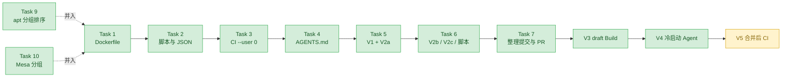

# Luckfox Pico LVGL Example — Cloud Agent 环境对齐 luckfox-pico 实施计划

> **For agentic workers:** REQUIRED SUB-SKILL: Use superpowers:subagent-driven-development (recommended) or superpowers:executing-plans to implement this plan task-by-task. Steps use checkbox (`- [ ]`) syntax for tracking.

**Goal:** 按 spec 把 luckfox-pico `c3ef271` 的 Cloud Agent 配置（apt 补齐、Tailscale、`USER ubuntu`、`install.sh` / `start.sh`）搬到本仓，主机名改为 `cursor-agent-for-luckfox-pico-lvgl-example-<suffix>`，CI 两个 job 加 `--user 0`。

**Architecture:** 两份 Dockerfile 按「只看 FROM dpkg」补包，并追加 luckfox-pico 的 Tailscale 层、sudoers 层与 `USER ubuntu`；`environment.json` 改为调用两个脚本，`install.sh` 从 luckfox-pico 逐字复制，`start.sh` 只改 2 行。用不进仓库的静态检查脚本 `v1.py`（全文见附录 A1）驱动 Task 1–4，再用本地 Docker 验证镜像、CI 路径与 Agent 路径（V2），V3/V4 由作者在 Cursor 平台执行。

**Tech Stack:** Dockerfile（`ubuntu:24.04` / `luckfoxtech/luckfox_pico:1.0`）、Bash、JSON、GitHub Actions YAML、Docker 28.5.2（仅当前 VM）、Python 3（检查脚本）。

**Spec:** [`docs/superpowers/specs/2026-10-06-lvgl-example-cloudagent-align-luckfox-pico-design.md`](../specs/2026-10-06-lvgl-example-cloudagent-align-luckfox-pico-design.md)

## 1. Global Constraints

每个 Task 默认包含 spec 全文。硬约束（取值照抄 spec）：

- luckfox-pico 参考固定为 `c3ef271944ec2878d4f54216757f8c9acbe8e77c`，一律 `git -C <luckfox-pico 检出目录> show c3ef271:<路径>` 取文件
- FROM 两行不改；apt `--no-install-recommends`、不锁版本；禁写 `which` `gnu-which` `conntrack-tools` `conntrackd` `iotop-c` `dnsutils`；不写 D / E 类；公开层不装 `openssh-server`，不用 `chpasswd`
- 保留两份的 `ARG DEBIAN_FRONTEND=noninteractive`、活动的 `ENV TZ=Asia/Shanghai`、备选「刻意不设 TZ」说明
- `repo_slug="luckfox-pico-lvgl-example"`；`environment.json` 不写 `user` 键；脚本以 `100644` 入库；禁止 `set -x`
- 不改交叉编译、`tests/`、业务代码、`build-image` job；不改 luckfox-pico 仓；Docker 只装在当前 VM
- 提交序：Dockerfile → 脚本与 JSON → CI → `AGENTS.md` → 全部 `docs/superpowers/` 单个提交；身份 `Cursor Agent <cursoragent@cursor.com>`，SSH 签名
- 未在 Cursor 平台执行的 V3/V4 不得标为通过

## 2. Review Focus

spec 隐含、V1/V2 原定检查没有覆盖、最可能在真机上出问题的 5 处，均已在 Task 6 本地验证：

1. Secret 能否穿过 `sudo -n -E` 到达 `start.sh`；不带 Secret 时 fail-fast 且不启动 `tailscaled`
2. `install.sh` 写技能树时 `$HOME` 仍为 `/home/ubuntu`，属主 `ubuntu:ubuntu`
3. `install.sh` 重复执行时 host key 指纹不变
4. 备选 FROM 公开层的 6 个 host key 在 `install.sh` 后被轮换
5. Agent 路径以 uid 1000 写工作区无需 `sudo`；CI 路径以 `--user 0` 写入正常

## 3. File Structure

| 文件 | 责任 |
| --- | --- |
| `.cursor/Dockerfile` / `.cursor/Dockerfile.luckfox_pico` | apt 补齐、Tailscale 层、sudoers、`USER ubuntu`（备选另有 `useradd`）、注释改口径 |
| `.cursor/environment.json`、`.cursor/install.sh`、`.cursor/start.sh` | `install` / `start` 拆为脚本 |
| `.github/workflows/build-luckfox-lvgl-demo.yml` | 两个 job 加 `options: --user 0` |
| `AGENTS.md` | Cloud Agent 与 CI 小节 |
| `docs/superpowers/specs/2026-07-24-…`、`2026-09-20-…`、`2026-09-21-…` | 各加一处指向新 spec 的说明 |
| `v1.py`（不入库，全文见附录 A1；附录 A2–A6 为其余验证脚本） | V1 静态检查，分 `dockerfiles` `json` `scripts` `ci` `scope` 五组，另有 `pkgs` 输出 39 个需求包 |

---

## 4. Tasks

### Task 1: V1 检查脚本 + 两份 Dockerfile（已完成）

**落地文件（以仓库为准，不在此重复正文）：** `.cursor/Dockerfile`、`.cursor/Dockerfile.luckfox_pico`

- [x] **Step 1:** 写 `/tmp/align/v1.py`（不入库，全文见附录 A1）
- [x] **Step 2:** 改动前运行：`dockerfiles` `json` `scripts` `ci` 四组 FAIL，`scope` OK
- [x] **Step 3–4:** 改两份 Dockerfile。luckfox-pico 的平台注释框、诊断 CLI 注释、Tailscale / sudoers / `USER` 段按行号原样复制，只改复核行、⚠️ 行与「V10 抓包」
- [x] **Step 5:** `python3 /tmp/align/v1.py dockerfiles` → `OK dockerfiles`
- [x] **Step 6:** 提交 `chore(cloud-env): 🐳`（apt 包分组排序后经 Task 9 并入本提交）

### Task 2: `environment.json` / `install.sh` / `start.sh`（已完成）

**落地文件：** `.cursor/environment.json`（与 luckfox-pico 文件逐字相同）、`.cursor/install.sh`、`.cursor/start.sh`

- [x] **Step 1:** `json` `scripts` 两组 FAIL
- [x] **Step 2:** 写文件；`start.sh` 与 luckfox-pico 的 `diff` 恰为 2 行
- [x] **Step 3:** `OK json`、`OK scripts`；两个脚本 git 模式 `100644`
- [x] **Step 4:** 提交 `feat(cloud-env): ✨`

### Task 3: CI 加 `--user 0`（已完成）

**落地文件：** `.github/workflows/build-luckfox-lvgl-demo.yml`

- [x] **Step 1:** `ci` 组 FAIL
- [x] **Step 2:** 两处 `password:` 之后各插入 luckfox-pico 第 151 行注释与 `options: --user 0`
- [x] **Step 3:** `OK ci`
- [x] **Step 4:** 提交 `ci(github-actions): 👷`

### Task 4: `AGENTS.md` 与历史 spec 指针（已完成）

**落地文件：** `AGENTS.md`；`docs/superpowers/specs/2026-07-24-…`（§5.2 标题后）、`2026-09-20-…`（§1 首段后）、`2026-09-21-…`（§5.2「不加 `--user 0`」一条下）

- [x] **Step 1–2:** 改 `AGENTS.md`；3 份历史 spec 各加一句 `> 2026-10-06 更新：…`
- [x] **Step 3:** 主机名出现 1 次、指针 3 处、`OK scope`
- [x] **Step 4:** `AGENTS.md` 提交 `docs(agents): 📝`；历史 spec 指针并入最后的 docs 提交（见执行记录 P2）

### Task 5: V1 全量 + V2a 镜像（已完成）

- [x] **Step 1:** `v1.py all` 五组 OK
- [x] **Step 2:** 改动前后 4 个镜像构建 rc=0，体积见验证证据
- [x] **Step 3:** 两个 after 镜像的身份、命令、Tailscale 版本、host key 数、39 个需求包均符合预期

### Task 6: V2b、V2c 与脚本本地运行（已完成）

- [x] **Step 1:** V2b（`--user 0`）glibc / uClibc 编译与 ctest 78/78（加 `--tmpfs /tmp:exec`，见 P3）
- [x] **Step 2:** V2c（默认 `ubuntu`，无 `sudo`）同上，产物属主 `ubuntu`
- [x] **Step 3:** `install.sh` 两镜像各跑两次：属主、幂等、备选 host key 轮换（先以 `ubuntu` 建 `~/.cursor`，见 P4）
- [x] **Step 4:** `start.sh` Secret 门禁：无 Secret 时 fail-fast；假 Secret 穿过 `sudo -E`

### Task 7: 整理提交、精简 plan、更新 PR（已完成）

- [x] **Step 1:** 回填验证证据与偏离；spec 状态改为「已实施，V3/V4 待作者执行」，§7 补 `~/.cursor` 前置条件
- [x] **Step 2:** 从 `origin/dev` 按序重建提交（实现 4 个 → `docs(superpowers)` 1 个），提交信息按本仓历史格式加 `Co-authored-by` footer
- [x] **Step 3:** 精简本 plan，并入最后的 docs 提交
- [x] **Step 4:** 强推分支，更新 PR #9 标题与正文

### Task 8: 作者执行（V3 / V4），合并后自动（V5）

- [x] **V3**：在 Dashboard 新建 draft Environment Build，`refs` 指向 `pi/cloudagent-align-luckfox-pico`。Expected：`SUCCEEDED`，`install` 退出 0。实测见验证证据。
- [x] **V4**：从该 Build 冷启动 Agent（启动时须显式选择草稿 Build，见 P7），执行：

  ```bash
  whoami; stat -c %U:%G /workspace; cat /tmp/cursor/start-user/start-user.status
  tailscale status --self --json | jq -r .Self.HostName
  ip -4 -o addr show scope global
  sha256sum /usr/local/share/vnc-desktop.Aptfile
  stat -c '%a %U:%G' ~/.cursor ~/.cursor/skills/grilling/SKILL.md
  ```

  Expected：
  - `ubuntu`、`ubuntu:ubuntu`、`0`；
  - 主机名 `cursor-agent-for-luckfox-pico-lvgl-example-<bcId 前 8 位>`；
  - 主网卡在 `172.30.0.0/24` 内；
  - sha256 以 `819987b7` 开头；
  - `~/.cursor` 为 `755 ubuntu:ubuntu`，`SKILL.md` 属主 `ubuntu:ubuntu`；
  - Mac 上 `ssh ubuntu@<主机名>` 成功（实际改为从另一台 Cloud Agent 经 tailnet 登录，见 P8）；
  - 按 AGENTS.md 完成 glibc / uClibc 构建与 `ctest`，全程无需 `sudo`。
- [ ] **V5**：合并后 `dev` push 的 CI：`build-image` 重建并签名，`build-demo` ×2 与 `native-tests` 通过。

### Task 9: apt 包按类别分组排序（作者追加，已完成，并入 Dockerfile 提交）

**落地文件：** `.cursor/Dockerfile`、`.cursor/Dockerfile.luckfox_pico`

- [x] **Step 1:** 方案选型（见 P9）：按 spec §2.2 分类分组，顺序为本仓构建依赖（基础工具、平台引导、ARM 交叉工具链、构建系统、native 验证、32 位运行）→ A → B → C；每组前一行 `# 组名`（续行内注释，构建前被删除），组内字母序，每行至多 9 个包。apt 注释段条目按同一顺序排列，`tcpdump` 从 luckfox-pico 的「iproute2 / jq / tcpdump」一条移到 B 类；两份文件分组顺序相同
- [x] **Step 2:** `v1.py dockerfiles` → OK（包集合不变）；`docker build --check` 两份均 `no warnings found`
- [x] **Step 3:** 两份镜像重新构建 rc=0，构建日志中的 `RUN` 已无注释行；默认 `ubuntu`、tailscale 1.102.5、需求包 39/39
- [x] **Step 4:** 并入 Dockerfile 提交，提交说明补一条；重排后 5 个提交均签名
- [x] **Step 5:** 两份 Dockerfile 中指 luckfox-pico 仓库的「SDK」改为全称（P11），Tailscale 层注释的「SDK/工具 RUN」改为「上方 apt RUN」

### Task 10: 平台 Aptfile 注释框的 Mesa 分组与合并检查（作者追加，已完成，并入 Dockerfile 提交）

**落地文件：** `.cursor/Dockerfile`、`.cursor/Dockerfile.luckfox_pico`、spec §2.4 / §2.5 / §3.7

- [x] **Step 1:** 对照 `/usr/local/share/vnc-desktop.Aptfile`（sha256 `819987b7…`）原文：Mesa 三包单独一组 `# Mesa software rendering for WebGL`；本仓照抄 luckfox-pico 10-05 注释框后并进了「桌面库」，与原文不一致（P12）
- [x] **Step 2:** 依赖链（`apt-cache depends`）与 FROM dpkg：两份 FROM 都没有 Mesa 三包与 `libgbm-dev`，均由 `libsdl2-dev → libgl-dev → libgl1 → libglx0 → libglx-mesa0 → libgl1-mesa-dri` 与 `libsdl2-dev → libgbm-dev` 带入；活动 Mesa 25.2.8，备选 23.2.1
- [x] **Step 3:** 运行时：容器挂载宿主 X `:1` 与授权，`LD_DEBUG=libs` 跑 `preview`。默认加载 Mesa（活动 `libGLX_mesa` + `libgallium` + `libLLVM.so.20`，备选 `libGLX_mesa` + `swrast_dri.so` + `libLLVM-15`），`SDL_FRAMEBUFFER_ACCELERATION=0` 时不加载，两者窗口都正常（`timeout` 退出码 124）；显式 OpenGL 上下文为 `llvmpipe (LLVM 20.1.2, 256 bits)`、`4.5 Mesa 25.2.8`。首轮未挂授权时 `preview` 连不上显示、未加载任何库，该轮结果作废
- [x] **Step 4:** 两份注释框恢复单独的 Mesa 行，加一行说明本镜像已由 `libsdl2-dev` 带入 Mesa；spec 新增 §2.5，§2.4、§3.7 同步。`v1.py dockerfiles` OK，`docker build --check` 无告警
- [x] **Step 5:** 作者追问是否还有类似合并（spec Q13b）。脚本逐组比对：注释框 ↔ Aptfile 原文无其他合并，只有「字体」组顺序不同，改回原文顺序；`RUN` 的「基础工具 / 平台引导」把注释段两条条目合成了一组，拆为「基础工具」「平台引导」两组。改后注释框与 Aptfile 逐组逐包同序（两份均 `True`），`RUN` 组名与注释段条目一一对应；`v1.py dockerfiles` OK，`docker build --check` 无告警
- [x] **Step 6:** 探测命令整理为附录 A4 的 `mesa-probe.sh` 后重跑：备选镜像在 `SDL_FRAMEBUFFER_ACCELERATION=0` 时 3/3 以 `X_ShmPutImage` BadValue（值 `0x1e0` = 480，即窗口宽度）退出，单独运行该情况 12/12 正常。原因是容器默认独立 IPC 命名空间，SDL 走 MIT-SHM 时宿主 X 按容器内的 shm ID 取段，前面的进程改变了 ID 分配后取到宿主上大小不符的段。加 `--ipc=host` 后备选 3/3、活动 1/1 正常。属于容器测试方式的问题，真实 Agent 中 `preview` 与 Xvnc 同处一个系统，spec §2.5 结论不变

---

## 5. 完成情况总结



绿色为已完成，黄色为待合并后执行。

## 6. 验证证据

### 6.1 V1 静态检查

`python3 /tmp/align/v1.py all` → `OK dockerfiles` / `OK json` / `OK scripts` / `OK ci` / `OK scope`。Task 9 后重跑仍全部 OK。脚本全文见附录 A1。

### 6.2 V2a 镜像

环境：当前 VM 按 Cursor 文档临时安装的 Docker 28.5.2（`fuse-overlayfs`），`docker build --network host`。

| 检查 | 活动（`ubuntu:24.04`） | 备选（`luckfox_pico:1.0`） |
| --- | --- | --- |
| 构建 | ✅ rc=0 | ✅ rc=0 |
| 体积（改动前 → 后） | 1081356554 → 1281493743 字节（+200 MB） | 1299686721 → 1409282818 字节（+110 MB） |
| `whoami` / uid / `sudo -n whoami` | ✅ `ubuntu` / 1000 / `root` | ✅ `ubuntu` / 1000 / `root` |
| `ubuntu` 的组 | 来自 FROM（`adm` `sudo` 等） | 只有 `ubuntu` |
| `tailscale` `tailscaled` `jq` `ss` | ✅ 均在，tailscale 1.102.5 | ✅ 均在，tailscale 1.102.5 |
| 需求包 | ✅ 39/39 | ✅ 39/39 |
| 公开层 `ssh_host_*` | ✅ 0 | 6（FROM 自带，见 6.4 轮换） |
| Task 9 后重建 | ✅ `--check` 无告警、rc=0、39/39 | ✅ `--check` 无告警、rc=0、39/39 |

### 6.3 V2b / V2c 构建与测试

uClibc 工具链为 luckfox-pico `c3ef271` 稀疏检出；两者均加 `--tmpfs /tmp:exec`（P3）。2026-10-07 整理为附录 A2 的脚本，对最终 Dockerfile 的两份镜像重跑，结果与下表相同。

| 检查 | V2b CI 路径（`--user 0`） | V2c Agent 路径（默认 `ubuntu`，无 `sudo`） |
| --- | --- | --- |
| 运行身份 | `root` | `ubuntu` |
| glibc `make install` 产物 | ✅ NEEDED `libc.so.6` | ✅ NEEDED `libc.so.6` |
| uClibc 产物 | ✅ NEEDED `libc.so.0` | ✅ NEEDED `libc.so.0` |
| ctest | ✅ 78/78 | ✅ 78/78 |
| `install/` 属主 | `root` | `ubuntu`；工作树干净 |

### 6.4 脚本本地运行（Review Focus）

`install.sh` 每个镜像跑两次，运行前先以 `ubuntu` 建 `~/.cursor`（P4）：

| 检查 | 活动 | 备选 |
| --- | --- | --- |
| 两次退出码 | ✅ 0 / 0 | ✅ 0 / 0 |
| `~/.cursor/skills` / `SKILL.md` | ✅ `750` / `644`，均 `ubuntu:ubuntu` | ✅ `750` / `644`，均 `ubuntu:ubuntu` |
| ed25519 指纹两次一致（幂等） | ✅ | ✅ |
| host key 来源 | 原无 key，新生成 | ✅ FROM 的 `SHA256:4ytbaE…` 轮换为 `SHA256:Rz1fY…` |
| stamp `/etc/ssh/.cursor-hostkeys-generated` | ✅ 存在 | ✅ 存在 |

`start.sh`（活动镜像）：

| 情形 | 结果 |
| --- | --- |
| 不带 Secret | ✅ `line 15: … TAILSCALE_AUTHKEY is required`，`rc=1`，没有 `tailscaled` 进程 |
| 带假 Secret | ✅ `start: required secrets are present`、`bcid: ready (bc-ec4c6f44-…)`，说明 Secret 穿过了 `sudo -n -E`；随后 sysctl 因容器只读失败（预期，不作判据） |

### 6.5 V3 draft Environment Build

Build [`bld-20261007-e9d4cd8f-db35-4b81-999f-e1b15582e68e`](https://cursor.com/dashboard/cloud-agents/builds/bld-20261007-e9d4cd8f-db35-4b81-999f-e1b15582e68e)（2026-10-07 04:13–04:18 UTC，Website 手动草稿）：

- 状态 `SUCCEEDED`，`failureType=null`；
- Docker 5 步 exit 0，Tailscale 1.102.5；Workspace Setup 打印 `__cursor_git_effective_user_group__ ubuntu ubuntu`；
- `install.sh` exit 0：grilling 1987 B 并 `chown`，装好 `openssh-server`；
- `Warming skipped (draft)`。

该 Build 基于 Task 9 之前的 Dockerfile。此后 Task 9、Task 10 与 P11 只改了包的顺序、分组和注释，包集合不变（39 个逐一相同，V1、6.2 已复核）；附录 A2 已对最终 Dockerfile 重跑 V2b/V2c，未重做 V3/V4。

### 6.6 V4 冷启动 Agent

第一次 Run `bc-772e5929` 落在旧的活跃 Build 上，不计入（P7）。以下为第二次 Run [`bc-dfb3468b-f841-47d7-a5e7-580cac59cecc`](https://cursor.com/agents/bc-dfb3468b-f841-47d7-a5e7-580cac59cecc)（`environment-info.build` 为上述草稿，`warmFork=cold`，`gitSetup=reuse`）：

| 检查项 | 结果 |
| --- | --- |
| `whoami` / `/workspace` 属主 / `start-user.status` | ✅ `ubuntu` / `ubuntu:ubuntu` / `0`（`start: complete`） |
| Tailscale 主机名 | ✅ `cursor-agent-for-luckfox-pico-lvgl-example-dfb3468b`，`BackendState=Running`，tailnet IPv4 `100.89.70.36`；Serve 5901 / 1054 / 1055 已起；sshd 监听 `0.0.0.0:22` |
| 网段 | ✅ `enp0s3 172.30.0.2/24`，与 luckfox-pico 一致，子网路由 `172.30.0.0/24` 有效 |
| Aptfile sha256 | ✅ `819987b7fef06af920bd9313347e05ca2fb0cd32ab4ad1e32a2a045238e4abb8` |
| `~/.cursor` 与 grilling 属主 | ✅ `755 ubuntu:ubuntu` / `644 ubuntu:ubuntu`（P4 的平台前置条件成立） |
| Health | Tailscale 报 `CONNMARK` 不受支持（`--nfmask` 未知），与 luckfox-pico 08-30 §2.1 相同，属平台内核限制，不影响 Serve / SSH |

SSH（从 `cursor-agent-ec4c6f44-1` 经 tailnet 发起，P8）：

| 检查 | 结果 |
| --- | --- |
| `ssh ubuntu@cursor-agent-for-luckfox-pico-lvgl-example-dfb3468b` | ✅ 登录成功 |
| `root@` 登录 | ✅ 被拒（`Permission denied (publickey)`） |
| `sshd -T` | ✅ `permitrootlogin no`、`passwordauthentication no`、`pubkeyauthentication yes` |
| `authorized_keys` | ✅ `~/.ssh` 700、文件 600，`ubuntu:ubuntu`；含 Secret 写入的 `yuangezhizao@MacMini.local` 与本次临时测试公钥 |

Agent 内构建（经上述 SSH，以 `ubuntu` 执行；脚本把 `sudo` 定义为直接报错退出，全程未触发）：

- glibc：`make install` 产物 NEEDED `libc.so.6`，属主 `ubuntu`；
- uClibc：按 AGENTS.md 稀疏检出 luckfox-pico `dev`（`c3ef271`），产物 NEEDED `libc.so.0`；
- ctest：78/78（18.05 s）；工作区无残留改动。该 Agent 检出 `06c4c5e`。此后两份 Dockerfile 的改动（Task 9、Task 10 与 P11）只涉及包的顺序、分组和注释，包集合不变（活动 39 个、备选 27 个，均逐一相同）；其余差异均为文档。

### 6.7 V5 合并后 CI

未做（合并后由 `dev` push 触发）。

## 7. 与计划的偏离及原因

- 提交 scope 用本仓历史的 `cloud-env`：Dockerfile 为 `chore(cloud-env): 🐳`，脚本为 `feat(cloud-env): ✨`（P1）。
- 3 份历史 spec 指针并入最后的 `docs(superpowers)` 提交，不放进 `docs(agents)`（P2）。
- V2b / V2c 加 `--tmpfs /tmp:exec`（P3）。
- `install.sh` 本地运行前先以 `ubuntu` 建 `~/.cursor`（P4）。
- apt 包按 spec §2.2 分类分组、组内字母序（Task 9，P9）。
- `AGENTS.md` 不引用本规格路径（P10）；指 luckfox-pico 仓库的「SDK」改用全称（P11）。
- 平台 Aptfile 注释框的 Mesa 三包恢复单独一行、「字体」组改回原文顺序，`RUN` 的「基础工具」「平台引导」分为两组（Task 10，P12）。
- 未入库的验证脚本收录为附录 A1–A6（§9），收录后逐个重跑。
- `AGENTS.md` 的 Secrets 一条补「缺失时 `start` 失败，Agent 仍可编码，只是无远程接入」（spec §6 R25）。

## 8. 执行记录

| ID | 结论 | 依据 |
| --- | --- | --- |
| P1 | 提交 scope 改为 `cloud-env`，Dockerfile 提交用 🐳 | 历史 PR #1–#3 与 e007428 均用 `cloud-env`，Dockerfile 提交沿用 e007428 的 `chore(cloud-env): 🐳`（作者确认；🐳 不在 cz-conventional-emoji 74 条类型表内，属本仓惯例） |
| P2 | 历史 spec 指针进最后的 docs 提交 | 作者要求 spec + plan 单个提交放最后；本仓惯例为全部 `docs/superpowers/` 修改在最后单个提交 |
| P3 | 首跑 V2b 时 `music.list.options_over_255`、`music.mpv_cmd.escaping_and_length` 报 `File name too long` | 本 VM 嵌套 Docker 的 fuse-overlayfs `NAME_MAX` 为 251（tmpfs 为 255）；改动前镜像同样失败，同一新镜像换 tmpfs 后 78/78。属本地存储驱动限制，与镜像无关；GitHub runner 为 overlay2，由 V5 确认 |
| P4 | 裸 `docker run` 中 `ubuntu` 读不到 `~/.cursor/skills` | 镜像里没有 `~/.cursor`，curl `--create-dirs` 以 root 建成 `750 root:root`，`chown` 只覆盖 `skills`。luckfox-pico 09-14 spec 已记录平台预先建好 `755 ubuntu:ubuntu` 的 `~/.cursor`，当前 VM 实测相同。`install.sh` 不改，spec §7 补此边界，V4 在平台确认 |
| P5 | final review 由执行者自审，没有独立 reviewer | 当前环境无子代理工具；自审未发现 Critical / Important |
| P6 | 两份 Dockerfile 照抄 luckfox-pico 的 sudoers 注释「Cursor 平台在运行时提供 ubuntu 用户」不准确（活动 FROM 自带、备选靠 `useradd`） | Minor，暂缓：为与 luckfox-pico 逐字对照不改，以后两仓一起修 |
| P7 | 第一次 V4 Run `bc-772e5929-9027-49b5-aeb3-56e55e765467` 不是从草稿 Build 启动 | 其 `environment-info.build` 为旧的活跃 Build `bld-20261006-d476b49a-…`（`warm_fork` + `reuse_then_checkout`），仍以 root 运行、没有 `start`，只有工作树切到了本分支；新 Agent 默认取活跃 Build，草稿须在启动时显式选择。第二次显式选择后冷启动成功 |
| P8 | V4 的 SSH 登录改为从另一台 Cloud Agent 经 tailnet 发起，不从 Mac | 作者确认。验证的是同一条路径（tailnet → sshd → 公钥认证、禁 root 与密码）；为此临时追加一把专用公钥，Secret 中的公钥以 `authorized_keys` 内容核对，未用它实际登录 |
| P9 | apt 包排序采用「按 spec §2.2 分组 + 组名注释 + 组内字母序」 | 作者要求按分类排序，先在本仓试行，效果好再改 luckfox-pico 仓库；分类与 PR 正文「apt 写入」表、spec §2.2 统一为本仓构建依赖 → A → B → C。Docker 官方最佳实践建议多行参数按字母排序（Building best practices「Sort multi-line arguments」）；Dockerfile reference「Format」说明续行中的 `#` 注释行在构建前被删除。否决：整体字母序（丢失分类）、每行一个包（39 包约 47 行）、按类拆多个 `RUN`（多次 `apt-get update`、层数多） |
| P10 | `AGENTS.md` 不引用本规格路径 | 作者要求：luckfox-pico 仓库的 AGENTS.md 讲 Tailscale / `ubuntu` 用户时没有引用 spec；Claude Code 官方文档建议只写每次会话都需要的事实（构建命令、约定、项目结构），历史与决策放到别处。保留事实描述，删去「设计见 …」链接；本 PR 之前已有的 07-24、09-25 spec 链接不动 |
| P11 | 指 luckfox-pico 仓库的「SDK」改用全称 | 作者要求。范围：提交信息、两份 Dockerfile（含本 PR 之前已有的「参考 SDK 仓库」两处）、spec §10 之前、本 plan、PR 正文。指 SDK 软件本身的说法改为「Luckfox Pico SDK」；spec §10、§11 的问答与 review 原文保留简称，在「术语」中注明 |
| P12 | 平台 Aptfile 注释框的 Mesa 三包单列一行，不照抄 luckfox-pico 并入「桌面库」；「字体」组改回原文顺序；`RUN` 的「基础工具」「平台引导」分为两组 | 作者发现后提问（spec Q13、Q13b）。Aptfile 原文单列 `# Mesa software rendering for WebGL`，注释框分组以原文为准；luckfox-pico 仓库的注释框留待后续同步。Mesa 三包已由 `libsdl2-dev` 带入，按写入规则不显式写（spec §2.5） |

---

## 9. 附录：未入库的验证脚本

这些脚本执行时放在 `/tmp`，不入库；为免丢失，2026-10-07 收录全文。收录前做了两处可移植性修改：路径改为参数或环境变量；`v1.py` 的提示文字按 P11 改用 luckfox-pico。修改后逐个重跑，结果如下。除特别说明外，均在本仓根目录运行。

| 编号 | 脚本 | 用途 | 2026-10-07 重跑 |
| --- | --- | --- | --- |
| A1 | `v1.py` | V1 静态检查（Task 1–4 的 RED / GREEN） | ✅ `dockerfiles` `json` `scripts` `ci` OK；`scope` 只报 pi 运行时生成的未跟踪 `.pi/`（不属于本 PR，未提交） |
| A2 | `v2-run.sh` + `v2-build.sh` | V2b（`--user 0`）/ V2c（默认 `ubuntu`）构建与测试 | ✅ 两份镜像 × 两条路径：`libc.so.6` / `libc.so.0`、ctest 78/78，`install/` 属主 `root` / `ubuntu` |
| A3 | `check.mjs` + `package.json` | spec、plan、PR 正文的 Mermaid 语法校验 | ✅ 7 张图全部 OK |
| A4 | `mesa-probe.sh` + `gl.c` | Mesa 运行时探测（spec §2.5） | ✅ 与 §2.5 实测表一致；须 `--ipc=host`（Task 10 Step 6） |
| A5 | `box-check.py` | 注释框 ↔ Aptfile、注释段 ↔ `RUN` 组名比对（spec Q13b） | ✅ 两份均 True |
| A6 | `from-dpkg.sh` | 两个锁定 FROM 的已装包清单（spec §2.2） | ✅ 92 / 366 包，与 2026-10-06 取证逐行相同 |

未收录：`s1` `l1` 等显式包提取、注释框与 Aptfile 副本、luckfox-pico `start.sh` 副本，都可以从 git 或锁定来源重新生成；提交说明草稿、`wt.tar` 等改写历史用的临时文件，最终内容已在 git 中；`.superpowers/sdd/` 下的 PR 正文、进度、构建日志与 Task brief，由 superpowers 按设计 gitignore，PR 正文在 GitHub 上，日志结论已写入 §6。

### A1 `v1.py`

用法：`LUCKFOX_PICO_REPO=<luckfox-pico 检出> python3 v1.py <dockerfiles|json|scripts|ci|scope|all|pkgs>`，默认检出路径为 `/workspace`，需含提交 `c3ef271`；`ci` 组依赖 PyYAML。

```python
#!/usr/bin/env python3
"""V1 静态检查（plan 附录 A1）。

在本仓根目录执行：python3 v1.py <dockerfiles|json|scripts|ci|scope|all|pkgs>
环境变量 LUCKFOX_PICO_REPO 指向 luckfox-pico 仓库检出（需含提交 c3ef271），默认 /workspace。
"""
import json, os, re, subprocess, sys, tempfile

REPO = subprocess.run(['git', 'rev-parse', '--show-toplevel'], check=True, capture_output=True, text=True).stdout.strip()
LP = os.environ.get('LUCKFOX_PICO_REPO', '/workspace')
LP_REV = 'c3ef271'
os.chdir(REPO)

A = 'iproute2 jq'.split()
B = 'htop neofetch tcpdump tree iftop iotop screen ncdu traceroute nmap ngrep conntrack psmisc fping dmidecode'.split()
C = 'vim file rsync unzip wget xz-utils openssh-client openssl locales'.split()
SAME = 'git sudo ca-certificates curl cmake pkg-config'.split()
OWN = 'gcc-arm-linux-gnueabihf g++-arm-linux-gnueabihf build-essential libdrm-dev libcjson-dev libsdl2-dev qemu-user'.split()
ACTIVE = set(SAME + OWN + A + B + C)
ALT = set('sudo curl gcc-arm-linux-gnueabihf g++-arm-linux-gnueabihf build-essential libdrm-dev libcjson-dev libsdl2-dev qemu-user locales'.split() + A + B)
REQUIRED = ACTIVE  # 需求集合：相同 + 本仓独有 + A + B + C
FORBIDDEN = set('which gnu-which conntrack-tools conntrackd iotop-c dnsutils'.split())
D = set('gcc-multilib g++-multilib bison flex texinfo libssl-dev gperf autoconf device-tree-compiler libncurses5-dev module-assistant expect fakeroot cpio bc gawk python-is-python3'.split())
E = set('less iputils-ping bind9-dnsutils netcat-openbsd lsof strace gdb-multiarch'.split())
FROM = {
    '.cursor/Dockerfile': 'FROM ubuntu:24.04@sha256:4fbb8e6a8395de5a7550b33509421a2bafbc0aab6c06ba2cef9ebffbc7092d90',
    '.cursor/Dockerfile.luckfox_pico': 'FROM luckfoxtech/luckfox_pico:1.0@sha256:915d44588085826cbeda4b969dbbe7d5e54bf779ba36cda3c5072ee9533e0417',
}
USERADD = 'RUN id -u ubuntu >/dev/null 2>&1 || useradd --create-home --shell /bin/bash ubuntu'
ENV_JSON = {
    'build': {'dockerfile': 'Dockerfile', 'context': '..'},
    'install': 'sudo -n -E bash .cursor/install.sh',
    'start': 'sudo -n -E bash .cursor/start.sh',
}
START_DIFF = '''2a3
> repo_slug="luckfox-pico-lvgl-example"
80c81
<   --hostname="cursor-agent-${agent_suffix}" \\
---
>   --hostname="cursor-agent-for-${repo_slug}-${agent_suffix}" \\
'''
HOST_RE = re.compile(r'^[a-z0-9]([a-z0-9-]{0,61}[a-z0-9])?$')

fails = []


def fail(group, msg):
    fails.append(f'FAIL {group}: {msg}')


def lp(path):
    return subprocess.run(['git', '-C', LP, 'show', f'{LP_REV}:{path}'], check=True, capture_output=True).stdout


def read(path):
    try:
        return open(path, encoding='utf-8').read()
    except FileNotFoundError:
        return None


def instructions(text):
    """非注释、非空行合并续行后的指令列表。"""
    out, cur = [], ''
    for line in text.split('\n'):
        s = line.strip()
        if not s or s.startswith('#'):
            continue
        cur = (cur + ' ' + s) if cur else s
        if cur.endswith('\\'):
            cur = cur[:-1].rstrip()
            continue
        out.append(cur)
        cur = ''
    if cur:
        out.append(cur)
    return out


def apt_packages(instr):
    for ins in instr:
        if ins.startswith('RUN apt-get update && apt-get install'):
            body = ins.split('--no-install-recommends', 1)[1].split('&&', 1)[0]
            return set(body.split()), ins
    return set(), ''


def check_dockerfiles():
    g = 'dockerfiles'
    for path, want, codename in (('.cursor/Dockerfile', ACTIVE, 'noble'), ('.cursor/Dockerfile.luckfox_pico', ALT, 'jammy')):
        text = read(path)
        instr = instructions(text)
        code = '\n'.join(l for l in text.split('\n') if not l.lstrip().startswith('#'))
        comments = '\n'.join(l for l in text.split('\n') if l.lstrip().startswith('#'))
        pkgs, _ = apt_packages(instr)
        if pkgs != want:
            fail(g, f'{path} apt 多 {sorted(pkgs - want)} 少 {sorted(want - pkgs)}')
        bad = pkgs & (FORBIDDEN | D | E)
        if bad:
            fail(g, f'{path} 含禁写 / D / E 类 {sorted(bad)}')
        for ins in instr:
            if 'apt-get install' in ins and '--no-install-recommends' not in ins:
                fail(g, f'{path} apt-get install 缺 --no-install-recommends: {ins[:60]}')
        if not instr or instr[-1] != 'USER ubuntu':
            fail(g, f'{path} 最后指令不是 USER ubuntu: {instr[-1] if instr else None}')
        if path.endswith('luckfox_pico'):
            if len(instr) < 2 or instr[-2] != USERADD:
                fail(g, f'{path} 倒数第二条指令不是 useradd 回退')
        elif 'useradd' in code:
            fail(g, f'{path} 活动镜像不应有 useradd')
        n = code.count(f'pkgs.tailscale.com/stable/ubuntu/{codename}')
        if n != 2:
            fail(g, f'{path} tailscale {codename} 源出现 {n} 次（应 2）')
        for need in ("ubuntu ALL=(ALL) NOPASSWD:ALL", 'visudo -cf /etc/sudoers.d/ubuntu', 'ARG DEBIAN_FRONTEND=noninteractive', FROM[path]):
            if need not in code:
                fail(g, f'{path} 缺 {need[:50]}')
        if path == '.cursor/Dockerfile' and 'ENV TZ=Asia/Shanghai' not in code:
            fail(g, f'{path} 缺 ENV TZ')
        for bad in ('openssh-server', 'chpasswd'):
            if bad in code:
                fail(g, f'{path} 非注释行含 {bad}')
        for need in ('2026-10-06', '819987b7', 'luckfox-pico'):
            if need not in comments:
                fail(g, f'{path} 注释缺 {need}')
        for bad in ('2026-07-26', '每次启动'):
            if bad in comments:
                fail(g, f'{path} 注释仍含 {bad}')
        if path.endswith('luckfox_pico') and '本备选镜像未重新构建' not in comments:
            fail(g, f'{path} 注释缺「本备选镜像未重新构建」')


def check_json():
    g = 'json'
    try:
        got = json.load(open('.cursor/environment.json'))
    except Exception as e:  # noqa: BLE001
        fail(g, f'解析失败 {e}')
        return
    if got != ENV_JSON:
        fail(g, f'与 spec §3.4 不等: {got}')


def check_scripts():
    g = 'scripts'
    for name in ('install.sh', 'start.sh'):
        if not os.path.exists(f'.cursor/{name}'):
            fail(g, f'.cursor/{name} 不存在')
    if fails:
        return
    if open('.cursor/install.sh', 'rb').read() != lp('.cursor/install.sh'):
        fail(g, 'install.sh 与 luckfox-pico 不逐字相同')
    with tempfile.NamedTemporaryFile(suffix='-start.sh') as t:
        t.write(lp('.cursor/start.sh'))
        t.flush()
        d = subprocess.run(['diff', t.name, '.cursor/start.sh'], capture_output=True, text=True).stdout
    if d != START_DIFF:
        fail(g, 'start.sh 与 luckfox-pico 的差异不是预期的 2 行:\n' + d)
    for name in ('install.sh', 'start.sh'):
        p = f'.cursor/{name}'
        if subprocess.run(['bash', '-n', p]).returncode != 0:
            fail(g, f'{p} bash -n 失败')
        if re.search(r'^\s*set\s+-\w*x', read(p), re.M):
            fail(g, f'{p} 含 set -x')
        if os.stat(p).st_mode & 0o111:
            fail(g, f'{p} 有可执行位（应 100644）')
        ls = subprocess.run(['git', 'ls-files', '-s', p], capture_output=True, text=True).stdout
        if ls and not ls.startswith('100644'):
            fail(g, f'{p} git 模式不是 100644: {ls.strip()}')
    host = 'cursor-agent-for-luckfox-pico-lvgl-example-ec4c6f44'
    if not HOST_RE.match(host) or len(host + '-1') > 63:
        fail(g, f'主机名 {host} 不合法或冲突后超 63 字节')
    if 'repo_slug="luckfox-pico-lvgl-example"' not in read('.cursor/start.sh'):
        fail(g, 'start.sh 缺 repo_slug')


def check_ci():
    g = 'ci'
    import yaml
    path = '.github/workflows/build-luckfox-lvgl-demo.yml'
    text = read(path)
    try:
        y = yaml.safe_load(text)
    except Exception as e:  # noqa: BLE001
        fail(g, f'YAML 解析失败 {e}')
        return
    lp_comment = lp('.github/workflows/build-luckfox-pico-firmware.yml').decode().split('\n')[150].strip()
    if not lp_comment.startswith('# 镜像末尾 USER ubuntu'):
        fail(g, f'luckfox-pico 第 151 行不是预期注释: {lp_comment[:40]}')
    for job in ('build-demo', 'native-tests'):
        opt = y['jobs'][job]['container'].get('options')
        if opt != '--user 0':
            fail(g, f'{job} container.options = {opt!r}')
    lines = text.split('\n')
    idx = [i for i, l in enumerate(lines) if l.strip() == 'options: --user 0']
    if len(idx) != 2:
        fail(g, f'options: --user 0 出现 {len(idx)} 次（应 2）')
    for i in idx:
        if lines[i - 1].strip() != lp_comment:
            fail(g, f'第 {i} 行注释与 luckfox-pico 第 151 行不同')
    base = yaml.safe_load(subprocess.run(['git', 'show', f'origin/dev:{path}'], capture_output=True, text=True, check=True).stdout)
    if y['jobs']['build-image'] != base['jobs']['build-image']:
        fail(g, 'build-image job 有改动')


def check_scope():
    g = 'scope'
    names = subprocess.run(['git', 'diff', '--name-only', 'origin/dev'], capture_output=True, text=True, check=True).stdout.split()
    names += subprocess.run(['git', 'ls-files', '--others', '--exclude-standard'], capture_output=True, text=True, check=True).stdout.split()
    for n in names:
        if not n.startswith(('.cursor/', '.github/workflows/', 'AGENTS.md', 'docs/')):
            fail(g, f'越界改动 {n}')


GROUPS = {'dockerfiles': check_dockerfiles, 'json': check_json, 'scripts': check_scripts, 'ci': check_ci, 'scope': check_scope}


def main():
    arg = sys.argv[1] if len(sys.argv) > 1 else 'all'
    if arg == 'pkgs':
        print(' '.join(sorted(REQUIRED)))
        return 0
    rc = 0
    for name in (GROUPS if arg == 'all' else [arg]):
        fails.clear()
        GROUPS[name]()
        if fails:
            print('\n'.join(fails))
            rc = 1
        else:
            print(f'OK {name}')
    return rc


if __name__ == '__main__':
    sys.exit(main())
```

### A2 `v2-run.sh` 与 `v2-build.sh`

用法：`bash v2-run.sh <镜像> <luckfox-pico 稀疏检出目录>`，稀疏检出方法见 `AGENTS.md`；`v2-build.sh` 放在同一目录。

```bash
#!/usr/bin/env bash
# V2b（CI 路径，--user 0）与 V2c（Agent 路径，镜像默认 ubuntu、无 sudo）（plan 附录 A2）
# 用法（本仓根目录）：bash v2-run.sh <镜像> <luckfox-pico 稀疏检出目录（含 tools/linux/toolchain）>
# 仓库以只读挂载后复制到容器 tmpfs 再构建，不污染宿主工作树；--tmpfs /tmp:exec 规避嵌套 Docker 的 NAME_MAX=251（plan P3）
set -euo pipefail
img=$1; lp=$2; here=$(cd "$(dirname "$0")" && pwd)
for mode in V2b V2c; do
  user=(); [ "$mode" = V2b ] && user=(--user 0)
  echo "== $mode ${user[*]:-（默认用户）}"
  docker run --rm "${user[@]}" --tmpfs /tmp:exec,size=4g \
    -v "$PWD":/src:ro -v "$lp":/opt/lp:ro -v "$here/v2-build.sh":/v2-build.sh:ro \
    "$img" bash -c 'cp -a /src /tmp/w && cd /tmp/w && bash /v2-build.sh'
done
```

```bash
#!/usr/bin/env bash
# V2b / V2c 容器内构建与测试（plan 附录 A2），由 v2-run.sh 在仓库副本根目录调用
set -euo pipefail
whoami
GLIBC_COMPILER=/usr/bin/arm-linux-gnueabihf- cmake -S . -B /tmp/b-glibc >/dev/null && make -C /tmp/b-glibc -j"$(nproc)" install >/tmp/glibc.log 2>&1 || { tail -20 /tmp/glibc.log; exit 1; }
echo "glibc libc.so.6: $(readelf -d install/luckfox_lvgl_demo/luckfox_lvgl_demo | grep -c 'NEEDED.*libc.so.6')"
env -u GLIBC_COMPILER LUCKFOX_SDK_PATH=/opt/lp cmake -S . -B /tmp/b-uclibc >/dev/null 2>&1 && make -C /tmp/b-uclibc -j"$(nproc)" >/tmp/uclibc.log 2>&1 || { tail -20 /tmp/uclibc.log; exit 1; }
echo "uclibc libc.so.0: $(readelf -d /tmp/b-uclibc/luckfox_lvgl_demo | grep -c 'NEEDED.*libc.so.0')"
cmake -S tests -B /tmp/b-tests -DLUCKFOX_TESTS_ARM32=ON >/dev/null && cmake --build /tmp/b-tests -j"$(nproc)" >/tmp/tests-build.log 2>&1 || { tail -20 /tmp/tests-build.log; exit 1; }
ctest --test-dir /tmp/b-tests --output-on-failure -j"$(nproc)" | grep -E 'tests passed|^\s+[0-9]+ - '
stat -c 'install owner: %U' install/luckfox_lvgl_demo/luckfox_lvgl_demo
```

### A3 `check.mjs` 与 `package.json`

用法：两个文件放在同一目录，执行 `npm install`，再运行 `node check.mjs <markdown 文件…>`。脚本只解析语法，不渲染。

````js
// Mermaid 语法校验（plan 附录 A3）。用法：npm install && node check.mjs <markdown 文件…>
import { JSDOM } from 'jsdom';
import fs from 'fs';
const dom = new JSDOM('<!doctype html><html><body></body></html>');
globalThis.window = dom.window; globalThis.document = dom.window.document;
const { default: mermaid } = await import('mermaid');
mermaid.initialize({ startOnLoad: false });
const blocks = [];
for (const f of process.argv.slice(2)) for (const m of fs.readFileSync(f, 'utf8').matchAll(/```mermaid\n([\s\S]*?)```/g)) blocks.push(m[1]);
for (const [i,b] of blocks.entries()) {
  try { const r = await mermaid.parse(b); console.log(i, 'OK', r.diagramType); }
  catch (e) { console.log(i, 'FAIL', String(e.message||e).split('\n').slice(0,4).join(' | ')); }
}
````

```json
{
  "dependencies": {
    "jsdom": "^25.0.1",
    "mermaid": "^11.17.2"
  }
}
```

### A4 `mesa-probe.sh` 与 `gl.c`

用法：`bash mesa-probe.sh <镜像>`。宿主须有 X 显示 `:1`，`gl.c` 放在同一目录。

```bash
#!/usr/bin/env bash
# Mesa 运行时探测（plan 附录 A4，spec §2.5）
# 用法（本仓根目录，宿主须有 X 显示 :1）：bash mesa-probe.sh <镜像>
# 必须带 X 授权：不带时 preview 连不上显示、不加载任何库，结果无效（plan Task 10 Step 3）
# 必须 --ipc=host：SDL 走 MIT-SHM 时宿主 X 按容器内的 shm ID 取段，独立 IPC 命名空间下会取错段，报 X_ShmPutImage BadValue（附录 A4 说明）
set -euo pipefail
img=$1; here=$(cd "$(dirname "$0")" && pwd)
xa=$(mktemp); cp "${XAUTHORITY:-$HOME/.Xauthority}" "$xa"; chmod 644 "$xa"; trap 'rm -f "$xa"' EXIT
docker run --rm --network host --ipc=host --tmpfs /tmp:exec,size=2g \
  -v /tmp/.X11-unix:/tmp/.X11-unix:ro -v "$xa":/xauth:ro -e XAUTHORITY=/xauth -e DISPLAY=:1 \
  -v "$PWD":/src:ro -v "$here/gl.c":/gl.c:ro "$img" bash -c '
dpkg-query -W -f="Mesa \${Version}；SDL2 " libglx-mesa0; dpkg-query -W -f="\${Version}\n" libsdl2-2.0-0
gcc /gl.c -o /tmp/gl $(pkg-config --cflags --libs sdl2) && /tmp/gl 2>/dev/null | grep GL_
cmake -S /src/tests -B /tmp/bt >/dev/null 2>&1 && cmake --build /tmp/bt --target preview -j >/dev/null 2>&1
for h in "" 0; do
  if [ -z "$h" ]; then unset SDL_FRAMEBUFFER_ACCELERATION; else export SDL_FRAMEBUFFER_ACCELERATION=$h; fi
  LD_DEBUG=libs timeout 4 /tmp/bt/preview >/tmp/l.log 2>&1 && rc=0 || rc=$?
  echo "preview SDL_FRAMEBUFFER_ACCELERATION=${h:-未设} rc=$rc（124 = 窗口运行到超时） Mesa: $(grep -o -E "calling init: [^ ]+" /tmp/l.log | grep -i -E "gallium|libLLVM|libGLX_mesa|swrast" | sort -u | xargs -r -n1 basename | tr "\n" " ")"
  [ "$rc" = 124 ] || { echo "  preview 未运行到超时，输出末尾："; grep -v -E "^ +[0-9]+:" /tmp/l.log | tail -5 | sed "s/^/  /"; }
done'
```

```c
/* 显式申请 OpenGL 上下文并打印 Mesa 渲染器（plan 附录 A4） */
#include <SDL2/SDL.h>
#include <stdio.h>
int main(void){SDL_Init(SDL_INIT_VIDEO);SDL_Window*w=SDL_CreateWindow("t",0,0,64,64,SDL_WINDOW_OPENGL);SDL_GLContext c=SDL_GL_CreateContext(w);
if(!c){printf("ctx fail %s\n",SDL_GetError());return 1;}
typedef const unsigned char*(*F)(unsigned);F g=(F)SDL_GL_GetProcAddress("glGetString");printf("GL_RENDERER=%s\nGL_VERSION=%s\n",g(0x1F01),g(0x1F02));return 0;}
```

### A5 `box-check.py`

用法：在 Cloud Agent 上执行 `python3 box-check.py`，需要 `/usr/local/share/vnc-desktop.Aptfile`。

```python
#!/usr/bin/env python3
"""平台注释框 ↔ Aptfile 原文、apt 注释段条目 ↔ RUN 组名比对（plan 附录 A5，spec Q13b）。

在本仓根目录、Cloud Agent 上执行（需要 /usr/local/share/vnc-desktop.Aptfile）：python3 box-check.py
"""
import re, sys

apt = open('/usr/local/share/vnc-desktop.Aptfile').read().split('\n')
sec = []
for l in apt[3:]:
    if l.startswith('# '):
        sec.append([])
    elif l.strip():
        sec[-1].append(l.strip())
rc = 0
for p in ['.cursor/Dockerfile', '.cursor/Dockerfile.luckfox_pico']:
    t = open(p).read()
    box = [re.sub(r'（.*', '', m.group(1)).split() for m in re.finditer(r'# │   \S[^:：]*?\s*: (.*)', t)][:len(sec)]
    bullets = list(dict.fromkeys(  # B 类注释段因行长写成两条，归一化为「B 类」后去重
        re.sub(r'^([ABC] 类).*', r'\1', re.match(r'# - (A 类|B 类|C 类|[^:：]+?)\s*[:：]', l).group(1).strip())
        for l in t.split('\n') if re.match(r'# - (基础工具|平台引导|ARM|构建系统|native|32 位|A 类|B 类|C 类)', l)))
    run = [l.strip()[2:] for l in t[t.index('RUN apt-get update'):].split('&& rm -rf')[0].split('\n') if l.strip().startswith('# ')]
    ok_box = box == sec
    ok_run = bullets == [re.sub(r'^([ABC] 类).*', r'\1', r) for r in run]
    print(f'{p}: 注释框与 Aptfile 逐组逐包同序 {ok_box}；RUN 组名与注释段条目对应 {ok_run}')
    rc |= not (ok_box and ok_run)
sys.exit(rc)
```

### A6 `from-dpkg.sh`

用法：`bash from-dpkg.sh`，在当前目录输出 `from-ubuntu.txt`、`from-luckfox.txt`。

```bash
#!/usr/bin/env bash
# 两个锁定 FROM 的已装包清单（plan 附录 A6，spec §2.2）：输出 from-ubuntu.txt（92 包）与 from-luckfox.txt（366 包）
set -euo pipefail
for pair in "ubuntu ubuntu:24.04@sha256:4fbb8e6a8395de5a7550b33509421a2bafbc0aab6c06ba2cef9ebffbc7092d90" \
            "luckfox luckfoxtech/luckfox_pico:1.0@sha256:915d44588085826cbeda4b969dbbe7d5e54bf779ba36cda3c5072ee9533e0417"; do
  set -- $pair
  docker run --rm --entrypoint dpkg-query "$2" -W -f='${db:Status-Abbrev} ${Package}\n' | awk '$1=="ii"{print $2}' | sort > "from-$1.txt"
  echo "from-$1.txt: $(wc -l < "from-$1.txt") 包"
done
```
