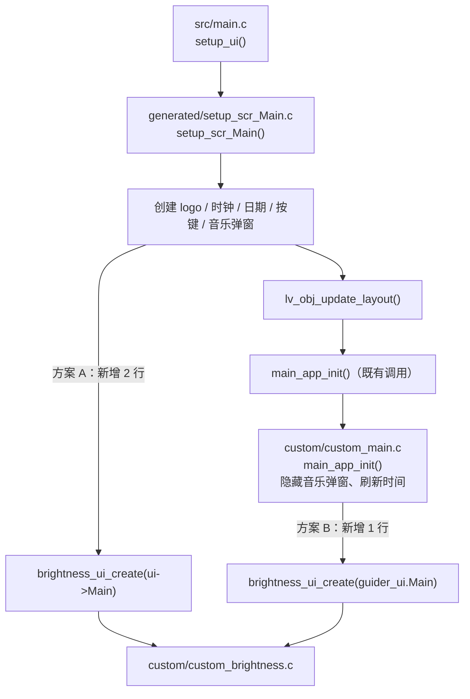

# Luckfox Pico LVGL Example — 主屏亮度滑条设计规格

- **日期**：2026-09-27
- **状态**：已落地，原生验证、独立评审与真机验证通过，验证证据见 plan
- **分支**：`cursor/brightness-slider-d537`
- **关联计划**：[`../plans/2026-09-27-lvgl-example-brightness-slider.md`](../plans/2026-09-27-lvgl-example-brightness-slider.md)。代码以仓库为准；plan 留 Task、证据与偏离。

## 1. 概述与目标

例程没有调节屏幕亮度的入口。本 spec 在主屏时钟下方加一条横向亮度滑条，拖动时经 sysfs 实时写背光，控件代码手写 LVGL，放在独立文件中。

目标：

- Luckfox Pico Ultra / Luckfox Pico Ultra W 的 Buildroot 固件上，主屏可拖动滑条在 10%–100% 间实时调节背光，拖到最左屏幕仍可见。
- 背光设备不存在时控件不出现，例程其余功能不受影响。
- 任何操作都不会把背光写成 0（黑屏）。

非目标：亮度持久化（重启回到固件默认 255）；设置页或弹窗；其他页面的亮度入口；外部改亮度后滑条自动同步；OFF 按钮行为；GUI Guider 存量代码的清理或授权处置。

## 2. 背景与依据

### 2.1 背光硬件与系统接口

- 设备树 `rv1106-luckfox-pico-ultra-ipc.dtsi`（Luckfox Pico Ultra 与 Luckfox Pico Ultra W 共用）定义 `backlight: backlight { compatible = "pwm-backlight"; pwms = <&pwm1 0 100000 50000>; brightness-levels = <0 1 … 255>; default-brightness-level = <255>; }`，PWM1 走 `pwm1m2_pins`。`brightness-levels` 是 0–255 的恒等表，sysfs 写入的级数即占空比 `n/255`。
- panel 节点不引用 `backlight`，DRM 不控制背光，用户态唯一接口是 `/sys/class/backlight/<name>/{brightness,max_brightness}`；`<name>` 取自 DT 节点名，预期为 `backlight`，`max_brightness` 预期为 255。
- 驱动为模块：`luckfox_rv1106_linux_defconfig` 中 `CONFIG_BACKLIGHT_PWM=m`。Ultra 的 Buildroot BoardConfig（`BoardConfig-EMMC-Buildroot-RV1106_Luckfox_Pico_Ultra-IPC.mk`）`RK_POST_OVERLAY` 含 `overlay-luckfox-buildroot-rgb`，其 `etc/init.d/S25backlight` 在后台 `sleep 1` 后 `insmod /oem/usr/ko/pwm_bl.ko`，故 sysfs 节点在开机约 1 s 后才出现。Ubuntu 用的 `overlay-luckfox-glibc-ultra` 无对应脚本，是否有节点未知。
- 写 0 即占空比 0，背光全灭；触摸仍工作但界面不可见，用户无法找回控件。
- sysfs 写入不跨重启，开机回到 `default-brightness-level` 255。写 `brightness` 需要 root，板上例程默认以 root 运行。

### 2.2 例程现状

- 界面由 NXP GUI Guider 导出（`generated/*.c` 文件头为 NXP 版权，`README_CN.md` 注明基于 GUI-Guider、LVGL 8.3）。仓库只有导出代码、没有 `.guiguider` 工程文件，且导出代码已被手改（`luckfox_*` 缩放封装、`setup_scr_Main.c` 按 `WIFI_ENABLE`/`MUSIC_ENABLE` 重排按键），重新导出会覆盖这些改动。
- 界面按 480×480 设计，`luckfox_get_drm_info()` 以 `SCALE = hdisplay / 480` 放大（720×720 屏为 1.5），只对经 `luckfox_lv_obj_set_pos/size`、`luckfox_lv_obj_set_style_text_font` 等封装设置的坐标、尺寸、字体生效。设备树 `display-timings` 默认 720×720；作者真机屏为 480×480（`SCALE = 1`），两种分辨率都在验证范围内。
- 主屏 480 坐标系占用：logo (60,118) 100×100；时钟 (220,115) 210×50；日期 (300,180) 115×30；底排按键 y=370、高 80，x 从 5 到 475 已占满。y≈220–360 为空。
- 主屏只创建一次：`gui_guider.c` 初始 `Main_del = true`，所有 `ui_load_scr_animation(…, auto_del=false)` 离开主屏时把 `Main_del` 置 `false`，返回时不再调用 `setup_scr_Main()`，控件与其状态常驻。
- `setup_scr_Main()` 末尾依次调用 `lv_obj_update_layout()`、`events_init_Main()`、`main_backend_init()`、`main_app_init()`；后两者定义在 `custom/custom_main.c`，是既有的手写挂载点。

### 2.3 GUI 工具的约束

- GUI Guider 免费，但 NXP 软件许可 §2.2 只授权「solely in combination with a NXP Product」开发 Authorized System；NXP AN13948 亦称其「free to use with NXP general purpose and crossover MCUs」。RV1106 为瑞芯微芯片，按条款字面不在授权范围，与个人或商用无关。最新 GUI Guider 2.0.1 面向 LVGL 9.4，LVGL 8.3 需 1.x；下载需 NXP 账号登录。
- SquareLine Studio 1.6.2 支持 LVGL 8.3.x 与 9.x，但只能打开自身工程文件，不能导入 GUI Guider 工程或既有 C 代码。与现有界面混用时：不能调用其 `ui_init()`（会设主题并加载首屏），只能单独调用 `ui_<Screen>_screen_init()` 再由现有按键 `lv_scr_load`；导出坐标为绝对像素，不经 `luckfox_*` 缩放，需按 720×720 设计或导出后改写；两边均用 `ui_` 前缀，需检查重名；导出目录需加入 `CMakeLists.txt` 的源文件与 include。免费版限非商用，并有屏幕数、控件数与分辨率上限（公开资料说法不一，含「≤480×480」一说），以官网为准。
- 新增界面代码因此手写 LVGL，放在不带 NXP 版权头的独立文件中。

### 2.4 验证中发现的两个既存缺陷（不在本 PR 修复）

- **`mpv` 启动失败时破坏父进程栈**：`custom/custom_musicplayer.c` 的 `music_player_thread_init()`（由 `custom_init()` 无条件调用）用 `vfork()` 启动 `mpv`，子进程在 `execlp("mpv", …)` 失败时执行 `return 0;`。POSIX 规定 `vfork()` 子进程从调用 `vfork()` 的函数返回属未定义行为；子进程与父进程共享地址空间与栈，返回会破坏父进程栈帧。系统无 `mpv` 时即触发：本机原生 harness 调用 `custom_init()` 时，5 个场景（含不创建亮度控件的 3 个）全部在进程退出时 `Segmentation fault`，不调用后全部正常退出。
- **板上固件带 `mpv`，上一条在真机不触发**：Ultra BoardConfig 的 `RK_BUILDROOT_DEFCONFIG=luckfox_pico_w_defconfig` 含 `BR2_PACKAGE_MPV=y`（连同 FFmpeg、ALSA、PulseAudio），`luckfox_pico_defconfig` 不含；SDK 另以 `sysdrv/tools/board/buildroot/mpv_patch/0002-change-j1.patch` 补齐 mpv 在 uClibc 工具链下缺失的数学函数。run 35115207257 的 Ultra artifact（`rootfs.img` 经 `SHA256SUMS` 校验 OK）用 `debugfs` 核实有 `/usr/bin/mpv`、`libmpv.so.1.109.0`、`libavcodec.so.58`、`libasound.so.2`，无 `opkg`/`apt` 等包管理器。故 `mpv` 只能在编译 SDK 时由 Buildroot defconfig 装入；烧录后在板上安装需自行用同一 uClibc 工具链交叉编译 mpv 及其依赖并手工拷贝，不作为支持路径。
- **时钟正午显示 AM**：`custom/custom_main.c` 的 `_time_update()`（主屏创建时与此后每 5 s 由 `main_time_update_timer` 调用）以 `tm_hour > 12` 判定下午：12:00–12:59 显示为 AM，0:00–0:59 显示为 `0:xx AM` 而非 `12:xx AM`，真机每天触发。每秒走字的 `clock_count_12()`（vendored `lib/lvgl/src/extra/widgets/dclock/lv_dclock.c`）在 11:59→12:00 切换 AM/PM、12→1 进位均正确，且 5 s 内会被 `_time_update()` 重新校准，修复只需改 `_time_update()`。

## 3. 需求

- FR1：主屏新增「Brightness」文字、百分比文字与横向滑条，规格见 §5.3。
- FR2：滑条范围 10–100（百分比），`LV_EVENT_VALUE_CHANGED` 时按 §5.2 换算后写 `brightness`，并更新百分比文字；换算结果与上次成功写入值（初值为创建时读到的 `brightness`）相同时跳过写入。
- FR3：控件创建时读当前 `brightness` 换算为滑条初值，低于 10 的显示为 10；创建时不写 sysfs。
- FR4：背光设备按 §5.2 查找；找不到或 `max_brightness` 不可用时不创建任何亮度控件，`printf` 一行区分原因的日志（§5.4）；可用时 `printf` 一行 `brightness: using <设备目录> (max <N>)`，供真机确认实际操作的设备。
- FR5：运行中写 `brightness` 失败时 `perror` 一次，之后同类失败不再打印；滑条值不回滚。
- FR6：背光目录由宏 `BACKLIGHT_SYSFS_DIR` 给出，默认 `"/sys/class/backlight"`，可在编译命令行覆盖。
- FR7：`AGENTS.md` 更正 uClibc 构建前提：只需按 CI 做法稀疏检出 `yuangezhizao/luckfox-pico@dev` 的 `tools/linux/toolchain`（约 233 MB）并设 `LUCKFOX_SDK_PATH`，Cloud Agent 容器内即可构建；产物可用 `qemu-user` 运行至打开 `/dev/dri/card0` 失败退出，作 ABI 与动态库冒烟；`qemu-user` 不在 `.cursor/Dockerfile` 中，需先 `apt-get update && apt-get install -y qemu-user`。
- NFR1：新增 `custom/custom_brightness.c`、`custom/custom_brightness.h`，不带 NXP 版权头；`custom/custom_main.c` 只增加一行 `#include "custom_brightness.h"` 与 `main_app_init()` 中一行 `brightness_ui_create(guider_ui.Main);`；不改 `custom/custom_musicplayer.c`、`generated/`、`CMakeLists.txt`（`custom/*.c` 已被 `file(GLOB)` 收录、`custom/` 已在 include 路径）、`src/main.c`、`lv_conf.h`、其他页面。
- NFR2：新代码不引入 `strcpy`/`strcat`/`sprintf`/`gets`；sysfs 读写用 stdio（`fopen`/`fgets`/`fprintf`，写入以 `fclose` 返回值判定成功），路径格式化用 `snprintf` 并检查截断，缓冲区长度由 `sizeof` 约束，数值解析用 `strtol` 并检查范围，只接受数字后紧跟 `\0` 或 `\n`（内核 sysfs 固定输出 `%d\n`，带尾随空格的手工假文件按非法处理）。不用 `open`/`read`/`write`：需要 `<fcntl.h>`，而 `custom.h`（提供 `luckfox_*` 缩放封装）已引入 `<linux/fcntl.h>`，两者同时包含会重复定义 `struct flock`；既有 `custom_main.c` 调用 `open()` 却未含 `<fcntl.h>`，交叉编译即报 `implicit declaration of function 'open'`，同源于此。C11 Annex K 的 `*_s` 函数在 glibc/uClibc 均不可用，不使用。
- NFR3：glibc 与 uClibc 两条 CI 行均须编译通过。

## 4. 设计决策

| 决策 | 结论 | 理由 |
|---|---|---|
| D1 控件形式与位置 | 主屏时钟下方空白区横向滑条 | 改动最小、一眼可见；底排已满，否决「设置页」（需第 6 个按键并重排）；否决角落按钮弹窗（多一步操作，当前只有亮度一项）；否决 `lv_arc` 旋钮（占地大、触摸精度差） |
| D2 最低亮度 | 滑条下限 10%，永不写 0 | 0 即黑屏且无法找回控件；本板真机实测 raw 25 为最暗可见、24 看不清（§6 第 4 步），10% 写 26，是写入值不低于 25 的最小整数百分比（9% 写 23；整数百分比每档约 2.55 级，写不出恰好 25）；关屏由 OFF 按钮负责。否决 5%（写 13，5%–9% 屏幕看不清）；否决把 1%–100% 重映射到 raw 25–255（阈值依屏而异，百分比也不再等于占空比）（Q3） |
| D3 持久化 | 不存文件，启动时读当前值 | YAGNI；sysfs 值在本次开机内保留，例程重启后滑条仍与实际亮度一致；跨重启的需求出现时再加文件持久化 |
| D4 设备缺失 | 不创建控件并打日志 | 与 WIFI 键在无 WiFi 时隐藏的既有做法一致；否决「显示但置灰」（会让人误以为可操作或是故障） |
| D5 设备查找 | 扫描 `BACKLIGHT_SYSFS_DIR` 取第一个非 `.` 开头项 | 不写死 `backlight` 节点名，兼容其他镜像命名；本板只有一个背光设备 |
| D6 代码位置 | 独立的 `custom/custom_brightness.c/.h`，在 `custom/custom_main.c` 的 `main_app_init()` 中挂载 | 隔离清楚、不修改 `lv_ui` 结构；`generated/` 不改；将来迁移到 SquareLine 或调整布局只需移动挂载行；新文件不带 NXP 版权头（§2.3）；否决挂在 `generated/setup_scr_Main.c`（Q10） |
| D7 写入时机 | 拖动中实时写，同值去重 | sysfs 写入开销可忽略，实时反馈最直观；否决「松手才写」 |
| D8 外观 | 高 20 的轨道加可见圆形拖动钮，主屏橙色 | 音量滑条式 8 高细条在 480 屏上只有 8 像素（720 屏约 12 像素），难以按中；橙色与主屏按键一致 |
| D9 GUI 工具 | 新界面手写 LVGL；不再用 GUI Guider 生成新界面；存量代码不动 | §2.3 的授权约束与缺失工程文件；SquareLine 混用可行但有 §2.3 所列限制，本 spec 不实施 |
| D10 既存缺陷 | §2.4 两处不在本 PR 修，移交后续修复 PR（音乐播放、主屏时间）；本 PR harness 绕开 `custom_init()` 完成验证 | 判据按 PR #5：只修本 PR 使其可达的缺陷；两处都不是亮度滑条引入的，也不阻塞本 PR 验证。全量扫描已规划音乐播放（同函数的启动健壮性、线程安全等）与主屏时间（tick 溢出、日历）两组修复，并入那里更内聚。否决「本 PR 顺带修」（Q11） |

## 5. 设计

### 5.1 结构

- `custom/custom_brightness.h`：只声明 `void brightness_ui_create(lv_obj_t *parent);`，包含 `lvgl.h`。
- `custom/custom_brightness.c`：
  - `static` 背光后端：查找设备、读 `max_brightness` 与 `brightness`、按百分比写入；保存设备目录、最大值、上次写入值与「已报错」标志。
  - `static` 事件回调：从 `lv_event_get_target()` 取滑条值，写入后更新作为 `user_data` 传入的百分比文字对象。
  - `brightness_ui_create()`：后端初始化失败即返回；否则创建三个控件并注册回调，最后把三者 `lv_obj_move_background()` 到父对象子列表最底层。LVGL 按子列表顺序绘制与命中测试，后创建者在上；`setup_scr_Main()` 先创建了「Can't find music!」弹窗 `Main_win_music`（点 MUSIC 且无音乐时显示），亮度控件无论挂在何处都晚于它，不下沉就会画在弹窗之上并可被拖动。主屏无其他控件与亮度控件区域重叠，下沉后只会被浮层遮盖；模块也无需引用 `Main_win_music`。
- `custom/custom_main.c`：加 `#include "custom_brightness.h"`，在 `main_app_init()` 中调用 `brightness_ui_create(guider_ui.Main);`。`main_app_init()` 由 `setup_scr_Main()` 在创建完全部控件、`lv_obj_update_layout()` 与 `events_init_Main()` 之后调用；主屏只创建一次（§2.2），控件只初始化一次。

### 5.2 数据流

- 查找：`opendir(BACKLIGHT_SYSFS_DIR)`，取第一个名字不以 `.` 开头的项作为设备目录；读 `<dir>/<name>/max_brightness`，解析为 1 到 `INT_MAX / 100`（21474836）的整数才算可用；上界只用于拒绝异常值（真实背光远小于此），换算的中间值 `raw × 100 + max / 2` 与 `pct × max + 50` 一律以 `long long` 计算：目标板 `long` 为 32 位，`max` 取上界时 `100 × 21474836 + 50` 已超过 `INT_MAX`。
- 读初值：读 `<dir>/<name>/brightness` 得 `raw` 并夹到 [0, max]，`pct = (raw × 100 + max / 2) / max`，夹到 [10, 100] 作为滑条初值与文字；读失败时按 100 显示（与固件默认 255 一致）。
- 写入：`raw = (pct × max + 50) / 100`，结果小于 1 时取 1（`max ≤ 4` 时 10% 会舍入为 0，`max = 1` 的 `gpio-backlight` 在 10%–49% 全为 0，违反 D2）；与上次成功写入值相同则跳过；否则以 `fopen(…, "w")` 写入十进制数值，sysfs 写入在 `fclose` 刷新缓冲时才真正发生，故以 `fprintf` 与 `fclose` 均成功判定写入成功。以 `max = 255` 为例，10% 对应 26，100% 对应 255；`max = 1` 时 10%–100% 均写 1。
- 所有读写都在 LVGL 主循环线程内同步完成，不新增线程或定时器。

### 5.3 UI 规格（480 设计坐标，经 `luckfox_*` 缩放）

| 元素 | 位置 / 尺寸 | 样式 |
|---|---|---|
| 「Brightness」文字 | (60, 245) | `lv_font_montserratMedium_16`，颜色 `0x5a5959` |
| 百分比文字 | (360, 245)，宽 60，右对齐 | 同上，内容如 `80%` |
| 滑条 | (60, 280)，360×20 | 轨道 `0xe0e0e0`，指示条 `0xff9600`，全圆角 |
| 拖动钮 | 滑条上 | 白底、`0xff9600` 描边的圆形，比轨道略大；外扩 6、描边 3 为物理像素不随 `SCALE` 缩放，与 `generated/` 既有控件的 pad/border 做法一致 |

```
+----------------------------------------+
|   [LOGO]        12:34 PM               |
|                       2026/09/27       |
|   Brightness                    80%    |   y≈245
|   [#################(O)-----------]    |   y≈280，x 60→420
| [WIFI][PAD][MUSIC][GIF][OFF]           |   y=370
+----------------------------------------+
```

### 5.4 错误处理

| 情况 | 行为 |
|---|---|
| `BACKLIGHT_SYSFS_DIR` 打不开、无有效项或路径拼接截断 | 不创建控件，`printf("brightness: no backlight device under %s, control hidden\n", BACKLIGHT_SYSFS_DIR)` |
| `max_brightness` 读不出、≤ 0 或超过 `INT_MAX / 100` | 不创建控件，`printf("brightness: invalid max_brightness in %s, control hidden\n", <设备目录>)` |
| 设备可用 | `printf("brightness: using %s (max %ld)\n", <设备目录>, max)` |
| `brightness` 读失败 | 控件照常创建，初值按 100 |
| 写 `brightness` 失败 | 首次 `perror`，之后静默；不回滚滑条 |

## 6. 验证（plan 执行时落地，此处只定判据）

1. 本机交叉编译与冒烟：
   - glibc：Cloud Agent 容器内 `cmake && make && make install` 成功，产物为 ELF32 ARM，`nm` 可见 `brightness_ui_create`。
   - uClibc：稀疏检出 `yuangezhizao/luckfox-pico@dev` 的 `tools/linux/toolchain`，设 `LUCKFOX_SDK_PATH` 后在仓库外的构建目录 `cmake && make` 成功；`readelf` 显示 ELF32 ARM、`NEEDED libc.so.0`、解释器 `/lib/ld-uClibc.so.0`，`nm` 可见 `brightness_ui_create`。
   - uClibc 冒烟：`qemu-arm -L <工具链 sysroot>`、`LD_LIBRARY_PATH` 指向 `lib/uclibc/{libdrm,libcjson}` 运行，须加载成功并执行到 `cannot open /dev/dri/card0` 后 `exit=1`；不以此判定界面或亮度功能。
2. 本机原生渲染：按 [`2026-07-24-lvgl-example-cloudagent-env-design.md`](2026-07-24-lvgl-example-cloudagent-env-design.md) §6.1 的方法编一个临时 harness（不入库），`-DBACKLIGHT_SYSFS_DIR` 指向临时目录下的假 `backlight/{brightness,max_brightness}`，分别以 480×480（`SCALE = 1`）与 720×720（`SCALE = 1.5`）输出主屏截图确认布局；harness 不调用 `custom_init()`（§2.4：容器无 `mpv` 时进程退出即段错误），自行设置 `main.c` 定义的 5 个全局量；并核对：初值随假 `brightness` 变化（含 0 显示为 10%）；程序化设置滑条值触发事件后假 `brightness` 为按 §5.2 换算的值；删掉假目录或写入非法 `max_brightness` 时控件不出现；`MUSIC_ENABLE=0` 时点 MUSIC 弹出的「Can't find music!」窗口完整盖住亮度控件，且在窗口上拖动不改变假 `brightness`。
3. CI：PR 上 `构建 Luckfox Pico LVGL 例程` 的 glibc 与 uClibc 两行均绿。CI 只在推送 `dev` 与 `pull_request` 时触发，功能分支推送不跑。
4. 真机（Luckfox Pico Ultra W，Buildroot，uClibc artifact）：
   - 前置采集：`ls /sys/class/backlight/`、`cat /sys/class/backlight/*/max_brightness`、`cat /sys/class/backlight/*/brightness`、`lsmod | grep pwm_bl`、`which mpv`（§2.4），结果回填 plan。
   - 功能：主屏出现滑条且不遮挡时钟、日期与底排按键；无音乐时点 MUSIC，弹窗盖住滑条；拖动时亮度连续变化、百分比同步；拖到最左屏幕仍可见；进出其他页面后滑条值保持。
   - 下限：用 `echo N > <using 行中的目录>/brightness` 找出最低可见值，须不高于 D2 下限对应的写入值；拖到最左仍可见。
   - 缺失：`rmmod pwm_bl` 后重启例程，控件不出现、串口有日志、其余功能正常。

## 7. 风险

| 风险 | 缓解 |
|---|---|
| 例程开机自启早于 `S25backlight` 的 `insmod`（后台 `sleep 1`） | 控件不出现但不崩溃；自启脚本排在 `S25` 之后并留出延时即可，不在本仓处理 |
| 低占空比下背光不可见 | D2 下限按本板实测阈值定为 10%；其他屏阈值不同时需重测并调整 `BRIGHTNESS_MIN_PCT` |
| Ubuntu 镜像无背光节点 | 按 D4 隐藏，不影响其他功能 |
| 外部改亮度后滑条与实际不一致 | 非目标；重启例程即重新读取 |
| 调暗后按 OFF 退出，背光停留在最后设置的亮度 | 属 D3 设计：sysfs 值在本次开机内保留、重启后回到 255，再次运行例程即可调节；真机已确认退出重进后滑条显示当前值 |

## 8. 待修问题（仅记录，本 PR 不修复）

- §2.4 `mpv` 缺陷：修法是子进程分支 `return 0;` 改为 `_exit(127);`。修法已验证：harness 调用 `custom_init()` 且无 `mpv`，修复前 `exit=139`，修复后 `exit=0`。
- §2.4 时钟缺陷：修法是 `_time_update()` 以 `tm_hour >= 12` 判 PM、小时取 `(tm_hour + 11) % 12 + 1`，`Main_digital_clock_1_meridiem` 以 `snprintf` 写入。修法已验证：以 `TZ` 设到本地 0、12、13 点，修复前 `0:00 AM`/`12:00 AM`/`1:00 PM`，修复后 `12:01 AM`/`12:01 PM`/`1:01 PM`。
- `music_player_thread_init()` 另有 `sleep(0.1)`（整型参数截断为 0）、`close(0)`（关闭父进程 stdin）、`strcpy(addr.sun_path, …)` 等既存问题；真机上无可见影响，留待另开 spec。
- 全量只读扫描另有 21 条发现（高 4、中 6、低 11），均不在本 PR 范围，按扫描报告分组另开修复 PR。

## 9. 文档与提交

| 文件 | 动作 | 何时 |
|---|---|---|
| `custom/custom_brightness.c/.h`、`custom/custom_main.c` | FR1–FR6 | `feat(custom)` 提交 |
| `AGENTS.md` | FR7 uClibc 构建前提与 qemu 冒烟 | 单独 `docs(agents)` 提交 |
| 本 spec 与关联 plan | 设计、验证证据、偏离 | PR 最后单个 `docs(superpowers)` 提交 |

## 10. QA（设计决策/约束澄清）

**Q1：当前 GUI 是用 SquareLine 设计的吗？以后能否用 SquareLine 继续设计？**
A：**不是，是 NXP GUI Guider 导出的代码；SquareLine 能用但不能导入现有界面。** 沿用 SquareLine 需在其中重画，或只为新页面混用并处理 §2.3 所列的 `ui_init()`、缩放、命名与授权问题。

**Q2：能否继续用 GUI Guider？**
A：**不再用它生成新界面（D9）。** 许可只授权配合 NXP 产品使用，RV1106 不在范围内；仓库也没有 `.guiguider` 工程文件，重新导出会覆盖手改代码（§2.2、§2.3）。存量代码本 spec 不处置。

**Q3：为什么滑条下限是 10%，而不是 0 或 5%？**
A：见 D2。

**Q4：为什么不记住亮度？**
A：见 D3。

**Q5：背光设备不存在时为什么隐藏而不是置灰？**
A：见 D4。

**Q6：为什么控件代码不写进 `generated/setup_scr_Main.c`？**
A：**隔离新代码、避开 NXP 版权头（D6）。** 控件代码在独立文件中，挂载只占 `custom/custom_main.c` 的两行，将来迁移或调整布局只动这两行；挂载点取舍见 Q10。

**Q7：验收怎么做？**
A：**云端原生渲染截图先对齐布局，真机为最终判据（§6）。** 截图不能代替真机，亮度效果与最低可见值只能在板上确认。

**Q8：PR 与文档提交如何安排？**
A：**提交序为 `feat(custom)` → `docs(agents)` → `docs(superpowers)`，与历史 PR 一致；spec 与 plan 为 PR 最后单个提交。**

**Q9：Cloud Agent 能否编译、运行 uClibc 版？能否用 QEMU 模拟 Buildroot 验证？**
A：**能编译，能以 `qemu-user` 冒烟，不做整机模拟。** 编译只需 CI 同款稀疏检出的工具链（约 233 MB，检出约 5 s、构建约 3 s），无需完整 SDK（FR7）。`qemu-arm` 用户态可加载 uClibc 解释器与 vendored `libdrm`/`libcjson` 并执行到打开 `/dev/dri/card0` 失败退出，证明 ABI 与动态库可用，但看不到界面。否决 QEMU 整机模拟：QEMU 无 RV1106 机型，SDK 内核与驱动为 RV1106 专用无法启动；改用通用 ARM Buildroot 加虚拟显卡与真机差异大；虚拟机无 `pwm-backlight`，亮度控件按 D4 隐藏，测不到本功能。分工为：界面看原生渲染预览（§6 第 2 步），uClibc 兼容性看本机编译、`qemu-user` 冒烟与 CI（§6 第 1、3 步），亮度效果与最低可见值只看真机（§6 第 4 步）。

**Q10：`brightness_ui_create()` 挂在 `generated/setup_scr_Main.c` 还是 `custom/custom_main.c` 的 `main_app_init()`？**
A：**挂在 `main_app_init()`（方案 B，D6）；`generated/` 不改。** 两处都只调用一次，主屏只创建一次（§2.2）：



| | 方案 A | 方案 B |
|---|---|---|
| 改动文件 | `generated/setup_scr_Main.c` | `custom/custom_main.c` |
| `generated/` 改动 | 2 行 | 无 |
| 可读性 | 主屏文件内直接可见 | 需跟进 `main_app_init()` |
| 显示与层级 | 相同：主屏尚未显示，LVGL 下一帧统一布局；层级由模块内 `lv_obj_move_background()` 保证（§5.1），与挂载点无关 | 同左 |

选 B 的依据：

- GUI Guider 的约定是每次导出覆盖 `generated/`、保留 `custom/`，手写代码本应放在 `custom/`。
- D9 已不再重新导出，`generated/` 视同冻结的导出物；往里加的改动越少，与上游 Luckfox 例程对比越容易。
- PR #5 同样约定不改 `generated/`。
- `main_app_init()` 本就是主屏的「应用初始化」挂载点，放在这里语义贴切。

不作为依据的三点：两处文件都带 NXP 版权头，授权上无差别；`generated/` 历史上已有手改（§2.2），「不改」是约定而非硬约束；两种方式显示效果相同，层级问题已在模块内解决。选 B 的代价只在可读性：读 `setup_scr_Main.c` 时看不到亮度调用。

**Q11：§2.4 两处既存缺陷为什么不在本 PR 修？**
A：**按 PR #5 的判据只修本 PR 使其可达的缺陷，两处都不满足（D10）。** PR #5 修 `wifi_backend_release()` 是因为恢复 WIFI 键使退出段错误变得可达；本 PR 的两处缺陷都不是亮度滑条引入的，`mpv` 缺陷只影响无 `mpv` 的原生 harness（绕开 `custom_init()` 即可），时钟缺陷与亮度无关。全量扫描已规划音乐播放与主屏时间两组修复 PR，两处分别并入，修法与对照证据见 §8。

## 11. 参考资料

- 设备树：https://github.com/yuangezhizao/luckfox-pico/blob/HEAD/sysdrv/source/kernel/arch/arm/boot/dts/rv1106-luckfox-pico-ultra-ipc.dtsi
- SDK：`sysdrv/source/kernel/arch/arm/configs/luckfox_rv1106_linux_defconfig`、`project/cfg/BoardConfig_IPC/BoardConfig-EMMC-Buildroot-RV1106_Luckfox_Pico_Ultra-IPC.mk`、`project/cfg/BoardConfig_IPC/overlay/overlay-luckfox-buildroot-rgb/etc/init.d/S25backlight`
- GUI Guider 许可：https://docs.mcuxpresso.nxp.com/guiguider/latest/About/LICENSE.html；AN13948：https://www.nxp.com/docs/en/application-note/AN13948.pdf；安装说明：https://docs.mcuxpresso.nxp.com/guiguider/latest/UG/getting_started.html
- SquareLine Studio 1.6.2：https://www.linkedin.com/posts/squareline-ltd_squarelinestudio-lvgl-embeddedgui-activity-7493579096501944320-9o9M
- 本仓 `generated/setup_scr_Main.c`、`generated/gui_guider.c`、`custom/custom_main.c`、`generated/setup_scr_Music_player.c`
