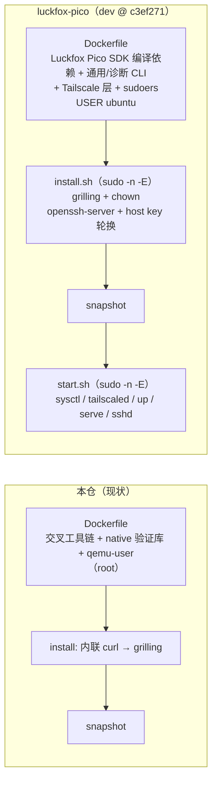
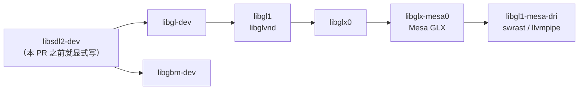
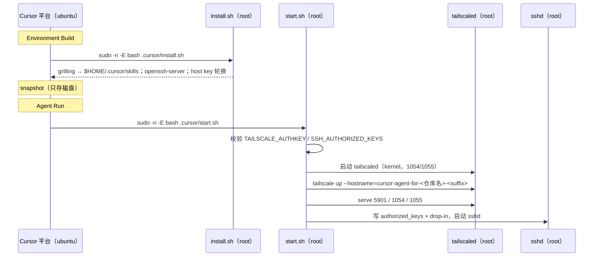
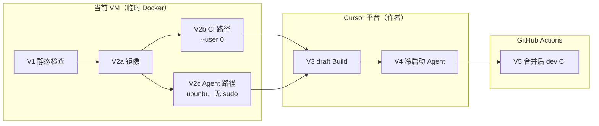

# Luckfox Pico LVGL Example — Cloud Agent 环境对齐 luckfox-pico 设计规格

- **日期**：2026-10-06
- **状态**：§10 QA 已闭合，10 轮 review 修订已并入（§11）；已按 [plan](../plans/2026-10-06-lvgl-example-cloudagent-align-luckfox-pico.md) 实施，V1–V4 通过，V5 待合并后 CI
- **分支**：`pi/cloudagent-align-luckfox-pico`（起点 `origin/dev` `a2fee6d`），PR [#9](https://github.com/yuangezhizao/luckfox_pico_lvgl_example/pull/9)
- **主题**：参考 luckfox-pico 的 Cloud Agent 配置，为本仓两份 Dockerfile 补齐常用 apt 包、新增 Tailscale、把默认运行用户从 root 改为 `ubuntu`，并把 `environment.json` 的 `install` / `start` 拆成两个脚本；Tailscale 主机名要能区分项目
- **参考实现**：[`yuangezhizao/luckfox-pico@c3ef271`](https://github.com/yuangezhizao/luckfox-pico/tree/c3ef271944ec2878d4f54216757f8c9acbe8e77c/.cursor) 的 `.cursor/`（`dev`，PR #11 合入后）
- **关联代码文件**：`.cursor/environment.json`、`.cursor/Dockerfile`、`.cursor/Dockerfile.luckfox_pico`、新增 `.cursor/install.sh`、`.cursor/start.sh`、`.github/workflows/build-luckfox-lvgl-demo.yml`、`AGENTS.md`
- **参考资料**：luckfox-pico 仓库的参考规格、本仓关联规格与外部文档见 §9

---

## 1. 概述与目标

本仓 Cloud Agent 环境（PR #1/#2/#3）只覆盖「交叉编译 + native 渲染验证」：镜像以 root 运行，`environment.json` 的 `install` 是一条内联 `curl`（grilling），没有 `start`。luckfox-pico 在 PR #8–#11 中已演进为：

1. Dockerfile 补装 `start.sh` 依赖与诊断 CLI（`iproute2` `jq` `tcpdump` `htop` `neofetch` 随 #8，`tree` 等 12 个随 #10；`vim` `file` `rsync` 等通用 CLI 是 #1 起就有的 luckfox-pico 依赖）；
2. 镜像安装 Tailscale，`start.sh` 每次 Agent Run 以 kernel 模式拉起 `tailscaled` 与 OpenSSH，可从 Mac 经 tailnet SSH / VNC 登录 Agent；
3. 镜像末尾 `USER ubuntu`，`install` / `start` 经 `sudo -n -E` 提权；
4. `install` / `start` 各自是 `.cursor/` 下的独立脚本。

本规格把这四项搬到本仓，并做一处有意偏离：Tailscale 主机名改为 `cursor-agent-for-<仓库名>-<bcId 前 8 位>`，使同一 tailnet 中能区分不同仓库的 Agent（§3.5）。

**不在本规格范围**：修改 luckfox-pico 仓（Q7：luckfox-pico 先不改）；E 类常用包（Q2b：记录在 §2.2，以后两仓一起补）；uClibc 工具链预装（Q1：以后另开 PR）；修改交叉编译 / 测试 / 业务代码；把 Docker 引擎写入 Dockerfile；Tailscale ACL；让 Agent 经 tailnet 直接部署到实体板（本规格只提供网络能力）。

**术语**：

- **本仓**：`yuangezhizao/luckfox_pico_lvgl_example`。
- **luckfox-pico 仓库**：`yuangezhizao/luckfox-pico`（Luckfox Pico SDK 的个人维护仓），本规格的参考对象。「luckfox-pico 08-30」「luckfox-pico 09-14」等指该仓 `docs/superpowers/specs/` 下对应日期的 spec（链接见 §9）。「Luckfox Pico SDK 编译依赖」指编译 luckfox-pico 本身所需的 apt 包。§10、§11 的问答与 review 原文保留当时的简称「luckfox-pico」，即 luckfox-pico 仓库。
- **活动 / 备选**：`.cursor/Dockerfile`（`environment.json` 当前引用）/ `.cursor/Dockerfile.luckfox_pico`（切换时改 `build.dockerfile`）。两仓都有这一对文件。
- **FROM**：Dockerfile 的基础镜像，均以 tag + digest 锁定；活动为 `ubuntu:24.04`，备选为 `luckfoxtech/luckfox_pico:1.0`。
- **bcId / suffix**：Cloud Agent 会话 ID（形如 `bc-<UUID>`）/ 该 UUID 的第一段（8 位十六进制），用作 Tailscale 主机名后缀。
- **A–E 类**：§2.2 对 apt 包的分组。

---

## 2. 现状对比

### 2.1 分层总览



| 维度 | 本仓现状 | luckfox-pico 现状 |
| --- | --- | --- |
| apt 清单 | 交叉工具链、cmake、build-essential、libdrm/libcjson/libsdl2-dev、pkg-config、qemu-user、git/sudo/curl/ca-certificates | Luckfox Pico SDK 编译依赖 + 通用 CLI + 诊断 CLI（§2.2） |
| Tailscale | 无 | 独立 `RUN`，官方 stable apt 源（活动 noble / 备选 jammy），不锁版本；kernel 模式 |
| 默认用户 | root | `USER ubuntu`（备选 FROM 先 `useradd`）；`/etc/sudoers.d/ubuntu` NOPASSWD |
| `environment.json` | `build` + 内联 `install` | `build` + `install: sudo -n -E bash .cursor/install.sh` + `start: sudo -n -E bash .cursor/start.sh` |
| OpenSSH | 无 | `install.sh` 装 `openssh-server`（不进公开层），stamp 控制 host key 一次性轮换；`start.sh` 写 `authorized_keys` 与 drop-in |
| Secrets | 无 | `TAILSCALE_AUTHKEY`、`SSH_AUTHORIZED_KEYS`（用户级，Q8） |
| Tailscale 主机名 | — | `cursor-agent-${agent_suffix}`（bcId 第一段） |
| Dockerfile 注释 | 07-26 口径（含 luckfox-pico 09-18 spec 已证伪的「每次启动跑桌面初始化脚本」） | 10-05 复核口径（Build 安装、Run 只启动） |
| CI 复用 `.cursor/Dockerfile` | 是（`build-demo`、`native-tests` 两个 job 以 `container:` 引用，无 `options`） | 是（`build-firmware` 加 `options: --user 0`） |

### 2.2 apt 清单对比（2026-10-06 实测）

**取证方式**：按 [Cursor 文档「运行 Docker」](https://cursor.com/cn/docs/cloud-agent/setup)在当前 VM 临时安装 Docker（`docker-ce 5:28.5.2`、`fuse-overlayfs`、`iptables-legacy`；未写入任何 Dockerfile），对两个锁定 digest 执行 `docker run --rm --entrypoint dpkg-query <image@digest> -W`，取状态 `ii` 的包：

| FROM | 系统 | 包数 | `ubuntu` 账户 |
| --- | --- | --- | --- |
| `ubuntu:24.04@sha256:4fbb8e6a…` | Ubuntu 24.04.4 LTS | 92 | 有（uid 1000） |
| `luckfoxtech/luckfox_pico:1.0@sha256:915d4458…` | Ubuntu 22.04.3 LTS | 366 | 无 |

包数与 luckfox-pico 08-30 plan 在 2026-09-06 的记录一致。四份 Dockerfile 显式包与各自 FROM 的交集：luckfox-pico 活动 55 个 / 备选 20 个、本仓活动 13 个均为空；**本仓备选 12 个中 `ca-certificates` `cmake` `pkg-config` 已在 FROM**（Q3）。

**写入规则**（沿用 luckfox-pico 08-30 §2.3.1）：需求集合里某包在 FROM 没有 → 显式写；FROM 已有 → 不写；不按平台 Aptfile 去重。下表「本仓目标」列即按此规则得出。

图例：FROM 列 ✅ 已有、➖ 没有；写入列 ✅ 显式写、➖ 不写、🆕 本次新增写入、❌ 本次删除。每格「活动 / 备选」。

| 分组 | 包 | FROM 24.04 | FROM luckfox | luckfox-pico 活动 / 备选 | 本仓现状 活动 / 备选 | 本仓目标 活动 / 备选 |
| --- | --- | --- | --- | --- | --- | --- |
| **相同** | `sudo` `curl` | ➖ | ➖ | ✅ / ✅ | ✅ / ✅ | ✅ / ✅ |
| **相同** | `ca-certificates` | ➖ | ✅ | ✅ / ➖ | ✅ / ✅ | ✅ / ❌ |
| **相同** | `cmake` `pkg-config` | ➖ | ✅ | ✅ / ➖ | ✅ / ✅ | ✅ / ❌ |
| **相同** | `git` | ➖ | ✅ | ✅ / ➖ | ✅ / ➖ | ✅ / ➖ |
| **本仓独有（保留）** | `gcc-arm-linux-gnueabihf` `g++-arm-linux-gnueabihf` `build-essential` `libdrm-dev` `libcjson-dev` `libsdl2-dev` `qemu-user` | ➖ | ➖ | ➖ / ➖ | ✅ / ✅ | ✅ / ✅ |
| **需补充 A**：`start.sh` 硬需 | `iproute2`（`ss`）`jq` | ➖ | ➖ | ✅ / ✅ | ➖ / ➖ | 🆕 / 🆕 |
| **需补充 B**：诊断 CLI | `htop` `neofetch` `tcpdump` `tree` `iftop` `iotop` `screen` `ncdu` `traceroute` `nmap` `ngrep` `conntrack` `psmisc` `fping` `dmidecode` | ➖ | ➖ | ✅ / ✅ | ➖ / ➖ | 🆕 / 🆕 |
| **需补充 C**：通用 CLI | `vim` `file` `rsync` `unzip` `wget` `xz-utils` `openssh-client` `openssl` | ➖ | ✅ | ✅ / ➖ | ➖ / ➖ | 🆕 / ➖ |
| **需补充 C**：通用 CLI | `locales` | ➖ | ➖ | ✅ / ✅ | ➖ / ➖ | 🆕 / 🆕 |
| **不对齐 D**：Luckfox Pico SDK 专属编译依赖 | `gcc-multilib` `g++-multilib` `bison` `flex` `texinfo` `libssl-dev` `gperf` `autoconf` `device-tree-compiler` `libncurses5-dev` `module-assistant` `expect` `fakeroot` `cpio` `bc` `gawk` `python-is-python3` | ➖ | ✅ | ✅ / ➖ | ➖ / ➖ | ➖ / ➖ |
| **不对齐 D**（已间接具备） | `make` `gcc` `g++` `patch` `bzip2` `perl` | ➖ | ✅ | ✅ / ➖ | ➖ / ➖ | ➖ / ➖（由 `build-essential` → `dpkg-dev` 拉入） |
| **E**：两仓都缺（Q2b：本次不装） | `iputils-ping` `bind9-dnsutils` `netcat-openbsd` `lsof` `strace` `gdb-multiarch` | ➖ | ➖ | ➖ / ➖ | ➖ / ➖ | ➖ / ➖ |
| **E**：两仓都缺（Q2b：本次不装） | `less` | ➖ | ✅ | ➖ / ➖ | ➖ / ➖ | ➖ / ➖ |

**E 类实测**（2026-10-06，两个 FROM 内 `apt-get update` 后 `apt-cache policy` / `show`）：

| 包 | 命令 | noble 候选（Section） | jammy 候选（Section） |
| --- | --- | --- | --- |
| `less` | `less` | 590-2ubuntu2.1（text） | 590-1ubuntu0.22.04.3（text），FROM 已有 |
| `iputils-ping` | `ping` | 3:20240117-1ubuntu0.1（net） | 3:20211215-1ubuntu0.1（net） |
| `bind9-dnsutils` | `dig` `nslookup` | 1:9.18.39-0ubuntu0.24.04.7（net） | 1:9.18.39-0ubuntu0.22.04.6（net） |
| `netcat-openbsd` | `nc` | 1.226-1ubuntu2（net） | 1.218-4ubuntu1（net） |
| `lsof` | `lsof` | 4.95.0-1build3（utils） | 4.93.2+dfsg-1.1build2（utils） |
| `strace` | `strace` | 6.8-0ubuntu2（utils） | 5.16-0ubuntu3（utils） |
| `gdb-multiarch` | `gdb-multiarch` | 15.1-1ubuntu1~24.04.1（universe/devel） | 12.1-0ubuntu1~22.04.2（universe/devel） |

`dnsutils` 在两个源中都只是 `Transitional package for bind9-dnsutils`（universe/net），若采用应写 `bind9-dnsutils`。当前 luckfox-pico Agent（同一 24.04 FROM + 平台 Aptfile）上这 7 个包均未安装，说明平台层也不带。

**E 类对本仓是否真有需要**（2026-10-06 核查）：本仓源码、`tests/`、CMake、CI workflow 与 README 均未调用这 7 个命令（`grep` 仅命中 libdrm 头文件注释与测试数据字符串）。CI 不需要它们，构建与测试也不依赖。逐个看交互排障价值：

| 包 | 用途 | 已有替代 | 对本仓的需要程度 |
| --- | --- | --- | --- |
| `less` | 分页器（`git log`、`man`） | Debian/Ubuntu 的 git 默认分页器是 `pager`，没有 `less` 时回落到 FROM 自带的 `more`（`util-linux`）；2026-10-06 在 24.04 FROM 中带 TTY 实测 `git log` 正常输出、退出 0 | 低 |
| `iputils-ping` | `ping` 板子 / tailnet 节点 | B 类 `fping` | 低 |
| `bind9-dnsutils` | `dig` 查 MagicDNS | `getent hosts`（FROM 自带）、`tailscale status` | 低 |
| `netcat-openbsd` | `nc` 测端口、调试 Unix 套接字 | B 类 `nmap`；音乐页的 `/tmp/mpvsocket` 已由 `tests/cases/music/` 用假 mpv 覆盖 | 低 |
| `lsof` | 查打开的文件与套接字 | A 类 `ss -p`、B 类 `psmisc` 的 `fuser` | 低 |
| `strace` | 跟踪 native harness（x86）的系统调用 | ARM 产物可用 `qemu-arm -strace`（noble 的 qemu-user 8.2.2 实测支持） | 中：只在排查 native 测试时有用 |
| `gdb-multiarch` | 配合 `qemu-arm -g <port>` 调试 32 位 ARM 产物，也能调 x86 | 无（镜像里连 `gdb` 都没有）；ASan/UBSan 已在 `tests/` 报告内存错误 | 中：只在需要断点调试时有用 |

结论：没有「缺了就做不成事」的包。网络类已被 A/B 覆盖；`strace` / `gdb-multiarch` 有调试价值，但属于按需工具，`ubuntu` 有免密 sudo，需要时 `sudo apt-get install` 即可。故本次不装（Q2b），留待两仓一起补。

### 2.3 Tailscale / 用户 / 脚本

luckfox-pico 的完整设计与实测见其 08-30、09-14 spec，本规格不复制，只列本仓落地时的差异点：

- **CI 复用镜像**：本仓 `build-demo` 与 `native-tests` 两个 job 都以 `.cursor/Dockerfile` 构建的镜像作 `container:`。加 `USER ubuntu` 后，两个 job 都必须 `options: --user 0`（luckfox-pico 只有 `build-firmware` 一个 job）。
- **CI 镜像标签取 `.cursor/Dockerfile` 内容哈希**：本 PR 改 Dockerfile，合并前 `build-image` 必然失败（AGENTS.md 已记录），CI 门禁只能在合并后的 `dev` push 上验证。
- **镜像体积**：Tailscale 层与 A/B/C 类包会进入 CI 镜像，CI 用不到；luckfox-pico 已接受同样取舍（同一 Dockerfile 服务两种用途）。
- **主机名**：luckfox-pico 写死 `cursor-agent-`，不同仓库的 Agent 在 tailnet 中无法区分（§3.5）。

### 2.4 平台 Aptfile 复核（2026-10-06）

在当前 luckfox-pico Agent 上：`/usr/local/share/vnc-desktop.Aptfile` sha256 `819987b7fef06af920bd9313347e05ca2fb0cd32ab4ad1e32a2a045238e4abb8`，58 个包名；平台工具包 `current.bundle-hash` 为 `c06a0611…`，均与 luckfox-pico 09-18 spec 记录一致。本仓注释框的包名与 Aptfile 逐一相同，分组也按 Aptfile 原文注释（2026-10-07 逐组比对：12 组的成员与顺序均与原文一致；此前 Mesa 被并入「桌面库」、「字体」组顺序与原文不同，均已改回，见 §2.5、Q13b）；luckfox-pico 注释框多出的 `google-chrome-stable` 由单独脚本安装、不在 Aptfile 中（注释已注明）。复核环境是 luckfox-pico 仓库的 Agent。平台工具包按内容寻址、与仓库无关，推断本仓环境相同，但未在本仓 Agent 上实测，由 V4 确认。

### 2.5 Mesa（平台 Aptfile 的软件渲染组，2026-10-07 实测）

[Mesa](https://docs.mesa3d.org/) 是 Linux 上 OpenGL / OpenGL ES / EGL / Vulkan 等图形 API 的开源实现，既带各家 GPU 的硬件驱动，也带纯 CPU 的软件光栅化器。Cloud Agent 没有 GPU，能用的只有软件光栅化器 [llvmpipe](https://docs.mesa3d.org/drivers/llvmpipe.html)：它用 LLVM 在运行时把着色器和光栅化编译成 x86-64 机器码，多线程执行，是 Mesa 最快的软件光栅化器。

平台 Aptfile 把下列 3 个包单列为一组，原文注释是 `# Mesa software rendering for WebGL`，用途是让 VNC 桌面里的 Chrome 在无 GPU 时也能跑 WebGL。luckfox-pico 10-05 注释框把这一组并进了「桌面库」，本仓照抄后与原文分组不一致；2026-10-07 起两份 Dockerfile 恢复单独的 Mesa 行。

| 包 | 源码包 | 作用 | 活动 / 备选镜像中的来源 |
| --- | --- | --- | --- |
| `libgl1` | libglvnd | `libGL.so.1`：厂商无关的 OpenGL 入口，按 GLX 厂商把调用分发给具体实现 | `libsdl2-dev` 依赖链 |
| `libglx-mesa0` | mesa | `libGLX_mesa.so.0`：Mesa 的 GLX 实现，由 libglvnd 分发到这里 | 同上 |
| `libgl1-mesa-dri` | mesa | DRI 驱动目录 `dri/`，含 `swrast_dri.so`（软件渲染入口）；Mesa 25 起各驱动只是指向 `libdril_dri.so` 的链接，实际代码在 `libgallium-*.so` | 同上 |
| `libgbm-dev`（在「桌面库」组） | mesa | GBM（Generic Buffer Management），DRM 设备上分配显存缓冲 | `libsdl2-dev` 直接依赖 |



两份 FROM 都没有这 3 个包和 `libgbm-dev`（dpkg 实测），它们都由本 PR 之前就显式写的 `libsdl2-dev` 经上图依赖链带入；活动为 Mesa 25.2.8（LLVM 20），备选为 Mesa 23.2.1（LLVM 15）。所以本仓镜像在平台按 Aptfile 安装之前就已有这些包，平台那一步对它们是空操作。按 §2.2 写入规则它们不进需求集合（本仓只直接需要 `libsdl2-dev`），**不显式写**。

本仓何时用到 Mesa（容器挂载宿主 X 显示 `:1` 与授权，`LD_DEBUG=libs` 观察 `preview` 加载的库）：

| 场景 | 是否加载 Mesa | 说明 |
| --- | --- | --- |
| `ctest`、`screenshots` | ➖ | headless，写内存帧缓冲，不碰 SDL / OpenGL |
| `preview`（默认） | ✅ | 窗口正常；活动加载 `libGLX_mesa` + `libgallium` + `libLLVM.so.20`，备选加载 `libGLX_mesa` + `swrast_dri.so` + `libLLVM-15` |
| `preview`，`SDL_FRAMEBUFFER_ACCELERATION=0` | ➖ | 窗口同样正常 |
| 显式申请 OpenGL 上下文 | ✅ | `GL_RENDERER=llvmpipe (LLVM 20.1.2, 256 bits)`，`GL_VERSION=4.5 Mesa 25.2.8` |
| 板上运行 | ➖ | 走 DRM / fbdev，与 Mesa 无关 |

`preview` 代码里请求的是 `SDL_RENDERER_SOFTWARE`，但 SDL 默认会用 3D 渲染器加速窗口表面（[`SDL_HINT_FRAMEBUFFER_ACCELERATION`](https://wiki.libsdl.org/SDL2/SDL_HINT_FRAMEBUFFER_ACCELERATION)：「By default SDL tries to make a best guess for each platform」），在 X11 上即经 GLX 走 Mesa llvmpipe 把画面送上窗口。设为 `0` 可完全绕开 Mesa，因此 Mesa 对本仓是**用得上、但非必需**的依赖。

---

## 3. 设计（以 §10 QA 结论为准）

### 3.1 apt 取舍

- **需求集合**：§2.2 的「相同」「本仓独有」+ A + B + C；D 不对齐；E 本次不装（Q2b）。
- **写入集合**：按 §2.2「本仓目标」列。备选删去 FROM 已有的 `ca-certificates` `cmake` `pkg-config`（Q3）。
- **约束**：`--no-install-recommends`；不锁版本；禁止写 `which` / `gnu-which` / `conntrack-tools` / `conntrackd` / `iotop-c` / `dnsutils`（前五者理由见 luckfox-pico 08-30 §2.3.1、09-16 §2.2；`dnsutils` 为过渡包）。
- 所有 apt `RUN` 位于 `USER ubuntu` 之前。
- **排列**（2026-10-07 作者追加）：apt 包按本节分类分组，顺序为本仓构建依赖（基础工具、平台引导、ARM 交叉工具链、构建系统、native 验证、32 位运行）→ A → B → C；每组前一行 `# 组名`（续行内注释，构建前被删除），组内字母序。apt 注释段的条目顺序与分组一致，`tcpdump` 归入 B 类。理由与否决方案见 plan P9。

### 3.2 Tailscale 层

与 luckfox-pico 相同（Q5）：独立 `RUN`，官方 stable 源（活动 `noble`、备选 `jammy`）的 keyring 与 list，`apt-get install -y --no-install-recommends tailscale`，不锁版本；build 期不 `tailscale up`。kernel 模式（不带 `--tun=userspace-networking`），偏离 Cursor 官方推荐的 userspace 模式，理由与实测见 luckfox-pico 08-30 §2.1。Serve 5901 / 1054 / 1055。

### 3.3 ubuntu 用户

与 luckfox-pico 09-14 相同：

- 两份 Dockerfile 在全部 `RUN` 之后 `USER ubuntu`；备选 FROM 实测无该账户（§2.2），`USER` 前 `id -u ubuntu >/dev/null 2>&1 || useradd --create-home --shell /bin/bash ubuntu`。该 FROM 没有 uid ≥ 1000 的账户，2026-10-06 实测 `useradd` 得到 uid 1000，与活动镜像一致（只有组 `ubuntu`，无附加组；免密 sudo 靠 sudoers）。
- `/etc/sudoers.d/ubuntu` 写 `ubuntu ALL=(ALL) NOPASSWD:ALL`，`visudo -cf` 校验。
- `environment.json` 不写 `user` 键；身份只来自镜像 `USER`。
- 不设密码、不 `chpasswd`（Cursor 文档 Docker 示例中的 `chpasswd` 不采用）。

### 3.4 environment.json / install.sh / start.sh

```json
{
  "build": {
    "dockerfile": "Dockerfile",
    "context": ".."
  },
  "install": "sudo -n -E bash .cursor/install.sh",
  "start": "sudo -n -E bash .cursor/start.sh"
}
```

- **`install.sh`**：与 luckfox-pico 逐字相同——grilling（pin `85f83d3`，与本仓现有 `install` 的 curl 参数一致）+ `chown -R ubuntu:ubuntu "$HOME/.cursor/skills"`；`openssh-server`（`--force-confold`）；无 stamp 时轮换 host key。
- **`start.sh`**：与 luckfox-pico 只差主机名相关的 2 行（§3.5：`set -euo pipefail` 之后新增 `repo_slug="luckfox-pico-lvgl-example"`；`--hostname` 改为 `"cursor-agent-for-${repo_slug}-${agent_suffix}"`），其余逐字相同，含 `--advertise-routes=172.30.0.0/24 --advertise-exit-node`（Q6）：Secret 校验 → bcId（最多 30 s）→ sysctl forwarding → `tailscaled`（1054/1055）→ LocalAPI 就绪（最多 30 s）→ `tailscale up` → serve 5901/1054/1055 → `authorized_keys` → sshd drop-in 与启动。
- **逐字相同的理由**：两仓脚本以后可以直接 `diff` 对照、互相移植修复。



### 3.5 主机名区分项目

luckfox-pico `start.sh` 第 80 行：`--hostname="cursor-agent-${agent_suffix}"`。bcId 本身唯一，不同仓库的 Agent 不会撞名，但在 Admin Console / `tailscale status` 中看不出属于哪个仓库。采用 `cursor-agent-for-<仓库名>-<suffix>`（Q7、Q7c），本仓即 `cursor-agent-for-luckfox-pico-lvgl-example-<suffix>`。

**约束（实测 / 源码）**：

- `tailscale up` 对 `--hostname` 调 `dnsname.ValidHostname`（源码取 main `edf8abd`，2026-10-05；当前 luckfox-pico Agent 上的 tailscale 为 1.102.4，本仓镜像会装当时的 stable）：每段只允许字母、数字、`-`，首尾须为字母或数字，最长 63 字节；**不合法直接报错，不会自动改写**。仓库名 `luckfox_pico_lvgl_example` 含 `_`，原样写入会让 `tailscale up` 失败、`start.sh` fail-fast 退出。故写成 `luckfox-pico-lvgl-example`。
- 长度：`cursor-agent-for-luckfox-pico-lvgl-example-ec4c6f44` 为 51 字节；同名冲突时 Tailscale 追加的 `-1` 后缀只影响 MagicDNS 名，仍在 63 以内。
- 仓库名不宜在运行时由目录名推导：Cloud Agent 的检出目录是 `/workspace`（luckfox-pico Agent 实测），`basename` 得到的是 `workspace`。
- 仓库名写死在 `start.sh` 顶部变量（`repo_slug="luckfox-pico-lvgl-example"`），不在运行时从 `git remote get-url origin` 解析（Q7b）：后者要处理带令牌的 URL、SSH 写法、`.git` 后缀与下划线，收益只是两仓脚本完全相同。

**前缀选择**（Q7c）：

| 前缀 | 本仓全名（字节） | luckfox-pico 若改（字节） | 63 字节下仓库名余量 | 评价 |
| --- | --- | --- | --- | --- |
| `cursor-agent-for-`（采用） | `cursor-agent-for-luckfox-pico-lvgl-example-ec4c6f44`（51，冲突 `-1` 后 53） | 38 | 35 | 与 luckfox-pico 现有 `cursor-agent-*` 同前缀，按前缀过滤仍能列出全部 Agent；长度适中 |
| `cursor-cloud-agent-for-` | 57（冲突后 59） | 44 | 29 | 与官方产品名 Cloud Agent 一致，但最长，离 63 只剩 4 字节；与 luckfox-pico 现有前缀不同 |
| `cursor-for-` | 45（冲突后 47） | 32 | 41 | 最短，但丢了 agent 语义，容易误读为「装了 Cursor 的某台开发机」；与 luckfox-pico 现有前缀不同 |

「余量」= 63 − 前缀 − `-` − 8 位 suffix − 冲突后缀 `-1`。`for` 的用法符合英语「名词 + for + 对象」（如 *Copilot for Microsoft 365*），读作「给该仓库用的 Cursor Agent」。

注：当前 luckfox-pico Agent 上实测 `Self.HostName=cursor-agent-ec4c6f44`，而 `DNSName=cursor-agent-ec4c6f44-1.…`，说明同名节点冲突后 Tailscale 自动加了 `-1` 且不会回退（[Machine names](https://tailscale.com/docs/concepts/machine-names)）。成因不在本规格范围，记入 §7。

### 3.6 CI

`.github/workflows/build-luckfox-lvgl-demo.yml` 的 `build-demo` 与 `native-tests` 两个 `container:` 都加 `options: --user 0`，并在其上加与 luckfox-pico `build-luckfox-pico-firmware.yml` 第 151 行**完全一致**的注释（Q9）：

```yaml
      # 镜像末尾 USER ubuntu（Cloud Agent）；Actions 要求 job 容器为超级用户（官方文档写 root）。用 --user 0（数字 uid）覆盖，不用 --user root（按 passwd 名解析）。https://docs.github.com/en/actions/reference/workflows-and-actions/dockerfile-support#user
      options: --user 0
```

`build-image` 不变。

### 3.7 Dockerfile 注释与文档

- 保留本仓已有的 `ARG DEBIAN_FRONTEND=noninteractive`（两份）与活动的 `ENV TZ=Asia/Shanghai`、备选「刻意不设 TZ」的说明。luckfox-pico 备选没有 `ARG DEBIAN_FRONTEND`，这是本仓有意保留的差异，不因对齐而删除。
- 两份 Dockerfile 的顶部说明与平台 Aptfile 注释框改为 luckfox-pico 10-05 口径（Build 期安装、Run 只启动桌面；去掉无依据的「每次启动」说法；补「浏览器：google-chrome-stable（单独脚本安装）」一行；分组按 Aptfile 原文注释，Mesa 单列一行，不照抄 luckfox-pico 的并入「桌面库」，并注明本镜像已由 `libsdl2-dev` 带入 Mesa，见 §2.5），复核日期更新为 **2026-10-06**（Q4，见 §2.4），并如实写明复核环境是 luckfox-pico 仓的 Agent（自建 Ubuntu 24.04 镜像）；备选 Dockerfile 沿用 luckfox-pico 备选的写法，注明「本备选镜像未重新构建」。保留本仓特有说明（工具链在镜像内安装、qemu-user 与 CI 标签哈希等）。apt 注释改为 luckfox-pico 的「只看 FROM dpkg」口径并引用 §2.2 的 2026-10-06 实测。
- `AGENTS.md` 的 Cloud Agent 小节：更新当前活动 / 备选 Dockerfile 的描述、grilling 改由 `install.sh` 写入、新增 `ubuntu` 用户 / Tailscale / Secrets 一句话、CI `--user 0`；参照 luckfox-pico AGENTS.md 加一句：要对锁定 digest 做 `dpkg-query` 时按 Cursor 文档临时安装 Docker，禁止写入 Dockerfile，遇 `/etc/fuse.conf` 的 conffile 提问用 `dpkg --force-confold --configure -a`。不复制端口表。
- 本仓既有 spec：07-24（§5.2 `environment.json`、`install` 口径）、09-20（`install` 为内联 curl）、09-21（CI job 运行用户）各加一处指向本规格的说明，不改写历史结论。

---

## 4. 需求

### 4.1 功能需求

| 编号 | 需求 |
| --- | --- |
| F1 | 两份 Dockerfile 的 apt 写入集合与 §2.2「本仓目标」列一致，最后非空指令为 `USER ubuntu` |
| F2 | 两份 Dockerfile 含 Tailscale 层（§3.2）与 `/etc/sudoers.d/ubuntu`；备选在 `USER` 前有 `useradd` 回退 |
| F3 | `environment.json` 与 §3.4 逐字相同，无 `user` 键 |
| F4 | `install.sh` 与 luckfox-pico 逐字相同；`start.sh` 与 luckfox-pico 只差 §3.4 所列 2 行 |
| F5 | CI 两个 `container:` 均 `options: --user 0`，注释与 luckfox-pico 逐字相同 |
| F6 | 冷启动 Agent：`whoami=ubuntu`、工作区属主 `ubuntu:ubuntu`；`start` 退出 0；tailnet 主机名为 `cursor-agent-for-luckfox-pico-lvgl-example-<suffix>` |
| F7 | 交叉编译（glibc / uClibc）与 `tests/` 在 `ubuntu` 用户下无需 `sudo` 即可通过 |

### 4.2 非功能需求

| 编号 | 需求 |
| --- | --- |
| N1 | 不引入明文密码 / `chpasswd`；本仓 Dockerfile 层不安装 `openssh-server`、不新增 host key。备选 FROM 的公开层自带 6 个 `ssh_host_*` 与 `PermitRootLogin yes`（2026-10-06 实测），前者由 `install.sh` 在私有快照中轮换，后者由 `start.sh` 的 drop-in 覆盖（`Include` 在前，先匹配生效；luckfox-pico 08-30 §2.3–§2.4） |
| N2 | 不改交叉编译、测试与业务代码 |
| N3 | Secret 值不出现在日志（禁止 `set -x`） |

---

## 5. 验证策略

V2a–V2c 合称 V2。



| 编号 | 方式 | 执行人 | 通过标准 |
| --- | --- | --- | --- |
| V1 | 静态 | Agent | `environment.json` 解析后与 §3.4 相等、无 `user` 键（F3）；`bash -n` 两个脚本；`diff` 与 luckfox-pico 脚本：`install.sh` 无差异，`start.sh` 只有 §3.4 所列 2 行（F4）；主机名匹配 `^[a-z0-9]([a-z0-9-]{0,61}[a-z0-9])?$`（`ValidHostname` 规则）；两份 Dockerfile 最后非空指令为 `USER ubuntu`、备选 `useradd` 在其前、均不含 `openssh-server` / `chpasswd`（F1、F2、N1）；workflow 两个 `container:` 均有 `options: --user 0`，其上注释与 luckfox-pico 第 151 行逐字相同（F5）；`git diff --stat origin/dev` 只涉及 `.cursor/`、workflow、`AGENTS.md`、`docs/`（N2）；脚本不含 `set -x`（N3） |
| V2a | 本地嵌套 Docker（按 Cursor 文档临时安装，不写入 Dockerfile）：镜像 | Agent | 两份 Dockerfile 均可 `docker build`；`docker run` 默认 `whoami=ubuntu`、uid 1000、`sudo -n whoami` 为 `root`；`dpkg-query -W` 覆盖 §2.2 目标包；`command -v tailscale tailscaled jq ss`；活动镜像无 `/etc/ssh/ssh_host_*`（N1）；记录改动前后镜像体积 |
| V2b | 同上：CI 路径 | Agent | `--user 0` 下按 CI 步骤完成 glibc 交叉编译（`make install`）、uClibc 交叉编译与 `ctest` |
| V2c | 同上：Agent 路径（F7） | Agent | 以默认用户 `ubuntu` 挂载工作区，不用 `sudo` 完成 glibc / uClibc 交叉编译与 `ctest` |
| V3 | draft Environment Build（`refs` 指向本分支） | 作者 | Build `SUCCEEDED`，`install` 退出 0 |
| V4 | 从该 Build 冷启动的 Agent | 作者 | F6、F7；`tailscale status` 显示新主机名；Mac 可 `ssh ubuntu@<主机名>`；`ip -4 -o addr` 的主网卡在 `172.30.0.0/24` 内（宣告的子网路由与实际 Pod 网段一致）；`/usr/local/share/vnc-desktop.Aptfile` 的 sha256 为 `819987b7…`（与 §2.4 一致，证实注释框适用于本仓环境） |
| V5 | 合并后 `dev` push 的 CI | 自动 | `build-image` 重建并签名，`build-demo` ×2 与 `native-tests` 通过 |

V2 环境准备备注：照 Cursor 文档命令装 Docker 时，`fuse3` 会在 `/etc/fuse.conf` 的 conffile 提问处中断（平台为 agent-store FUSE 预写了 `user_allow_other`），需 `dpkg --force-confold --configure -a` 保留现有文件。

---

## 6. 风险

| 风险 | 缓解 |
| --- | --- |
| 主机名含 `_` 或超 63 字节，`tailscale up` 报错 | 写死 `luckfox-pico-lvgl-example`；V1 用 `ValidHostname` 规则校验 |
| 合并前 PR 的 `build-image` 失败 | 已知行为（AGENTS.md）；以 V2 本地构建 + V5 合并后 CI 覆盖 |
| CI 漏加 `--user 0` | 两个 job 都改；V1 静态检查两个 `container:`，V2b 按 CI 步骤以 `--user 0` 复现 |
| 两仓 Agent 都宣告 `172.30.0.0/24` | 同一时间只批准一个（luckfox-pico 08-30 §2.7） |
| CI 镜像构建新增对 `pkgs.tailscale.com` 的依赖，源不可达时 `build-image` 失败 | 与 luckfox-pico 相同取舍；失败可重跑，不影响已签名镜像的复用 |
| 旧 Build 仍是 root | 验收必须用指向本分支的 draft Build。新 Agent 默认从活跃 Build warm fork，草稿须在启动时显式选择：2026-10-07 第一次 V4 Run 未选中，落在旧 Build 上（plan P7） |
| `install.sh` 失败（`raw.githubusercontent.com` / apt 源不可达等） | Build 失败；按 [Cursor 文档](https://cursor.com/cn/docs/cloud-agent/setup)，失败的 Build 不替换当前活跃 Build，Agent 仍从上一个成功的 Build 启动 |
| `start.sh` 失败（Secret 缺失、`tailscale up` 失败、LocalAPI 超时等） | fail-fast，不留下半初始化的服务；`/tmp/cursor/start-user/start-user.status` 非 0。luckfox-pico 实测（08-30 plan，Run `bc-5ca5fe8a`）此时 Agent 仍照常启动、可正常编码，只是没有 tailnet / SSH 远程接入 |
| 平台 `start` 执行的是 Build 快照里的 `start.sh`，之后才检出目标分支（luckfox-pico 08-30 §2.5「平台 `start` 工作树」） | 分支上对 `start.sh` 的修改，只有进入新 Build 后才会生效；验收与合并后都要从含本变更的 Build 另起 Agent |

---

## 7. 已知边界

- 主机名 `-1` 后缀：同名节点冲突后 Tailscale 不回退（§3.5 注）。本规格只改命名，不处理节点状态持久化。
- 密钥有效期沿用 luckfox-pico 08-30 §2.5：用户级 `TAILSCALE_AUTHKEY` 最长 90 天，过期后新 Agent 的 `tailscale up` 失败（后果见 §6 `start.sh` 失败一行），需生成新 key 并更新 Secret；已认证节点的 node key 默认 180 天到期。两仓共用同一把 key，一次轮换同时影响两仓。
- kernel 模式与 exit node 宣告不在 Cursor 官方支持范围（luckfox-pico 08-30 §2.1、§2.7）。
- tailnet 端口暴露沿用 luckfox-pico 08-30 §2.8 的接受范围：不配 Tailscale ACL；kernel 模式下所有监听 `0.0.0.0` 的端口（如 exec-daemon 的 26053–26055，以及有人启动 Docker 时的 2375）对获准连接本节点的 tailnet 设备可达；1054/1055 经 Serve 可被当作 Agent 的网络代理。信任边界变化时再补 ACL / grants。
- 子网路由 `172.30.0.0/24` 沿用 luckfox-pico 的实测值（2026-10-06 当前 luckfox-pico Agent 仍为 `enp0s3 172.30.0.2/24`）；本仓 Agent 的 Pod 网段由 V4 确认，若不同则宣告的路由无效，但不影响 SSH / VNC 入站。
- `install.sh` 依赖平台预先建好 `ubuntu:ubuntu 755` 的 `~/.cursor`：`curl --create-dirs` 以 root 新建的父目录为 `750 root:root`，`chown` 只覆盖 `~/.cursor/skills`（与 luckfox-pico 09-14 spec 的记录一致；当前 VM 实测 `~/.cursor` 为 `755 ubuntu:ubuntu`）。裸 `docker run` 没有这一步，grilling 会不可读，故 V2 本地运行前先以 `ubuntu` 建该目录；V4 已在平台确认 `~/.cursor` 为 `755 ubuntu:ubuntu`、grilling 属主 `ubuntu:ubuntu`；若平台以后不再预建该目录，需两仓一起把 `chown` 目标提到 `$HOME/.cursor`。
- 备选 Dockerfile 不做 Environment Build 验证（与 luckfox-pico 09-18 一致），只做 V2 本地构建。

---

## 8. 提交与 PR

- 分支 `pi/cloudagent-align-luckfox-pico`，草稿 PR #9，base `dev`。
- 先推送 spec / plan 文档；实现完成后 `git rebase -i` 整理为：实现提交在前（按 Dockerfile / 脚本与 JSON / CI / 文档拆分），spec + plan 单个提交在最后。
- 提交信息遵循 cz-conventional-emoji；身份为 `Cursor Agent <cursoragent@cursor.com>`，SSH 签名。
- plan 随 spec 先行提交；代码入库后精简 plan：已入库的 Task 只留落地文件指针与勾选，不重复仓库正文，保留未入库的部分（V3/V4 待作者执行项、实测证据、偏离记录）。
- 实现完成后更新 PR #9 正文：改动一览、V1–V2 实测、V3/V4 待作者执行、合并后须知（CI 镜像重建、需从新 Build 另起 Agent）。

---

## 9. 参考资料

luckfox-pico 仓库（均取 `c3ef271`，即 `dev` 合入 PR #11 后）：

- 参考实现 `.cursor/`（`environment.json`、`install.sh`、`start.sh`、两份 Dockerfile）：https://github.com/yuangezhizao/luckfox-pico/tree/c3ef271944ec2878d4f54216757f8c9acbe8e77c/.cursor
- 08-30 spec（Tailscale / OpenSSH / install·start 分工）：https://github.com/yuangezhizao/luckfox-pico/blob/c3ef271944ec2878d4f54216757f8c9acbe8e77c/docs/superpowers/specs/2026-08-30-luckfox-cloudagent-tailscale-design.md
- 09-14 spec（`USER ubuntu` 与 `sudo -n -E`）：https://github.com/yuangezhizao/luckfox-pico/blob/c3ef271944ec2878d4f54216757f8c9acbe8e77c/docs/superpowers/specs/2026-09-14-luckfox-cloudagent-default-user-design.md
- 09-16 spec（诊断 CLI）：https://github.com/yuangezhizao/luckfox-pico/blob/c3ef271944ec2878d4f54216757f8c9acbe8e77c/docs/superpowers/specs/2026-09-16-luckfox-cloudagent-diagnostic-cli-design.md
- 09-18 spec（平台安装与 Build / Run 分层）：https://github.com/yuangezhizao/luckfox-pico/blob/c3ef271944ec2878d4f54216757f8c9acbe8e77c/docs/superpowers/specs/2026-09-18-luckfox-cloudagent-platform-install-design.md
- 固件 CI workflow 第 151 行（本仓 CI `--user 0` 注释的来源，§3.6）：https://github.com/yuangezhizao/luckfox-pico/blob/c3ef271944ec2878d4f54216757f8c9acbe8e77c/.github/workflows/build-luckfox-pico-firmware.yml#L151

本仓：

- 实施计划（Task、证据、偏离与附录验证脚本）：[`../plans/2026-10-06-lvgl-example-cloudagent-align-luckfox-pico.md`](../plans/2026-10-06-lvgl-example-cloudagent-align-luckfox-pico.md)
- 关联规格：[`2026-07-24-lvgl-example-cloudagent-env-design.md`](2026-07-24-lvgl-example-cloudagent-env-design.md)（Dockerfile 模式环境）、[`2026-09-20-lvgl-example-grilling-skill-design.md`](2026-09-20-lvgl-example-grilling-skill-design.md)（grilling 安装）、[`2026-09-21-lvgl-example-github-actions-ci-design.md`](2026-09-21-lvgl-example-github-actions-ci-design.md)（CI job 运行用户）
- PR：https://github.com/yuangezhizao/luckfox_pico_lvgl_example/pull/9

外部文档：

- Cursor Cloud Environment Setup（install / start / 运行 Docker / 运行 Tailscale / 机密信息）：https://cursor.com/cn/docs/cloud-agent/setup
- Tailscale Machine names（§3.5）：https://tailscale.com/docs/concepts/machine-names
- Tailscale 源码 `util/dnsname/dnsname.go`（`ValidHostname`，§3.5）：https://github.com/tailscale/tailscale/blob/edf8abd/util/dnsname/dnsname.go
- GitHub Actions Dockerfile support → USER（§3.6）：https://docs.github.com/en/actions/reference/workflows-and-actions/dockerfile-support#user
- Docker Building best practices → Sort multi-line arguments（§3.1 排列，plan P9）：https://docs.docker.com/build/building/best-practices/#sort-multi-line-arguments
- Dockerfile reference → Format（续行中的 `#` 注释行在构建前被删除，plan P9）：https://docs.docker.com/reference/dockerfile/#format
- Claude Code「How Claude remembers your project」（`AGENTS.md` 只写每次会话都需要的事实，plan P10）：https://code.claude.com/docs/en/memory
- AGENTS.md 约定（plan P10）：https://agents.md/
- Mesa Introduction（§2.5）：https://docs.mesa3d.org/
- Mesa LLVMpipe（§2.5）：https://docs.mesa3d.org/drivers/llvmpipe.html
- SDL2 `SDL_HINT_FRAMEBUFFER_ACCELERATION`（§2.5）：https://wiki.libsdl.org/SDL2/SDL_HINT_FRAMEBUFFER_ACCELERATION

---

## 10. QA（grilling 记录）

问句与推荐取自问答原文；同一问题的补充背景与再答并入原条目，由回答引出的新问题单列为 Q2b、Q7b、Q7c 等。「答」是作者回答经润色后的版本，意思与原回答一致。Q13 起为作者提问、执行者作答，标「答（执行者）」。

**Q1. 范围与 PR 粒度；uClibc 工具链预装**

- 问：apt / Tailscale / ubuntu 用户 / install·start 拆分 + CI `--user 0` + 文档，一个 PR 完成？「在 `install.sh` 里预装 uClibc 工具链」是否排除？
- 推荐：一个 PR、多个提交；uClibc 预装不做。
- 答：「uClibc 工具链预装」具体指什么？请先补充背景，我再判断。
- 问（补充背景）：板上运行的是 uClibc 产物，所需的 `arm-rockchip830-linux-uclibcgnueabihf-gcc 8.3.0` 只在 luckfox-pico 仓的 `tools/linux/toolchain/`，apt 和镜像里都没有；现在每个新 Agent 要先按 AGENTS.md 稀疏检出到 `/tmp`，CI 每次 run 也检出一次。实测检出耗时 4 s，工作树 233M + `.git` 89M = 321M（`c3ef271`）。「预装」指由 `install.sh` 在 Build 期检出到固定位置（如 `/opt/luckfox-pico`）进快照，新 Agent 直接 `LUCKFOX_SDK_PATH=/opt/luckfox-pico`。代价：快照 +321M、版本冻结在 Build 时（CI 每次取最新 `dev`）、install 需幂等更新、Build 期依赖 GitHub。A 不做 / B 本 PR 做 / C 以后另开 PR？
- 推荐：C，与「对齐 luckfox-pico」无关，单独做更好审。
- 答：同意 C，把背景和结论记进 spec。
- 结论：一个 PR、多个提交；uClibc 预装以后另开 PR（§1 不在范围）。

**Q2. apt 补哪些**

- 问：A（`iproute2` `jq`）、B（15 个诊断 CLI）、C（通用 CLI）、D（SDK 专属）、E（两仓都缺的常用包 + `gdb-multiarch`）各取哪些？
- 推荐：A+B+C+E，D 不装。
- 答：我希望 apt 与 luckfox-pico 对齐。请用表格列出哪些相同、哪些需要补充、哪些不必对齐。E 类先记进 spec。容器里到底有哪些包、缺哪些包，要实际验证，不能凭推测下结论。
- 结论：以 §2.2 的 2026-10-06 `dpkg-query` 实测表为准对齐 luckfox-pico（相同 / 需补充 A+B+C / 不对齐 D）；E 类实测结果记入 §2.2。

**Q2b. E 类装不装；对本仓是否真有需要**

- 问：`less` `iputils-ping` `bind9-dnsutils` `netcat-openbsd` `lsof` `strace` + `gdb-multiarch`：A 本 PR 全装 / B 只装 6 个通用包 / C 本次不装，以后两仓一起补？
- 推荐：C，单方面加会让两仓清单再次分叉。
- 答：同意 C，记进 spec。另外请评估这些包对当前 LVGL 项目是否真的有需要。
- 结论：本次不装。需求评估见 §2.2「E 类对本仓是否真有需要」：本仓代码、测试与 CI 都不用它们，网络类已被 A/B 覆盖，`strace` / `gdb-multiarch` 只在调试时有用，可按需 `sudo apt-get install`。

**Q3. 备选 Dockerfile 写入规则**

- 问：改为 SDK「FROM 已有则不写」，删去 `ca-certificates cmake pkg-config`？
- 推荐：改。
- 答：与 luckfox-pico 对齐。先确认它的备选 Dockerfile 有没有显式写 FROM 已有的包；如果没有，本仓也删掉。
- 结论：实测 SDK 备选 20 个显式包与 FROM 交集为空；本仓备选的 `ca-certificates` `cmake` `pkg-config` 均在 FROM，删除（§2.2）。

**Q4. Dockerfile 注释**

- 问：改为 SDK 10-05 精简口径，保留本仓特有说明？
- 推荐：改。
- 答：同意。今天是 10-06，请重新复核，并把日期更新为今天。
- 结论：已于 2026-10-06 复核 Aptfile（§2.4），注释中复核日期写 2026-10-06（§3.7）。

**Q5. Tailscale 模式与版本**

- 推荐：与 SDK 完全一致（kernel、stable 源不锁版本、Serve 5901/1054/1055）。
- 答：同意。
- 结论：§3.2。

**Q6. 子网路由与 exit node 宣告**

- 推荐：保留，与 SDK 逐字一致。
- 答：同意。
- 结论：§3.4。

**Q7. 主机名格式**

- 问：A `cursor-agent-lvgl-<suffix>` / B `cursor-lvgl-<suffix>` / C 由仓库名推导；SDK 是否另开 PR 对称改名？
- 推荐：A；SDK 这次不改。
- 答：SDK 先不改，先改本仓。我想用 `cursor-agent-for-<仓库名>-<suffix>`，有没有更好的建议？`for` 这样用语法对吗？
- 结论：SDK 不改；采用 `…-for-<仓库名>-<suffix>` 的形式。`for` 的用法正确（§3.5）。

**Q7b. 仓库名写死还是运行时推导**

- 问：A 在 `start.sh` 顶部写死 `repo_slug="luckfox-pico-lvgl-example"` / B 运行时从 `git remote get-url origin` 解析并规范化？
- 推荐：A。
- 答：A 就行，B 还得额外处理下划线。前缀用 `cursor-agent-for`、`cursor-cloud-agent-for` 还是 `cursor-for`？请给出推荐。
- 结论：写死（§3.5）；前缀见 Q7c。

**Q7c. 主机名前缀**

- 问：`cursor-agent-for-` / `cursor-cloud-agent-for-` / `cursor-for-`？长度与取舍见 §3.5「前缀选择」。
- 推荐：`cursor-agent-for-`，与 SDK 现有 `cursor-agent-*` 同前缀，长度适中。
- 答：采用推荐方案。
- 结论：主机名为 `cursor-agent-for-luckfox-pico-lvgl-example-<suffix>`（§3.5）。

**Q8. Secrets 作用域**

- 推荐：用户级 Secret，两仓复用同一把 Reusable key。
- 答：是用户级的。
- 结论：`TAILSCALE_AUTHKEY`、`SSH_AUTHORIZED_KEYS` 为用户级，本仓环境可见，无需另配。

**Q9. CI 运行用户**

- 推荐：`build-demo` 与 `native-tests` 都加 `options: --user 0`。
- 答：同意，并加上与 luckfox-pico 完全一致的注释。
- 结论：§3.6。

**Q10. 验证分工**

- 推荐：Agent 做 V1/V2（嵌套 Docker）；作者做 V3/V4；V5 合并后自动。
- 答：同意。Docker 的安装可参考官方文档 <https://cursor.com/cn/docs/cloud-agent/setup#docker> 中的命令。
- 结论：§5；Docker 已按该文档命令在当前 VM 安装（§5 备注）。

**Q11. QA 能否闭合**

- 问：除 Q7c 外均已有结论，是否还有补充？
- 推荐：没有则闭合 QA，进入 plan。
- 答：目前没有要补充的。请先帮我 review 一遍当前的 spec。
- 结论：QA 闭合；review 意见与处理见 §11。

**Q12. review 中替作者沿用的决定；SDK spec 链接形式**

- 问：R20 沿用 SDK 08-30 §2.8「不配 ACL、接受 tailnet 端口暴露」，R21 在本仓 AGENTS.md 新增嵌套 Docker 一句，是否接受？R15 的 SDK spec 链接改为 `dev` 分支后可能与引用的章节号脱节，是否保留？
- 推荐：R20、R21 接受；链接形式由作者定。
- 答：R20 和 R21 按建议处理。R15 还是用固定提交的链接，原条目下加的注也可以去掉。
- 结论：§7 与 §3.7 按 R20、R21 落地；SDK spec 链接固定在 `c3ef271`。

**Q13（作者提问，2026-10-07）. Dockerfile 中 Mesa 被并入「桌面库」，Mesa 是什么**

- 问：`.cursor/Dockerfile` 平台注释框里 Mesa 合并到了「桌面库」中，请详细解释 Mesa 是什么；spec 和 plan 如果没有提到，请补充。
- 答（执行者，实测）：
  - 合并是执行者照抄 luckfox-pico 10-05 注释框时引入的。平台 Aptfile 原文把 Mesa 单列一组（`# Mesa software rendering for WebGL`），改动前本仓也是单独一行。
  - Mesa 是 Linux 上 OpenGL / OpenGL ES / EGL / Vulkan 等图形 API 的开源实现。Cloud Agent 没有 GPU，只能用其中的软件光栅化器 llvmpipe（LLVM 运行时编译、多线程 CPU 渲染）；实测 `GL_RENDERER=llvmpipe (LLVM 20.1.2, 256 bits)`。平台装它是为了让 VNC 桌面里的 Chrome 能跑 WebGL。
  - 三个包：`libgl1`（libglvnd 的厂商无关 OpenGL 入口）、`libglx-mesa0`（Mesa 的 GLX 实现）、`libgl1-mesa-dri`（含 `swrast_dri.so` 的驱动目录）。
  - 两份 FROM 都没有它们，本仓镜像里的 Mesa 由本 PR 之前就显式写的 `libsdl2-dev` 经依赖链带入（活动 25.2.8、备选 23.2.1），平台按 Aptfile 安装时已是空操作；按写入规则不显式写。
  - 用途：`ctest`、`screenshots` 与板上运行都不用；`preview` 默认经 SDL 帧缓冲加速走 llvmpipe 上屏，设 `SDL_FRAMEBUFFER_ACCELERATION=0` 时不加载 Mesa、窗口照常，所以「用得上、但非必需」。
- 结论：两份注释框恢复单独的 Mesa 行，并注明本镜像已由 `libsdl2-dev` 带入；详情、依赖链图与实测表见 §2.5，执行证据见 plan Task 10、P12。

**Q13b（作者提问，2026-10-07）. Dockerfile 中是否还有其他像 Mesa 一样被合并的组**

- 问：由 Q13 引出：Dockerfile 中是否还有其他包像 Mesa 一样被合并了？
- 答（执行者，脚本逐组比对）：
  - 平台注释框 ↔ Aptfile 原文：Mesa 改回后，两份注释框 12 组的成员与原文一一对应，没有其他合并；luckfox-pico 注释框也只有 Mesa 一处合并（「桌面库」10 包 = 原文 7 + 3）。另发现「字体」组顺序与原文不同（原文 `xfonts-base` `xfonts-terminus` 在前），不是合并。
  - apt 注释段条目 ↔ `RUN` 组名：`RUN` 中的「基础工具 / 平台引导」把注释段两条独立条目合成了一组，是 Task 9 分组时引入的同类问题。B 类注释段因行长写成两条、`RUN` 中为一组，两条均标 B 类，不算合并。
- 结论：「字体」组改回原文顺序；`RUN` 拆为「基础工具」（活动 `ca-certificates git sudo`、备选 `sudo`）与「平台引导」（`curl`）两组。改后注释框与 Aptfile 逐组逐包同序，`RUN` 组名与注释段条目一一对应（plan Task 10 Step 5、P12）。

---

## 11. Review 记录（2026-10-06）

QA 闭合后作者要求逐轮 review，共 10 轮。各小节的表格（或文字）是该轮在会话中输出的原文。

### 11.1 第 1 次 review（R1–R8）

| # | 问题 | 处理 |
| --- | --- | --- |
| R1 | 上面说的 `less` 说法未经验证 | 实测后改写 |
| R2 | 备选镜像要 `useradd`，但没写建出来的 uid；uid 决定挂载工作区后能不能直接读写 | 实测是 1000，和活动镜像一致，已补上 |
| R3 | 本地验证只覆盖 CI 用的 root 路径；「`ubuntu` 用户不用 `sudo` 就能编译和跑测试」要等你冷启动 Agent 才能验证；提到了镜像变大但没有量化 | 本地验证拆成三项：镜像本身、CI 路径（root）、Agent 路径（`ubuntu`）；uClibc 编译也纳入，并记录改动前后的镜像体积 |
| R4 | 「注释改成 SDK 口径」可能被理解成连本仓库的 `ARG DEBIAN_FRONTEND` 也删掉（SDK 备选 Dockerfile 里没有这一行） | 写明保留，属于有意的差异 |
| R5 | 风险表漏了一项：CI 构建镜像现在要访问 `pkgs.tailscale.com` | 已补 |
| R6 | 主机名合法性只写了「按规则校验」，没有可执行的判据 | 补了与 Tailscale 校验规则一致的正则 |
| R7 | 没写 PR 正文什么时候更新 | 补了一条 |
| R8 | 文首状态和 §4 标题还写着「草稿」「草案」 | 已更新 |

注：R1 中「上面说的 `less` 说法」指 §2.2 E 类评估中原写的「Agent 的命令非交互，git 不起分页」。

### 11.2 第 2 次 review（R9–R11）

| # | 问题 | 处理 |
| --- | --- | --- |
| R9 | §3.4、F4、V1 都写「`start.sh` 与 SDK 只差主机名」。但仓库名写死成 `repo_slug` 变量后，实际是 2 行差异 | 写明这 2 行：在 `set -euo pipefail` 之后新增 `repo_slug="luckfox-pico-lvgl-example"`；`--hostname` 改为 `"cursor-agent-for-${repo_slug}-${agent_suffix}"` |
| R10 | §10 开头说「同一主题的多轮问答并入同一条」，但 Q2b、Q7b、Q7c 是单独列的 | 改成：补充背景和再次回答并入原条目，由回答引出的新问题单独列出 |
| R11 | `start.sh` 会宣告子网 `172.30.0.0/24`。这个网段只在 SDK 的 Agent 上测过（今天当前 Agent 仍是 `172.30.0.2/24`），本仓库的 Agent 没验证过 | V4 加一项：看主网卡地址是否在这个网段内。§7 记下：网段不一致时，宣告的路由无效，但不影响 SSH / VNC 登录 |

### 11.3 第 3 次 review（R12–R16）

| # | 问题 | 处理 |
| --- | --- | --- |
| R12 | §1 说 SDK 仓库在 PR #8–#11 里「补装通用与诊断 CLI」，但按提交历史查：`vim file rsync` 等通用工具从 PR #1 起就作为 SDK 依赖存在 | 按实际引入的 PR 改写：`iproute2 jq tcpdump htop neofetch` 来自 #8，`tree` 等 12 个来自 #10，通用 CLI 来自 #1 |
| R13 | E 类 `strace` 那一行写的 qemu 8.2.2，只在 ubuntu 24.04（noble）上测过，没注明 | 注明是 noble |
| R14 | §3.5 写「Tailscale `edf8abd`，本机 1.102.4」，把源码版本和已安装版本混在一起，「本机」也指代不清 | 分开写：源码取自 main 分支的 `edf8abd`；当前 SDK Agent 装的是 1.102.4；本仓库镜像会装构建当时的 stable 版 |
| R15 | 文首列了 SDK 的 4 份 spec，但只有文件名、点不开，正文却多次引用它们的章节 | 改成固定到 `c3ef271` 提交的链接 |
| R16 | §11 写「5 个外链」，与实际数量不符 | 改为「全部外链」；重新检查了 11 个外链，全部返回 200；本仓库的 3 个相对链接也都指向存在的文件 |


### 11.4 第 4 次 review（R17）

本轮会话中以文字输出，原文如下：

**R17：** spec 里有一个结论只是推断，却写成了事实。
- **问题：**
  - 平台桌面包清单（Aptfile）是我在 SDK 仓库的 Agent 上复核的。spec §2.4 据此写「平台层与仓库无关」，但本仓库的 Agent 上从没实测过。
  - §3.7 要求两份 Dockerfile 都把复核日期写成 10-06，这会让备选 Dockerfile 的注释读起来像是在备选镜像上复核过。SDK 的备选 Dockerfile 遇到同样情况时，明确注明了「本备选镜像未重新构建」。
- **处理：**
  - §2.4 改为推断，交给 V4 确认；
  - §3.7 写明复核是在 luckfox-pico 仓库的 Agent 上做的，备选 Dockerfile 沿用 SDK「未重新构建」的写法；
  - V4 增加一项检查：在本仓库 Agent 上看 Aptfile 的 sha256 是否为 `819987b7…`。

### 11.5 第 5 次 review（R18–R19）

| # | 问题 | 处理 |
| --- | --- | --- |
| R18 | N1 写「host key 不进公开镜像层」，对备选镜像不成立。实测 luckfox 官方镜像的公开层里本来就有 6 个 `ssh_host_*` 密钥，还配置了 `PermitRootLogin yes` | 改为「本仓库的 Dockerfile 层不装 `openssh-server`、不新增 host key」，并写明另外两点：镜像自带的共享密钥由 `install.sh` 在私有快照里轮换；`PermitRootLogin yes` 会被 `start.sh` 写入的配置片段覆盖（`Include` 在前，先加载的设置生效） |
| R19 | 部分需求在合并前没有任何验证项：<br>• F3 只校验了 JSON 语法，没比对内容；<br>• F1 的「最后一条指令是 `USER ubuntu`」、F5（CI 加 `--user 0`）、N1–N3 都没有对应检查；<br>• 其中 F5 要到合并后的 CI 才会暴露 | V1 补上对应的静态检查，并标注各自覆盖哪条需求：<br>• `environment.json` 内容与 spec 一致；<br>• Dockerfile 最后一条指令、`useradd` 的位置、不含 `openssh-server` 和 `chpasswd`；<br>• workflow 两处 `options: --user 0`，注释与 SDK 逐字一致；<br>• 改动只涉及约定的文件；<br>• 脚本里没有 `set -x`。<br>V2a 增加「活动镜像里没有 host key」；§6 风险表同步更新 |

### 11.6 第 6 次 review（R20–R21）

| # | 问题 | 处理 |
| --- | --- | --- |
| R20 | 安全：SDK 08-30 §2.8 记录了作者接受「不配 ACL；kernel 模式下所有监听 `0.0.0.0` 的端口对 tailnet 可达；1054/1055 经 Serve 可被当作代理」。本仓库 Agent 加入同一 tailnet 后风险相同，但 spec 没有记录 | §7 增加一条，沿用 SDK §2.8 的接受范围，本仓同样不配 ACL |
| R21 | 与 SDK 一致性：SDK 的 AGENTS.md 写了「对锁定 digest 做 `dpkg-query` 时临时装嵌套 Docker，禁止写入 Dockerfile」；本仓 §3.7 的 AGENTS.md 更新没有这一条，而本次 V2 正依赖它，还遇到了 `/etc/fuse.conf` 的 conffile 提问 | §3.7 的 AGENTS.md 更新加一句：按 Cursor 文档临时装 Docker、禁止写入 Dockerfile、遇 `/etc/fuse.conf` 提问用 `dpkg --force-confold --configure -a` |

### 11.7 第 7 次 review（R22–R23）

| # | 问题 | 处理 |
| --- | --- | --- |
| R22 | 与作者最初的要求逐条对照：「代码入库后精简 plan，只保留未入库的部分」没有写进 §8 | §8 补一条 |
| R23 | 交叉引用检查：V2 已拆为 V2a / V2b / V2c，但 §5 备注、§6、§7、§8、Q10 仍以「V2」统称，而「V2」没有定义 | §5 表前补一句「V2a–V2c 合称 V2」 |

### 11.8 第 8 次 review（R24）

| # | 问题 | 处理 |
| --- | --- | --- |
| R24 | 读者视角：全文大量使用「SDK」作简称却从未定义，且有两种含义——多数指 `yuangezhizao/luckfox-pico` 仓（「SDK 08-30 §2.8」「与 SDK 逐字相同」），少数指 Luckfox SDK 的编译依赖（「SDK 依赖」「SDK 专属编译依赖」）；「活动 / 备选」「本仓」「bcId / suffix」「A–E 类」也没有在首次出现处定义 | §1 末尾新增「术语」，逐个定义 |

### 11.9 第 9 次 review（无问题）

本轮未发现问题，会话中输出的检查表原文如下：

| 检查 | 方法 | 结果 |
| --- | --- | --- |
| Markdown 表格 | 脚本逐行比对每行列数与表头（忽略代码块与反引号内的竖线） | 18 张表、0 行异常 |
| Mermaid 图 | 用 mermaid 11.17.2 的 `mermaid.parse`（jsdom 环境）解析全部 `mermaid` 代码块 | 2 张图（flowchart、sequence）均解析通过 |
| 实测数字复现 | 按 `origin/dev`（本仓）与 `c3ef271`（SDK 仓）重新提取四份 Dockerfile 的显式包，并与两个 FROM 的 dpkg 清单求交 | 显式包 55 / 20 / 13 / 12、交集（仅本仓备选 `ca-certificates` `cmake` `pkg-config`）、B 类 15 个、D 类 17 个、主机名 51 字节、Aptfile 58 个包名，均与正文一致 |

### 11.10 第 10 次 review（R25–R26）

| # | 问题 | 处理 |
| --- | --- | --- |
| R25 | 失败模式：§6 没写 `install` / `start` 失败的后果。实际是：`install` 失败则 Build 失败，失败的 Build 不替换当前活跃 Build；`start` 失败（`start-user.status` 非 0）时 Agent 仍照常启动、可编码，只是没有远程接入（SDK 08-30 plan Run `bc-5ca5fe8a` 实测）；另外平台 `start` 执行的是快照里的 `start.sh`，分支修改要进新 Build 才生效 | §6 补三行 |
| R26 | 失败模式：§7 漏了 Tailscale 密钥有效期。auth key 最长 90 天、node key 默认 180 天，过期后 `start.sh` 在 `tailscale up` 处失败；两仓共用同一把 key | §7 补一条，引用 SDK 08-30 §2.5 |

「QA 决策落地」角度：Q1–Q12 的结论逐条在正文中找到对应位置（Q1→§1、§8；Q2/Q2b/Q3→§2.2、§3.1；Q4→§2.4、§3.7；Q5→§3.2；Q6→§3.4；Q7/Q7b/Q7c→§3.5；Q8→§2.1；Q9→§3.6；Q10→§5；Q11→文首状态；Q12→§3.7、§7、文首参考规格），未发现问题。

### 11.11 各轮核对后无需修改的点

- 第 1 轮：四份 Dockerfile 与 FROM 的交集、E 类候选版本、主机名长度与「余量」算式（63 − 17 − 1 − 8 − 2 = 35）、`--user 0` 下 CI 与改动前（镜像无 `USER`，默认 root）行为相同、`start.sh` 用到的 `sysctl` / `timeout` / `install` 分别来自 FROM 自带的 `procps` / `coreutils`。
- 第 2 轮：SDK PR 编号 #8–#11 分别对应 Tailscale / 默认用户 / 诊断 CLI / 平台安装；SDK `start.sh` 第 80 行与 workflow 第 151–152 行的引用内容一致；当前 Agent 上 `bind9-dnsutils` 也未安装。
- 第 3 轮：文中全部外链返回 200。
- 第 4 轮：本仓现有 `install` 的 curl 与 SDK `install.sh` 的 curl 逐字一致；24.04 FROM 中 `/usr/bin/pager` 实际指向 `/usr/bin/more`，与 R1 的结论一致。
- 第 5 轮：按 F/N 逐条对照 V，补齐后每条需求在合并前都有验证项（F6 与 V3/V4 由作者执行）。
- 第 6 轮：SDK AGENTS.md 的 Cloud Agent 小节与本仓 §3.7 计划逐条对照：配置文件组成、默认用户 `ubuntu` 与「编译不要额外 `sudo`」、活动 / 备选描述已在计划内；工具链内置与 buildroot `dl/` 两条是 SDK 专属；「桌面包由平台在 Build 期装入快照」一句属于 SDK 09-18 的平台说明，本仓 AGENTS.md 原本没有对应句，不跟进；嵌套 Docker 一条即 R21。
- 第 7 轮：作者最初 6 条要求中，其余各条（apt / Tailscale / `ubuntu` 用户对比与建议、install·start 拆分与主机名、grilling QA、联网与 Mermaid、`pi/` 分支与草稿 PR 与 rebase、中文）均已覆盖；全文 § 节号与 Q / F / N / V 编号引用经脚本检查均有定义（R17 为第 4 轮的文字原文，非表格行，属脚本误报）。
- 第 8 轮：Serve、drop-in、stamp、Pod 网段等技术词在出现处已有上下文或指向 SDK spec 的对应章节，不另列术语。

### 11.12 问题数量汇总

| 轮次 | 检查角度 | 问题数 | 编号 |
| --- | --- | --- | --- |
| 第 1 次 | 逐节通读，核实自己写下的说法 | 8 | R1–R8 |
| 第 2 次 | 逐节通读，核对措辞与外部事实（PR 编号、行号、外链） | 3 | R9–R11 |
| 第 3 次 | 逐节通读，核对历史来源与版本标注 | 5 | R12–R16 |
| 第 4 次 | 区分推断与实测 | 1 | R17 |
| 第 5 次 | 需求（F / N）与验证（V）逐条对照 | 2 | R18–R19 |
| 第 6 次 | 安全；与 SDK 仓的一致性 | 2 | R20–R21 |
| 第 7 次 | 与作者最初要求逐条对照；交叉引用脚本检查 | 2 | R22–R23 |
| 第 8 次 | 无会话上下文的读者视角（术语定义） | 1 | R24 |
| 第 9 次 | 渲染正确性（表格列数、Mermaid 解析）；实测数字复现 | 0 | — |
| 第 10 次 | QA 决策落地；失败模式 | 2 | R25–R26 |
| **合计** | | **26** | R1–R26 |

26 处中没有一处改变 apt 取舍、Tailscale、`ubuntu` 用户、脚本、主机名与 CI 的设计（§3.1–§3.6）；涉及 §3 的只有 §3.7 的注释与文档计划（R4 明确保留 `ARG DEBIAN_FRONTEND`、R17 写明复核环境、R21 新增 AGENTS.md 一句）。其余为事实准确性、需求与验证的可追溯性和表述问题。R20、R21 是把沿用 SDK 的既有决定显式写出，已经作者确认（Q12）。

### 11.13 已使用的 review 角度

前 3 轮按章节顺序通读，后 7 轮各换专门角度。按「发现问题时所用的角度」把 26 处问题逐条归类（每处只归一类）：

| 类别 | 角度 | 关注点 | 使用轮次 | 发现的问题 |
| --- | --- | --- | --- | --- |
| 正确性 | 事实核实 | 文中说法有无实测或来源支撑，是否对所有对象都成立（如活动与备选） | 第 1、5 次 | R1、R18 |
| 正确性 | 推断与实测区分 | 推断是否被写成了事实 | 第 2、4 次 | R11、R17 |
| 正确性 | 外部事实核对 | PR 编号、行号、外链、版本号 | 第 2、3 次 | R13、R14 |
| 正确性 | 历史来源 | 内容由哪个 PR、何时引入 | 第 3 次 | R12 |
| 正确性 | 实测复现 | 文中数字能否按当前文件重算出来 | 第 9 次 | 无 |
| 一致性 | 内部一致性 | 同一事物前后说法、数字、状态是否一致 | 第 1–3 次 | R8、R9、R10、R16 |
| 一致性 | 交叉引用 | § 节号与 Q / F / N / V / R 编号是否都有定义 | 第 7 次 | R23 |
| 一致性 | 与参考实现一致 | 与 SDK 仓的文件、AGENTS.md 逐条对照 | 第 6 次 | R21 |
| 完整性 | 内容完整性 | 关键事实、风险、流程有无遗漏 | 第 1 次 | R2、R5、R7 |
| 完整性 | 需求与验证追溯 | 每条 F / N 是否都有对应的 V | 第 5 次 | R19 |
| 完整性 | 与原始需求对照 | 作者最初的要求是否都落到了 spec | 第 7 次 | R22 |
| 完整性 | QA 决策落地 | Q1–Q12 的每条结论，正文是否都已体现 | 第 10 次 | 无 |
| 可执行性 | 验收可执行 | 验证标准能否直接执行、有无可判定的判据 | 第 1 次 | R3、R6 |
| 风险 | 安全 | 暴露面、权限、凭据 | 第 6 次 | R20 |
| 风险 | 失败模式 | 每一步失败时会怎样，后果是否写明 | 第 10 次 | R25、R26 |
| 表达 | 歧义 | 是否可能被误读为另一种做法 | 第 1 次 | R4 |
| 表达 | 读者视角 | 没有会话上下文的读者能否读懂（术语定义） | 第 8 次 | R24 |
| 表达 | 引用可追溯 | 引用能否点开并定位到固定版本 | 第 3 次 | R15 |
| 表达 | 渲染正确性 | 表格列数、Mermaid 语法 | 第 9 次 | 无 |

合计 19 个角度、26 处问题；「实测复现」「渲染正确性」「QA 决策落地」三个角度未发现问题。

### 11.14 未使用的 review 角度

以下常用角度本次未专门使用，留作以后 review 的清单：

| 类别 | 角度 | 关注点 | 对本 spec 的适用度 |
| --- | --- | --- | --- |
| 风险 | 回滚与迁移 | 合并后出了问题怎么回退；旧 Build 和新 Build 并存时的行为 | 中 |
| 风险 | 敏感信息 | 文档里有没有泄露令牌、内部 ID、tailnet 域名等 | 中 |
| 风险 | 与上游官方文档一致 | 偏离 Cursor / Tailscale / GitHub 官方推荐的地方是否都已标注 | 中，kernel 模式的偏离已从 SDK 继承 |
| 维护 | 维护成本与漂移 | 两仓以后怎么保持同步；不锁版本带来的漂移 | 中 |
| 维护 | 时效性 | 「今天」「当前 Agent」这类会过时的说法，是否都带了日期 | 低 |
| 成本 | 资源成本 | 镜像体积、Build 时长（V2a 目前只计划记录体积） | 低 |
| 范围 | 范围与必要性 | 有没有做了用不到的东西，或该做却漏掉的 | 低，E 类和 uClibc 已在 QA 里讨论过 |
| 可执行性 | 前置条件与权限 | 执行人是否有条件执行，比如作者能否触发 draft Build、Secret 是否已配置 | 低，Q8、Q10 已确认 |
