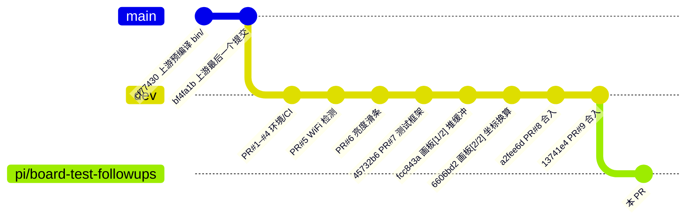
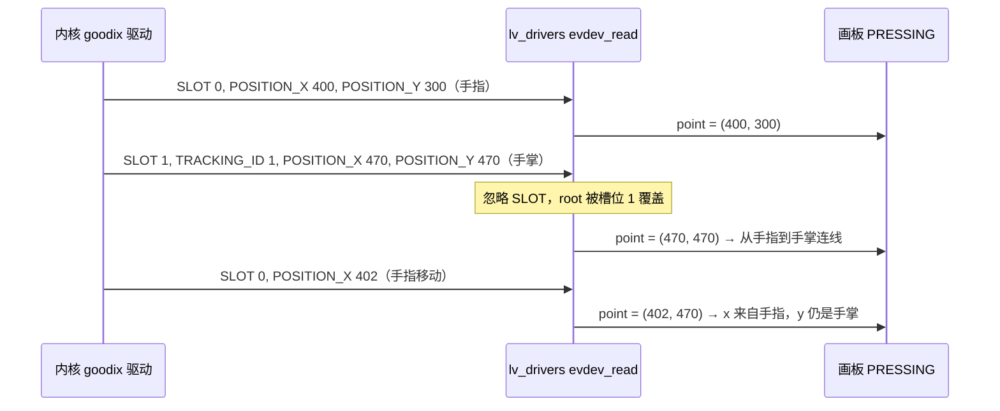

# Luckfox Pico LVGL Example — PR #8 真机遗留问题追溯与修复设计规格

- **日期**：2026-10-10
- **状态**：两轮板上对比已完成（§2.4、§2.5）：F1、F2、F3、F4、F6 确认为历史问题，F5 未复现；§9 QA 全部闭合；修复已全部实现，主机验证通过（plan §4），待修复后真机复测（§3.5）
- **分支**：`pi/board-test-followups`（起点 `origin/dev` `13741e4`）
- **范围来源**：PR [#8](https://github.com/yuangezhizao/luckfox_pico_lvgl_example/pull/8) 正文「后续 PR 候选范围」两张表与[真机测试评论](https://github.com/yuangezhizao/luckfox_pico_lvgl_example/pull/8#issuecomment-5968843362)（2026-10-03，Luckfox Pico Ultra W）；PR #8 的 spec 为 [`2026-10-01-lvgl-example-fix-existing-defects-design.md`](2026-10-01-lvgl-example-fix-existing-defects-design.md)，其范围来自 PR #7 的 [`2026-09-28-lvgl-example-native-tests-design.md`](2026-09-28-lvgl-example-native-tests-design.md) §10
- **关联计划**：[`../plans/2026-10-10-lvgl-example-board-test-followups.md`](../plans/2026-10-10-lvgl-example-board-test-followups.md)

---

## 1. 概述与目标

PR #8 修复了 30 处既存缺陷。它在云端 VM 上实现，真机验证只能由作者把 CI 产出的 uClibc 二进制 `adb push` 到板上执行。真机验证中有 6 个现象不通过或单独记录（§2.2 的 F1–F6），复核中另有 3 条有意不修的问题（R1–R3）。

本规格分两步：

1. **追溯**：对每个问题，先从代码判断它是历史一直存在，还是 PR #8 引入；再编出 PR #8 之前和之后若干提交的 uClibc 二进制，由作者在板上逐个对比，用实测确认结论（§3）。
2. **修复**：追溯结论确认后，按 §9 QA 定下的范围逐个修复。每个修复都有在修复前失败的自动化测试，修复后跑无界面的 `ctest`，以及带界面的 LVGL 渲染（`screenshots` 截图与 `preview` 窗口）。

**不在本规格范围**（Q2、Q15、Q16）：PR #8 spec §3.3 中除「mpv 监听线程跨线程调用 LVGL」以外的暂缓项（WiFi `popen` 移入工作线程、`-O3` 与 LVGL 优化级别等）；重构 `generated/`；应用自动修复或重启系统的 wpa_supplicant 配置（N1）；配置里没有 `network={}` 块时由应用 `add_network` 并追加块（N4，Q31 C，记入 plan §6.2）；中文 SSID 字形与同名 SSID 去重（N2）。

**术语**：

- **对比点**：用于板上对比的一个提交及其 uClibc 二进制，见 §2.3。
- **历史问题**：在上游原始代码（`bf4fa1b`）中就存在的问题。
- **PR #8 引入**：在 `45732b6`（PR #8 基线）上不存在、在 `a2fee6d`（PR #8 合入）上出现的问题。
- **暴露**：问题本身是历史问题，但 PR #8 修掉了挡在它前面的另一个缺陷，使它第一次能被观察到。

## 2. 背景与代码追溯

### 2.1 历史版本

`dev` 的应用代码只经历了上游与 PR #5–#8 的改动；PR #1–#4 与 PR #9 只改环境、CI 与文档。上游 `bf4fa1b` 到 PR #8 基线 `45732b6` 之间，`custom/`、`generated/`、`src/`、`lib/` 只改了 `custom/custom_main.c`（PR #5 WiFi 检测、PR #6 亮度滑条）、`custom/custom_wifi.c`（5 行）与新增的 `custom/custom_brightness.{c,h}`，另有顶层 `CMakeLists.txt` 的编译选项；与 F1–F6 涉及的函数无关（`git diff --stat bf4fa1b 45732b6`）。



### 2.2 问题清单与初步结论

F1–F6 来自真机验证，R1–R3 来自 PR #8 复核的「本 PR 不修」。「初步结论」只基于代码，需要 §3 的板上对比确认。

| 编号 | 页面 | 现象 | 初步结论（代码） | 板上结论（§2.4） |
|---|---|---|---|---|
| F1 | WiFi | 连点 Scan 10 次一直显示 `scanning`；手动 `wpa_cli -i wlan0 scan` 后才发现热点 | 历史问题 | **确认历史问题**：`45732b6` 与 `a2fee6d` 表现一致 |
| F2 | 画板 | 在右下区域画线，笔迹吸附到右侧靠下位置；中央正常 | 大概率是历史问题（触摸驱动），PR #8 的坐标换算不是根因 | **确认历史问题**：单指三个版本都跟手（假设 1 排除）；第 2 轮两指复现，根因是 `lv_drivers` evdev 不区分多点触控槽位（假设 2，§2.5） |
| F3 | 画板 | 轻点不出点，移动后才画出短线 | 历史问题 | **确认历史问题**：`fcc843a` 与 `a2fee6d` 都不出点 |
| F4 | 音乐 | 107 字节的长文件名在列表中被裁切，三项无法区分 | 历史问题，被 PR #8 暴露 | **确认历史问题**：`cf77430` 与 `a2fee6d` 都两端裁切，无法区分 |
| F5 | 音乐 | 首次进入时进度滑块约 50% | 历史问题 | **未复现**：`cf77430` 与 `a2fee6d` 首次进入都在最左端，属间歇性 |
| F6 | 音乐 | 启动时没有音乐，运行中放入文件后仍提示找不到，重启后才能进入 | 历史问题 | **确认历史问题**：`cf77430` 与 `a2fee6d` 都仍提示 `Can't find music!` |
| R1 | 音乐 | 监听线程用 `strtok`，与 UI 线程日历的 `strtok` 共享 libc 静态游标 | 历史问题 | 高 |
| R2 | 音乐 | mpv 连上后崩溃无人回收（无 `SIGCHLD` 处理），留下僵尸，之后每次按键报 `mpv_send` 错误 | 历史问题 | 高 |
| R3 | 音乐 | fd 没有 `CLOEXEC`，mpv 继承 DRM、fb、evdev 的 fd，`popen` 子进程继承 `fd_mpv` | 历史问题 | 高 |

#### 2.2.1 F1 WiFi Scan 不主动扫描

- Scan 按钮回调 `WIFI_scanning_btn_event_handler` 只调用 `_wifi_scanning_ssid()`，后者执行 `wpa_cli -i wlan0 scan_results`，读取 wpa_supplicant 已缓存的结果，从不发起扫描。上游 `bf4fa1b` 的 `custom_wifi.c:225` 就是同一条命令。
- wpa_supplicant 2.6 在没有启用网络时不做常规扫描：`wpa_supplicant/scan.c:732-737` 在 `!wpa_supplicant_enabled_networks(wpa_s) && wpa_s->scan_req == NORMAL_SCAN_REQ` 时打印 `No enabled networks - do not scan` 并返回。`wpa_cli scan` 发起的是手动扫描（`MANUAL_SCAN_REQ`），不受此限。PR #8 真机测试把两份配置恢复成空文件，正好落在这个条件里。
- 已连接时 wpa_supplicant 也不会周期扫描（未配置 `bgscan`），扫描结果会停留在旧状态。
- PR #8 只改了扫描结果的解析（WiFi [6/9]），没有改触发方式。PR #7 spec §10.2 与 PR #8 spec §3.3 都把「Scan 触发真实扫描」列为暂缓项。
- **差分实验**（2026-10-10，回应 Q4「疑似 PR #8 改坏」）：在 `/tmp` 的临时副本里用同一套 `tests/` 框架和同一个假 `wpa_cli`，分别链接 `45732b6` 与 `a2fee6d` 的 `custom_wifi.c`，对 5 份 `scan_results` 输出打印下拉框选项（实验代码不进仓库）：

  | 输入 | `45732b6`（PR #8 前） | `a2fee6d`（PR #8 后） |
  |---|---|---|
  | 只有表头（wpa_supplicant 尚未扫描） | `scanning` | `scanning` |
  | `wpa_cli` 连不上守护进程 | `scanning` | `scanning` |
  | 只有热点 `Redmi K20 Pro` | `Redmi`、`...` | `Redmi K20 Pro`、`...` |
  | 4 个常见 SSID（含 15 字节的 `TP-LINK_5G_ABCD` 与中文） | `RedmiChinaNet-AbCd`、空项、`...` | 4 个 SSID 原样、`...` |
  | 只有隐藏网络（空 SSID、`\x00\x00\x00\x00`） | `scanning` | `scanning` |

  结论：两版只在 wpa_supplicant 缓存为空时显示 `scanning`，条件完全相同；PR #8 之前的解析反而更差（按空格截断、相邻项粘连、丢掉不少于 15 字节和转义过的 SSID）。旧版「看起来能扫到」取决于 wpa_supplicant 自己有没有扫描过：配置里有启用的网络且未连接时，它会自己周期扫描，缓存非空；配置为空时不扫描。PR #8 真机测试时两份配置被恢复为空文件。板上用 §3.3 的 F1 步骤在同一 wpa_supplicant 状态下对照确认。

#### 2.2.2 F2 画板右下区域落点吸附

画布几何（`generated/setup_scr_Sketchpad.c:34-38`）：宽 `WIDTH*SCALE`，高 `HEIGHT*0.75*SCALE`，居中后上移 `80*SCALE`。

| 屏幕 | 画布尺寸 | 画布左上角 | 画布下边 |
|---|---|---|---|
| 480×480（`SCALE=1`） | 480×360 | (0, -20) | y=339 |
| 720×720（`SCALE=1.5`） | 720×540 | (0, -30) | y=509 |

PR #8 画板 [2/2] 的换算只是 `point.y -= -20`（480 屏），x 不变；它让笔迹整体下移 20 像素与手指对齐，不会只在右下角产生吸附。因此怀疑方向是触摸输入本身。`lib/lv_drivers/indev/evdev.c`（上游原样，`EVDEV_CALIBRATE 0`）有两处可疑：

1. **不做坐标映射，越界钳位**：`evdev_read()` 直接把内核上报的原始坐标当屏幕坐标，再钳到 `[0, hor_res-1]`、`[0, ver_res-1]`。如果 GT911 上报范围大于屏幕（例如面板配置是 720 而屏是 480，或配置与屏方向不一致），越靠右下误差越大，超出部分全部被钳到屏幕右边或下边，表现为「吸附」。中央误差较小，可能不易察觉。LVGL 9 的 `lv_evdev.c` 已改为用 `EVIOCGABS` 读出 `min/max` 并映射到显示分辨率。
2. **不区分多点触控槽位**：驱动忽略 `ABS_MT_SLOT`，任何槽位的 `ABS_MT_POSITION_X/Y` 都会覆盖 `evdev_root_x/y`。GT911（`goodix` 驱动）使用 MT 协议 B；内核对未变化的 `ABS_X/ABS_Y` 不重复上报，所以第二个接触点（例如在右下角画画时手掌根落在屏幕右下边缘）一旦移动，指针坐标就跳到第二个接触点。



两种假设都与 PR #8 无关。PR #8 之前的画板还有缓冲区缺陷（⑱：画布指向已返回函数的栈），在 `45732b6` 及更早的二进制上画画属于未定义行为，可能花屏或崩溃，不能直接拿来对比落点。所以对比用 `fcc843a`（只修了缓冲区）与 `6606bd2`（再加坐标换算），并用 §3.2 的 `evdev_probe` 采原始事件，区分上述两种假设。

#### 2.2.3 F3 画板轻点不出点

`lv_sketchpad_event()` 只处理 `LV_EVENT_PRESSING`：第一次只记录起点，之后每次与上一点连线。轻点时手指不动，后续 `PRESSING` 的两点相同，`lv_draw_sw_line()` 在 `point1 == point2` 时直接返回（`lib/lvgl/src/draw/sw/lv_draw_sw_line.c:58`），所以什么都不画。这段逻辑来自上游，PR #8 没有改动。

#### 2.2.4 F4 音乐长名称裁切

- 列表 roller 固定宽 272（`setup_scr_Music_player.c:418`），文字居中，未选中项 12 号字、选中项 18 号字；roller 的每一项是一整行，超出宽度的部分两侧都被裁掉，所以前缀相同、只在末尾不同的长名称看起来一样。
- 当前歌曲名标签 `Music_player_music_name` 宽 200、高 22，`LV_LABEL_LONG_WRAP`，长名称折行后超出标签高度。
- 上游就是这个布局。PR #8 之前：选中 ≥32 字节的文件名会死循环（④），列表总长超过 256 字节会栈溢出（②），长名称在正常使用中走不到「看清列表」这一步。PR #8 修掉这两处后，裁切第一次能被观察到，属于「暴露」。

#### 2.2.5 F5 音乐首次进入进度约 50%

- 初值来自 GUI Guider 生成代码：`setup_scr_Music_player.c:242-244` 把进度滑块设为范围 0–100、值 50。上游相同。
- 之后的更新全部来自 mpv 监听线程 `get_music_playback_time()`：它在非 UI 线程直接调用 `lv_slider_set_value()`、`lv_slider_set_range()`（PR #8 spec §3.3 暂缓项「mpv 监听线程跨线程调用 LVGL」）。进入页面时 `music_app_init()` 发 `playlist-pos 0` 和 `pause true`，mpv 加载第一首后应上报 `playback-time` 为 0，滑块本应回到 0。实测停在 50，可能原因（待板上确认）：
  1. 跨线程调用 LVGL，失效区域与刷新竞争，值已改但没有重绘；
  2. 监听线程每次 `read` 最多 511 字节，再按 `\n` 切分；加载文件时 mpv 一次输出多条事件，跨两次 `read` 的那一行解析失败被丢弃，`playback-time` 事件可能正好丢失；
  3. 暂停状态下 mpv 尚未上报 `playback-time`。
- 三种原因在 PR #8 前后都存在。PR #8 删掉了启动时的 `sleep(1)` 与无参 `mpv` 预热，只影响启动时序，不改变初值与跨线程调用。

#### 2.2.6 F6 运行中加入音乐仍提示找不到

- `MUSIC_ENABLE` 只在启动时由 `luckfox_check_music_enable_info()` 计算一次（`src/main.c`），MUSIC 按钮回调 `Main_Music_btn_event_handler` 只看这个值，为 0 时弹出「Can't find music!」窗口。
- 即使重新判断，音乐页也只建一次：`ui_load_scr_animation(…, auto_del=false)` 把离开页的 `*_del` 置 false，第一次进入后不再调用 `setup_scr_Music_player()`，`music_scan_list()` 与 mpv 播放列表（`loadfile … append`）都不会刷新。
- 上游相同，PR #8 没有改动。

#### 2.2.7 R1–R3

均在上游即存在，PR #8 复核时登记、有意不修（PR #8 正文「本 PR 不修」）。R1 与 F5 同在监听线程，若 F5 改写监听线程，R1 可以一起处理。

### 2.3 对比点与二进制

用 `yuangezhizao/luckfox-pico@dev` 稀疏检出的 uClibc 工具链（`arm-rockchip830-linux-uclibcgnueabihf-gcc`）在各提交上执行 `cmake` + `make`，产物均为 ARM 32 位 uClibc 可执行文件，已在 `qemu-arm` 下确认动态库能加载（输出 `cannot open /dev/dri/card0`）。

| 文件名 | 提交 | 说明 | SHA256 |
|---|---|---|---|
| `luckfox_lvgl_demo-bin-cf77430` | `cf77430` | 上游仓库提交的预编译 `bin/luckfox_lvgl_demo`（2024-07-12） | `fd8530e1de84950d3b75057d7cd8e279f76367f8433fac3df8e3d1efb202f4ed` |
| `luckfox_lvgl_demo-bf4fa1b` | `bf4fa1b` | 上游最后一个提交，本地重编 | `b1bc2b5cac19a93693981d9f0381ae0a833281aa39d02e861971006fbc1c3896` |
| `luckfox_lvgl_demo-45732b6` | `45732b6` | PR #8 基线（PR #7 合入） | `57da0fc275b4e765f85b9f99b43f2171e3e9c416b1ece1dadffb78a1228e4451` |
| `luckfox_lvgl_demo-fcc843a` | `fcc843a` | PR #8 画板 [1/2]：只修画布缓冲区 | `3e498a97a86682a3c68869b3f5714b913c76cae5c15bd177067e06bd130e0454` |
| `luckfox_lvgl_demo-6606bd2` | `6606bd2` | PR #8 画板 [2/2]：再加坐标换算 | `08edf6174965d7012ddaa0f7da04197376fb7f75e9a03240f943fdd50eb351ab` |
| `luckfox_lvgl_demo-a2fee6d` | `a2fee6d` | PR #8 合入，即当前 `dev` 的应用代码 | `45802123067635bbcfac12b05029a89d0194a21d7fa01bc143641931c3806dda` |
| `evdev_probe` | — | 触摸诊断工具（§3.2），打印坐标范围与原始事件 | `282af4119937a6c17af4f39e6129db3b4b8eab8324eb2759afbff252cee1a88b` |

音乐页测试素材：`music/` 下 3 个 60 秒正弦波 mp3，文件名各 68 字节、前 63 字节相同（`luckfox_roller_clip_test_long_common_prefix_abcdefghijklmnopq_0{1,2,3}.mp3`），roller 选项串总长 206 字节，低于旧版 `roller_str[256]` 的上限；旧版不点选列表项（≥32 字节会触发 ④ 的死循环）。

交付（Q1）：放在 Cursor 存储 `/cursor/stores/self/board-compare-20261010/`（7 个文件、`music/` 下 3 个 mp3 与 `SHA256SUMS`，已 `sha256sum -c` 全部 `OK`），同目录上一级另有打包文件 `board-compare-20261010.tar.gz`（SHA256 `3dcb96c50afe7d53ddca55ff956d2bfe60f67621bfc92f2d09bd3609c781f236`）。存储上的文件权限为 `666`，推到板上后需 `chmod +x`。

### 2.4 第 1 轮板上对比结果（2026-10-10）

作者在本地 Mac 上由 pi（`openai-codex` `gpt-6-astra`，medium）按 §3 引导执行并记录，原始记录 `RESULTS.md`、26 份板上日志与 11 张照片在 Cursor 存储 `board-compare-results-20261010/` 与作者经 Tailscale 上传的 `board-compare-out.zip` 中。板上环境：Linux 5.10.160，`model` 为 `Luckfox Pico Ultra`，帧缓冲 `480,480`，触摸 `Goodix Capacitive TouchScreen`（`/dev/input/event0`）。

| 项 | `cf77430` | `45732b6` | `fcc843a` | `6606bd2` | `a2fee6d` |
|---|---|---|---|---|---|
| F1 第 1 轮（缓存为空） | 不可测 | 一直 `scanning` | — | — | 一直 `scanning` |
| F1 第 2 轮（手动扫描后） | 不可测 | 显示多个热点 | — | — | 显示多个热点 |
| F2 单指画右下 | — | — | 跟手 | 跟手 | 跟手 |
| F2 手掌搭边 | — | — | 裸屏无法完成 | 裸屏无法完成 | 裸屏无法完成 |
| F3 轻点 | — | — | 不出点 | — | 不出点 |
| F4 列表 | 两端裁切，无法区分 | — | — | — | 两端裁切，无法区分 |
| F5 首次进入进度 | 最左端 | — | — | — | 最左端 |
| F6 运行中加入音乐 | 仍提示找不到 | — | — | — | 仍提示找不到 |

触摸数据（`evdev_probe`，按 `TRACKING_ID` 切分笔画）：

- `ABS_X`、`ABS_Y`、`ABS_MT_POSITION_X/Y` 的范围都是 0–479，与 480 屏一致；四角轻点分别上报 (0,0)、(479,0)、(479,479)、(0,479)，中心附近 (232,235)。**假设 1（范围不匹配被钳位）排除。**
- `ABS_MT_SLOT` 范围 0–4（最多 5 点），但三个版本的全部日志里都没有出现 `ABS_MT_SLOT` 事件，全程只有单点；画线笔画相邻两帧坐标最大跳变 2–5 像素，没有跳到边缘的帧。**假设 2（多点触控槽位串扰）未被验证**，单指条件下不会触发。
- 单指右下笔画的范围：`fcc843a` x 360–403、y 222–275；`6606bd2` x 334–398、y 202–279；`a2fee6d` x 329–404、y 216–298。都没有到达画布右下角（x 接近 479、y 接近画布下边 339）。
- 轻点都只有一帧坐标（持续 0.04–0.14 s），与 F3 的机制一致：后续 `PRESSING` 两点相同，`lv_draw_sw_line()` 直接返回。
- `6606bd2` 与 `a2fee6d` 的画板代码完全相同（两者之间只改了 `src/main.c` 的退出清屏），作者感觉两者笔迹位置略有差别，属主观感受；`fcc843a` 与 `6606bd2` 的差别按代码只是整体 20 像素垂直偏移。

其他记录：

- **F5**：PR #8 真机测试看到约 50%，本轮两个版本都在最左端（值 0）。说明 `playback-time` 事件本轮被正常处理，PR #8 那次属间歇性。可能原因仍是 §2.2 F5 的跨线程刷新与跨 `read` 丢行；PR #8 测试用的是 107 字节文件名和含 `"` 的文件名，mpv 输出的事件更长，跨 `read` 切断的概率更高。
- **退出清屏**：`45732b6`、`fcc843a`、`6606bd2` 的日志有 `cat: write error: No space left on device`，`a2fee6d` 没有，证实 PR #8 退出 [1/1] 在板上生效；上游预编译 `cf77430` 按 OFF 后画面停留、不黑屏（上游 `a32e371` 才加清屏），属预期。
- **N1 板上 WiFi 配置为空**：`rkwifi_server`（`librkwifibt.so`）把 `/etc/wpa_supplicant.conf` 复制为 `/data/wpa_supplicant.conf` 后执行 `wpa_supplicant -B -i wlan0 -c /data/wpa_supplicant.conf -d`。板上两份都是 0 字节，没有 `ctrl_interface`，开机后 `wpa_cli` 一律报 `Failed to connect to non-global ctrl_ifname: wlan0`，应用的 Scan、Load、状态刷新都连不上守护进程。本轮 F1 由 pi 在作者同意后临时用只含 `ctrl_interface=/var/run/wpa_supplicant` 的配置重启 wpa_supplicant 完成，结束后按原参数恢复。Luckfox 官方 Wi-Fi 文档要求 `/etc/wpa_supplicant.conf` 含 `ctrl_interface`、`ap_scan=1`、`update_config=1`。配置为何为空不明；PR #8 真机测试开始前的备份也是空文件。
- **N2 WiFi 下拉框**：扫描结果有中文 SSID（`沐沐`、`CMCC-时屿`），工程字体只有 Montserrat，无 CJK 字形；同名多 BSSID 重复出现（`920` 两次）。都是现状，PR #8 spec §1 已把「不去重」列为非目标。
- **N4 Load 依赖已有 `network={}` 块**（复测设计时读代码发现，不是板上现象）：`_wifi_conf_load()` 用 `wpa_cli` 的 `set_network 0 ssid/psk` 加 `save_config`，随后只改写 `/etc/wpa_supplicant.conf` 中已有 `network={}` 块的 `ssid=`、`psk=` 行。配置里没有块时 `set_network 0` 返回 `FAIL`，配置也无处可写，页面没有任何提示。上游 `bf4fa1b` 同样写死 `set_network 0`。Luckfox 官方模板带一个占位的 `network={}` 块（`ssid="luckfox"`），本 PR 早先在 README 只摘录了前三行。
- **N3 板子意外重启**：F2 四角采集的第 7 步（只运行 `evdev_probe`，作者在裸屏上悬空画线）期间 adb 断开，重连后 `uptime` 1 分钟、时钟回到 2021-01-01，原因未知，与被测应用无关。由于板上没有 RTC，重启前后的时间戳不连续，`markers.txt` 需分段对齐。

### 2.5 第 2 轮板上验证：F2 多点触控（2026-10-10）

作者在本地由 pi 引导，只运行 `a2fee6d`，`evdev_probe` 并行记录（`board-compare-results-f2r2.zip`）。

| 步骤 | 作者原话 | 槽位事件 |
|---|---|---|
| 1 右下先按住，中央画横线 | 「是出现中央与右下之间的连线，刷的一下子就画上了」 | slot 1、slot 0 |
| 2 中央先画，右下点一下再抬起 | 「另一只手的手指在 Back 正上方的画布点一下时突然和中央手指连起了线，中央手指继续移动时不再出线」 | slot 1、slot 0 |
| 3 单指画过画布下边进入按钮区 | 「笔迹到画布边缘时消失，越过画布下边进入按钮区后，回到画布上笔迹恢复，碰到按钮时，页面未发生跳转」 | 无 |

第 2 步的事件序列与 §2.2 F2 假设 2 的预测一致：

```text
1609503333.420609 ABS_MT_SLOT 1
1609503333.420609 ABS_MT_TRACKING_ID 5        ← 第二根手指按下 (388,207)，指针坐标被它覆盖 → 连线
1609503333.420609 ABS_MT_POSITION_X 388
1609503333.420609 ABS_MT_POSITION_Y 207
1609503333.577318 ABS_MT_TRACKING_ID -1       ← 第二根手指抬起，evdev_button 置为松开
1609503337.443732 ABS_MT_SLOT 0
1609503337.443732 ABS_MT_POSITION_Y 199       ← 中央手指仍在移动，内核照常上报 ABS_X/ABS_Y，
1609503337.443732 ABS_Y 199                      但不再发 BTN_TOUCH 或新的 TRACKING_ID，指针一直是松开 → 不出线
```

第 1 步：右下手指先按下（slot 0），中央手指作为 slot 1 按下的瞬间指针从右下跳到中央，画出连线；中央手指抬起（slot 1 的 `TRACKING_ID -1`）后指针同样被置为松开。

结论：

- PR #8 真机测试的「右下区域吸附到右侧靠下」是在右下区域画画时手掌或其他手指碰到屏幕右下边缘，第二个接触点覆盖了指针坐标；单指时不出现。
- 缺陷在 `lib/lv_drivers/indev/evdev.c`，自上游 `00974b5` 起未改，与 PR #8 无关。LVGL 9 的 `lv_evdev.c` 只在开启手势识别时处理 `ABS_MT_SLOT`，指针路径同样会被任意槽位覆盖（§10）。
- 第 3 步越过画布下边时笔迹被画布裁掉，回到画布后继续；`PRESS_LOCK` 使按住经过按钮时不触发按钮。均为正常行为，不需要补测。
- 第 3 步之后作者重新插拔 USB，板子再次重启（`uptime` 0 分钟）。两次重启都发生在 USB 连接中断时，推测板子经 USB 供电、插拔导致掉电，与被测应用无关（§2.4 N3）。

## 3. 板上对比方案

### 3.1 通用步骤

1. `RkLunch-stop.sh` 停掉占用音频的 RKIPC；备份 `/etc/wpa_supplicant.conf`、`/data/wpa_supplicant.conf`。
2. 每个对比点：`adb push luckfox_lvgl_demo-<提交> /root/`，`chmod +x`，前台运行并把输出存为 `/root/log-<提交>.txt`。
3. 每个对比点只做与它相关的检查项（§3.3 的矩阵），退出用主屏 OFF。

### 3.2 F2 触摸数据采集

1. `cat /proc/bus/input/devices`，记录 GT911 的 `Name`、`Handlers`、`ABS` 位图。
2. `./evdev_probe /dev/input/event0`，记录开头的 `range` 行（`ABS_X`、`ABS_MT_POSITION_X` 等的 `min/max`）。
3. 不运行应用，依次用一根手指点屏幕四角和中心，记录每次的 `ABS_MT_POSITION_X/Y`，判断上报范围是否等于屏幕分辨率、方向是否一致。
4. 只用一根手指、手掌悬空，在右下区域画短线；再让手掌根自然落在屏幕右下边缘画同样的线。记录是否出现 `ABS_MT_SLOT 1`。
5. 用 `fcc843a`、`6606bd2`、`a2fee6d` 分别重复第 4 步的两种姿势，对照屏幕上的落点。`lv_drivers` 的 evdev 不 `EVIOCGRAB`，`evdev_probe` 可以与应用同时读同一个设备：先在后台启动 `evdev_probe` 写日志，再前台运行应用。

判据：第 3 步范围或方向不一致，支持假设 1；第 4 步只有手掌落下时才吸附且出现槽位 1，支持假设 2；`fcc843a` 与 `6606bd2` 的差别只应是整体 20 像素的垂直偏移。

### 3.3 检查矩阵

「必测」是判断来源所需的最少组合；`bf4fa1b` 与预编译 `cf77430` 用于确认「历史问题」，二者选一即可。上游版本只在 `/proc/device-tree/model` 为 `Luckfox Pico Ultra W` 时启用 WiFi（`bf4fa1b` `custom_main.c:334-339`），SDK `824b817f` 起该值恒为 `Luckfox Pico Ultra`，上游版本会隐藏 WIFI 按钮，所以 F1 最早只能测 `45732b6`（含 PR #5 的 SDIO 判定）。

| 问题 | `cf77430`／`bf4fa1b` | `45732b6` | `fcc843a` | `6606bd2` | `a2fee6d` | 操作 |
|---|---|---|---|---|---|---|
| F1 | 不可测 | 必测 | — | — | 必测 | 每个版本做两轮：① `wpa_cli -i wlan0 bss_flush 0` 清空扫描缓存，先在 shell 执行 `wpa_cli -i wlan0 scan_results` 确认只有表头，再进 WIFI 连点 Scan；② shell 执行 `wpa_cli -i wlan0 scan`，等 5 s，再次 `scan_results` 确认非空后点 Scan。判据：同一轮中各版本显示是否一致（只允许解析差异，如旧版按空格截断） |
| F2 | 可选（可能花屏或崩溃） | 可选（同左） | 必测 | 必测 | 必测 | 见 §3.2 |
| F3 | 可选（同上） | — | 必测 | — | 必测 | 画布中央轻点一下，不移动 |
| F4 | 必测 | — | — | — | 必测 | `/music` 放 3 个各约 70 字节、前 60 字节相同的文件名（总长小于 256，避开旧版 ②）；旧版只看列表、不点选（避开 ④ 的死循环） |
| F5 | 必测 | — | — | — | 必测 | 启动后第一次进 MUSIC，不点播放，看进度滑块 |
| F6 | 必测 | — | — | — | 必测 | 启动前清空 `/music`；启动后放入 mp3，再点 MUSIC |

### 3.4 第 2 轮：F2 多点触控验证（Q12）

只测 `a2fee6d`（`evdev.c` 自上游未改，任一版本结论相同），`evdev_probe` 在后台同时记录。

1. 一根手指按住画布右下角附近（例如 Back 按钮正上方）不动，另一只手的手指在画布中央画横线；画完先抬中央的手指，再抬右下的手指。
2. 反过来：先在中央画线不抬起，另一根手指在右下角按一下再抬起，中央手指继续画。
3. 单指从画布中央一直画到画布右下角，越过画布下边进入按钮区再抬起。

预期（假设 2 成立时）：第 1 步笔迹在中央与右下手指之间来回连线；第 2 步右下手指抬起后，中央手指继续移动却不再出线（右下手指的 `TRACKING_ID -1` 把整个指针置为松开）；日志出现 `ABS_MT_SLOT 1`。第 3 步只用于确认画布边缘与越界的绘制是否正常。

### 3.5 修复后真机复测

二进制：修复后的 uClibc 产物，文件名与 SHA256 见 plan §4。对比包里的 `music/` 三个 mp3 与 `evdev_probe` 已在板上 `/root/board-compare-20261010/`。照 §3.1 准备（`RkLunch-stop.sh`、备份两份 WiFi 配置、确认 `/music` 不存在），每项写时间标记、记录原话。

| 项 | 步骤 | 判据 |
|---|---|---|
| N1 | 保持两份配置为空（当前状态），进 WIFI 点一次 Scan | 红色提示 `wpa_supplicant not reachable`，不再一直 `scanning` |
| F1 | 只写入三行（`ctrl_interface=/var/run/wpa_supplicant`、`ap_scan=1`、`update_config=1`，**不带** `network={}` 块，否则占位网络启用后 wpa_supplicant 会自己扫描）到 `/etc/wpa_supplicant.conf`，照 `rkwifi_server` 的做法复制为 `/data/wpa_supplicant.conf` 并重启 wpa_supplicant（`killall wpa_supplicant; wpa_supplicant -B -i wlan0 -c /data/wpa_supplicant.conf`）；`wpa_cli -i wlan0 bss_flush 0` 确认缓存为空；开热点，进 WIFI 只点一次 Scan，不手动 `wpa_cli scan` | 先显示 `scanning`，约 3 秒后列出热点；全程不点 Load |
| N4 | 仍是 F1 的三行配置，在 WIFI 页填任意合法 SSID 与 8 位以上密码，点 Load | 红色提示 `No network block in wpa_supplicant.conf`；`/etc`、`/data` 两份配置哈希不变 |
| 密码回读 | 按 README 写入官方完整模板（三行加占位 `network={}` 块），照 F1 的方式复制到 `/data` 并重启 wpa_supplicant；在 WIFI 页填测试热点的 SSID 与密码（作者自定，可含空格），点 Load，等 10 秒（spec Q27） | `/etc/wpa_supplicant.conf` 与 `/data/wpa_supplicant.conf` 的 `ssid=`、`psk=` 与输入逐字一致；`wpa_cli -i wlan0 status` 为 `wpa_state=COMPLETED`；重启应用后 SSID 框回填一致 |
| F2 | §3.4 第 1、2 步 | 第 1 步：中央手指不画线，不出现中央与右下之间的连线（笔跟随先按下的右下手指）；第 2 步：右下手指点按时不连线，抬起后中央手指继续出线 |
| F3 | 画布中央轻点 | 留下一个点 |
| F4 | `/music` 放 3 个测试 mp3，进 MUSIC、打开列表 | 列表各项形如 `luckfox_rolle...lmnopq_01.mp3`，可区分；顶部歌曲名循环滚动；可点选 |
| F5 | 首次进入 MUSIC 不碰 | 进度在最左端 |
| F6-空 | `/music` 存在但没有 mp3 时点 MUSIC；放入 2 个 mp3 进入后返回，删掉 1 个再进入；再删光后点 MUSIC（spec Q28） | 空目录弹出找不到；删 1 个后列表少 1 项；删光后弹出找不到、不进入空页面 |
| F6 | 启动前 `/music` 不存在；点 MUSIC 弹窗后关闭，运行中放入 3 个 mp3，再点 MUSIC；返回后再复制一个 `_04.mp3`，再进入；再返回、不改目录再进入 | 第二次点 MUSIC 进入音乐页且列表 3 项；放入第 4 个后再进入为 4 项并停在第一首；目录不变时再进入不打断播放 |
| R2 | 在音乐页 `killall mpv`，等 2 秒，再按下一曲 | 应用日志有 `mpv connection closed`；`ps` 中没有 `mpv` 或 `<defunct>`；按键不再连续打印 `mpv_send` 错误；应用不退出 |
| R3 | 应用运行时对其 pid 执行 `for f in /proc/$P/fd/*; do ls -l $f; grep flags /proc/$P/fdinfo/${f##*/}; done` | `/dev/fb0`、`/dev/input/event0` 与 mpv 套接字的 `flags` 含 `02000000`（`O_CLOEXEC`） |
| OFF | 主屏 OFF | 黑屏，日志无 `cat: write error` |

结束后两份 WiFi 配置保留完整模板（含测试热点）、恢复为不含热点的完整模板，还是恢复为空文件，由作者决定（Q15 建议不留空文件，否则 WIFI 页不可用）。

PR #8 真机测试评论中另有几项「未测」，沿用 PR #8 的结论，本 PR 不补测（spec Q29）：整板重启后的 mpv 启动耗时（清缓存模拟 780 ms，距 5 s 上限余量大）、声音（无扬声器）、72 分钟 tick 长跑（由 32 位测试覆盖）、离开 WIFI 页后的进程采样可能漏过短命进程（检查方法的局限）。

## 4. 需求

范围（Q2）：F1–F6、R1–R3，以及 PR #8 spec §3.3 暂缓项中的「mpv 监听线程跨线程调用 LVGL」（F5 要修彻底离不开它）。

| 编号 | 需求 | 依据 |
|---|---|---|
| F1 | 点 Scan 能看到当前环境中的热点，不依赖 wpa_supplicant 自己是否扫描过 | Q4 |
| F2 | 多指或手掌接触时，笔迹只跟随第一根按下的手指，不跳到其他接触点，也不因其他接触点抬起而停笔 | Q13 |
| F3 | 轻点不移动也留下一个点 | Q5 |
| F4 | 前缀相同的长文件名在列表中可区分；当前歌曲名完整可读 | Q6 |
| F5 | 首次进入进度为 0；之后的进度与时长由 UI 线程刷新 | Q7 |
| F6 | 运行中放入或删除音乐后，不重启也能进入音乐页并看到最新列表 | Q8 |
| R1 | 监听线程不再与 UI 线程共享 `strtok` 的静态游标 | Q2、Q7 |
| R2 | mpv 意外退出后被回收，不留僵尸 | Q2 |
| R3 | 应用打开的 fd 不被 mpv 与 `popen` 子进程继承 | Q2 |
| N1 | `wpa_cli` 连不上 wpa_supplicant 时，WIFI 页给出提示而不是一直显示 `scanning`；README 写明板上 `/etc/wpa_supplicant.conf` 的前提 | Q4、Q15 |
| N4 | 配置里没有 `network={}` 块时，Load 给出提示而不是静默失败；README 给出带 `network={}` 块的官方完整模板 | Q31 |

## 5. 设计

### 5.1 已定（第 1、2 轮 QA）

- **F3**（Q5）：`LV_EVENT_PRESSED` 时在落点画一个直径等于线宽的圆点，之后按现有逻辑连线；`static lv_coord_t last_x, last_y = LAST_VALUE;` 改为两个变量都初始化为 `LAST_VALUE`（现状 `last_x` 初值为 0）。
- **F4**（Q6）：列表显示「头部…尾部」形式的缩写，按下标对应歌曲，不改文件名本身；当前歌曲名标签改为 `LV_LABEL_LONG_SCROLL_CIRCULAR`。缩写长度按 roller 宽度与字体确定，细节在 plan 中定。
- **F5 与 R1**（Q7）：生成代码的进度初值由 50 改为 0；监听线程不再调用 LVGL，把 `playback-time`、`duration` 加锁写入共享状态，由 UI 线程上约 200 ms 一次的 `lv_timer` 刷新滑块；`read` 的数据按行缓冲，跨两次 `read` 的行拼接后再解析；`strtok` 改为 `strtok_r`。
- **F6**（Q8）：每次点 MUSIC 都重新检查 `/music`；每次进入音乐页重新扫描，列表有变化时重建 roller 并重置 mpv 播放列表（`playlist-clear` 后重新 `loadfile`），回到第一首并暂停，列表未变化时保持当前状态。进入页面的时机用音乐页的 `LV_EVENT_SCREEN_LOAD_START`，在 `custom/` 中注册，不改 `generated/` 的页面切换逻辑。
- **F2**（Q13）：`custom/` 新增 `custom_touch.c`（`custom_touch_init(path)`、`custom_touch_read(drv, data)`），`src/main.c` 用它替换 `evdev_init()`、`evdev_read`，`lib/lv_drivers` 不改。按 MT 协议 B 记录各槽位的 `TRACKING_ID` 与坐标，只跟随第一根按下的手指（主触点）；其他接触点的按下、移动、抬起都忽略；主触点抬起即停笔，屏幕上仍有其他接触点时，要等全部抬起、重新按下才继续；设备不支持 `ABS_MT_SLOT` 时退回 `ABS_X/ABS_Y` 加 `BTN_TOUCH`。设备以 `O_RDONLY | O_NONBLOCK | O_CLOEXEC` 打开（R3 中 evdev 的部分一并解决）。测试回放板上录到的两段多指事件（§2.5）。
- **R2、R3**（Q2）：细节在 plan 中定。
- **F1 与 N1**（Q4、Q15）：点 Scan 时先非阻塞执行 `wpa_cli -i wlan0 scan`，下拉框显示 `scanning`，约 3 秒后由一次性 `lv_timer` 读取 `scan_results`；`wpa_cli` 连不上守护进程（输出含 `Failed to connect` 或命令失败）时，复用 PR #8 新增的红色提示标签显示 `wpa_supplicant not reachable`。README 写明板上 `/etc/wpa_supplicant.conf` 需包含 `ctrl_interface=/var/run/wpa_supplicant`、`ap_scan=1`、`update_config=1`（Luckfox 官方 Wi-Fi 文档）。应用不改写、不重启系统的 wpa_supplicant。
- **N4**（Q31）：`WIFI_load_btn_event_handler()` 在输入校验之后、`_wifi_conf_load()` 之前读 `WPA_FILE_PATH`：能读且没有 `network={}` 块时，用红色提示标签显示 `No network block in wpa_supplicant.conf` 并返回，不调用 `wpa_cli`；读不了时保持旧行为。README 改为官方完整模板，并说明 Load 改写的是该块的 `ssid`、`psk`。
- **F5 的测试**（Q14）：虽然第 1 轮未复现，仍按 Q7 修；用假 mpv 把一行事件拆成两次输出，写出修复前必然失败的测试。

### 5.2 待定

- **F2**：根因已确认（§2.5），修法见 §5.1。

### 5.3 提交组织（Q9）

沿用 PR #8：每个问题一个 `fix` 提交，测试与修复在同一个提交，标题带「页面 [n/N]」；spec 与 plan 先推送，完成后 rebase 成最后一个 `docs(superpowers)` 提交。

## 6. 测试策略

- **无界面**：`tests/` 主机原生工程（gcc + ASan/UBSan），`cmake -S tests -B build-tests -DLUCKFOX_TESTS_ARM32=ON && cmake --build build-tests -j && ctest --test-dir build-tests --output-on-failure -j`。2026-10-10 在本分支起点上 78/78 通过（含 2 条 arm32）。每个修复先写在修复前失败的测试，配 `tests/tools/mutate.sh` 的改坏变体。
- **带界面**（Q10）：给 `screenshots` 新增音乐页（长文件名、进度初值）与画板（轻点后）场景，输出 480/720 截图作为证据；`preview` 在 `Xvfb` 下开窗，用脚本模拟鼠标操作后截屏。截图记入 plan 证据，PNG 不提交。
- **交叉编译**：glibc 与 uClibc 两条，告警数与基线对比（glibc 119、uClibc 118）。
- **真机**：修复后的 uClibc 二进制由作者在 Luckfox Pico Ultra W 上复测 F1–F6。

## 7. 风险

| 风险 | 缓解 |
|---|---|
| `45732b6` 及更早的二进制画画是未定义行为，可能崩溃 | F2、F3 以 `fcc843a` 为最早对比点，旧版只作可选项 |
| 旧版选中 ≥32 字节文件名会死循环，列表总长超过 256 字节会栈溢出 | F4 的测试文件名控制在约 70 字节、总长小于 256，旧版不点选 |
| F2 根因只能靠板上数据确认 | §3.2 先采数据，再定修法 |
| 测试改动板上配置与 `/music` | 先备份，测后用 `cp -p` 恢复并核对哈希（沿用 PR #8 Task 32 的做法） |

## 8. 已知边界

- 云端 VM 上无法运行 ARM 二进制访问真实 DRM、fb、触摸设备；板上结论全部依赖作者实测。
- 当前 VM 没有 `mac80211_hwsim` 等内核模块（无 `/lib/modules/$(uname -r)`），无法在本机模拟无线网卡运行真实 wpa_supplicant；F1 只能在本机做解析差分，扫描行为以板上为准。
- 当前 VM 不是 `.cursor/Dockerfile` 构建的环境，ARM 交叉工具链、`qemu-user`、`libsdl2-dev`、`xvfb` 为本次会话临时 `apt-get install`，未写入 Dockerfile。

## 9. QA（grilling 记录）

问句与推荐取自问答原文；「答」记录作者原话或明确的采纳。第 1 轮（Q1–Q11）作者对 Q1、Q4 单独作答，其余回答为「其余均遵从推荐」；第 2 轮（Q4 续、Q12、Q14–Q16）回答为「第二轮问题均遵从推荐」。编号 Q13 预留给 F2 修法，待第 2 轮板上验证后提问。Q17–Q26 是修复完成后关于 PR 正文与文档标题编号的两轮问答，会话中对应编号为 Q1–Q5 与 Q6–Q10（续问 Q9），此处为与前文区分而顺延。

**Q1. 对比用二进制怎么交付（§2.3）**

- 问：A Mac 上线 Tailscale 后 `scp` 本机 `/tmp/cmp/board-compare-20261010.tar.gz`；B GitHub 认证修好后建 draft release 上传附件；C 推送一个只用来编对比点的 CI workflow。
- 推荐：A，B 备选。
- 答（原话）：「放置到fuse的文件系统中,比如/cursor/stores/user/ 或 /cursor/stores/self 我可以直接在 cursor 的编辑器中下载,也可能会同步到本地mac mini的文件系统」
- 结论：放在 `/cursor/stores/self/board-compare-20261010/`，另放一份打包文件（§2.3）。

**Q2. 本 PR 的范围（§4）**

- 问：F1–F6 必修；R1–R3 与 PR #8 spec §3.3 暂缓项「mpv 监听线程跨线程调用 LVGL」修不修？
- 推荐：修 F1–F6，加上跨线程问题（F5 要修彻底离不开它）与 R1–R3（都在同一个监听线程与 mpv 启动函数里，每条约 10 行）；其余暂缓项（WiFi `popen` 移入工作线程、`-O3` 等）不动。
- 答：遵从推荐。

**Q3. 对比点是否足够（§2.3、§3.3）**

- 问：`cf77430` 预编译、`bf4fa1b`、`45732b6`、`fcc843a`、`6606bd2`、`a2fee6d`，是否还要加别的提交？
- 推荐：就用这些；上游 `cf77430` 与 `bf4fa1b` 二选一，优先上游预编译版。
- 答：遵从推荐。

**Q4. F1 Scan 怎么改（§5.1）**

- 问：A 点 Scan 时先非阻塞执行 `wpa_cli -i wlan0 scan`，下拉框显示 `scanning`，约 3 秒后由一次性 `lv_timer` 读 `scan_results`；B 扫描放进工作线程，结果投递回 UI 线程。
- 推荐：A。
- 答（原话）：「这个疑似是PR8给修坏的,请查看是否是这样?然后我再做决定,我记不清PR8之前的二进制是否正常了,可能需要实测一下」
- 回复：已做差分实验（§2.2 F1），PR #8 前后在同一份 `scan_results` 上显示 `scanning` 的条件相同，PR #8 只改善了解析；旧版「看起来正常」取决于 wpa_supplicant 是否自己扫描过。板上按 §3.3 F1 的两轮步骤对照确认。
- 结论（第 2 轮）：板上第 1 轮确认 F1 为历史问题（§2.4）后再问。问：A 点 Scan 先非阻塞 `wpa_cli -i wlan0 scan`，约 3 秒后一次性 `lv_timer` 读 `scan_results`；B 扫描放工作线程。推荐 A，并在 `wpa_cli` 连不上守护进程时用红色提示标签显示 `wpa_supplicant not reachable`。答（原话）：「第二轮问题均遵从推荐」。采用 A 加提示（§5.1）。

**Q5. F3 轻点出点（§5.1）**

- 问：`LV_EVENT_PRESSED` 时在落点画一个直径等于线宽的圆点，之后照旧连线？
- 推荐：这样改，并把 `last_x` 也初始化为 `LAST_VALUE`。
- 答：遵从推荐。

**Q6. F4 长名称显示（§5.1）**

- 问：A 列表显示「头部…尾部」，按下标对应，不改文件名；当前歌曲名标签改循环滚动。B 列表左对齐只显示前缀。C 缩小字体或加宽列表。
- 推荐：A；前缀相同只在末尾不同的文件名，B、C 仍无法区分。
- 答：遵从推荐。

**Q7. F5 进度条（§5.1）**

- 问：初值由 50 改为 0；监听线程只加锁写共享状态，UI 线程 `lv_timer`（约 200 ms）刷新滑块；`read` 按行缓冲；`strtok` 改 `strtok_r`（R1）。
- 推荐：如上。
- 答：遵从推荐。

**Q8. F6 运行中加入音乐（§5.1）**

- 问：A 每次点 MUSIC 重新检查，每次进入音乐页重新扫描，列表变化则重建 roller、`playlist-clear` 后重新 `loadfile`，回到第一首并暂停，未变化保持当前状态；B 只在点 MUSIC 时重新检查，列表仍只建一次。
- 推荐：A；进入时机用 `LV_EVENT_SCREEN_LOAD_START`，在 `custom/` 注册，不改 `generated/` 的页面切换。
- 答：遵从推荐。

**Q9. 提交组织（§5.3）**

- 问：沿用 PR #8，每个问题一个 `fix` 提交，测试与修复同提交，标题带「页面 [n/N]」；spec、plan 先推，最后 rebase 成一个 `docs(superpowers)` 提交。
- 推荐：沿用。
- 答：遵从推荐。

**Q10. 带界面的测试（§6）**

- 问：A `screenshots` 新增音乐页与画板场景，并在 `Xvfb` 下跑 `preview` 用脚本模拟鼠标截屏；B 只做截图。
- 推荐：A，截图入证据、不提交 PNG。
- 答：遵从推荐。

**Q11. `evdev_probe` 是否进仓库**

- 问：目前只在 plan 附录与对比包里。
- 推荐：不进仓库，留在 plan 附录；若 F2 确认要改 evdev 驱动，再考虑转成测试或工具。
- 答：遵从推荐。

**Q12. F2 是否做第 2 轮多点触控验证（§3.4）**

- 问：第 1 轮单指未复现，坐标范围假设已排除。用两根手指验证多点触控槽位串扰：一指按住右下角、另一指在中央画线；中央画线时另一指在右下角点一下再抬起；单指从中央画到画布右下角并越过下边。只测 `a2fee6d`（`evdev.c` 自上游未改）。
- 推荐：做；只需启动一次应用，可沿用本地 pi 的提示词。
- 答：遵从推荐（「第二轮问题均遵从推荐」）。

**Q14. F5 未复现，是否仍按 Q7 修（§5.1）**

- 问：第 1 轮两个版本首次进入都在最左端，未复现约 50%。是否仍按 Q7 修（初值 0、按行缓冲、UI 线程刷新、`strtok_r`）？
- 推荐：照修；缺陷在代码中确实存在，不靠复现证明；用假 mpv 把一行事件拆成两次输出，写出修复前必然失败的测试。
- 答：遵从推荐。

**Q15. N1 板上 WiFi 配置为空是否纳入（§2.4、§5.1）**

- 问：A 不修板上配置，README 写明 `/etc/wpa_supplicant.conf` 需含 `ctrl_interface` 等三行，应用连不上 wpa_supplicant 时提示（与 Q4 合并）；B 应用检测到缺 `ctrl_interface` 时自动补三行并重启 wpa_supplicant；C 不处理。
- 推荐：A；B 让应用改系统配置、重启系统服务，风险大。另建议作者按官方三行恢复板上 `/etc/wpa_supplicant.conf`，否则修完 F1 也无法在该板验证。
- 答：遵从推荐。

**Q16. N2 中文 SSID 与同名 SSID 是否纳入**

- 问：下拉框中的中文 SSID 无字形，同名多 BSSID 重复出现。
- 推荐：都不修，只记录；中文显示需要引入 CJK 字体，体积大，宜单独开 PR；去重在 PR #8 spec §1 已列为非目标。
- 答：遵从推荐。

**Q13. F2 怎么修（§5.1）**

- 问：A 改 vendored `lib/lv_drivers/indev/evdev.c`，不读 `ABS_MT_*`，只用内核的单点模拟 `ABS_X/ABS_Y` 加 `BTN_TOUCH`（约 10 行）；`lib/` 不在测试工程里、不能配变体；单点模拟跟随最早按下且未抬起的手指，先按的手指先抬起时指针会跳到另一根手指，仍会连线。B 在 `custom/` 新增 `custom_touch.c` 自己读触摸，`lib/` 不动，`src/main.c` 改用它：只跟随第一根按下的手指，其他接触点一律忽略，主触点抬起即停笔、等全部抬起重新按下才继续，不支持多点的设备退回 `ABS_X/ABS_Y` 加 `BTN_TOUCH`；约 80 行，能用板上录到的多指事件回放出修复前必然失败的测试并配变体，顺带以 `O_CLOEXEC` 打开设备（R3）。
- 推荐：B；测试可用真机数据，`lib/` 保持上游原样，以后升级 lv_drivers 不冲突。
- 答（原话）：「遵循建议」。

**Q17. PR 正文标题的序号格式**

- 问：A `## 1. 概述`、`### 2.1 小节`；B `## 一、概述`、`### （一）小节`；C `## 1 概述`、`### 2.1 小节`。
- 推荐：A；层级一眼可见，与 spec 的「§2.2」引用一致。
- 答（原话，Q17–Q21 共同回答）：「全部遵循推荐,其中Q5针对superpowers的plan和spec文档也需要编号,但具体格式可以再议,也可以现在就讨论好」。
- 结论：PR #1–#10 正文按 A 补序号，`CURSOR_AGENT_PR_BODY_*` 注释与 Cursor 页脚原样保留；改后逐行比对只有标题行与 Q19 的锚点变化，线上正文与本地新文件逐字节一致。

**Q18. 加序号的范围**

- 问：只给 `##`、`###` 标题加，列表、表格、加粗小标题不动？
- 推荐：只改标题；表格已有「序号」列的不重复编号。
- 答：遵从推荐（见 Q17）。

**Q19. PR #8 中会失效的锚点链接**

- 问：PR #8 概述的 `[真机验证](#真机验证已执行)` 在标题加序号后失效。A 改为 `#4-真机验证已执行`（除标题外唯一的改动）；B 不改。
- 推荐：A。
- 答：遵从推荐（见 Q17）。

**Q20. 带 emoji 的标题**

- 问：PR #3、#4 的 `## ⚠️ 合并后须知`，序号放在 emoji 前，写成 `## 4. ⚠️ 合并后须知`？
- 推荐：放在 emoji 前，序号始终在最左。
- 答：遵从推荐（见 Q17）。

**Q21. 以后的约定写在哪**

- 问：A 写进 `~/.pi/agent/AGENTS.md`（作者个人约定，所有仓库生效）；B 写进本仓 `AGENTS.md`；C 不写。
- 推荐：A。
- 答：遵从推荐，并要求 superpowers 的 spec 与 plan 也编号（见 Q17 原话），格式见 Q22–Q26。

**Q22. spec 的四级标题**

- 问：A 所有层级都编号（`#### 2.2.1 F1 …`）；B 四级不编号，靠 F1、R1 识别。
- 推荐：A，规则统一，可引用为 §2.2.1；最多用到四级。
- 答（原话，Q22–Q24、Q26 共同回答）：「除了Q9全部遵循建议,我想知道历史PR的改动量大吗?」。
- 结论：本 spec 的 `#### F1`–`#### R1–R3` 改为 `#### 2.2.1`–`#### 2.2.7`。

**Q23. plan 里的 Task 标题**

- 问：A `### 2.3 Task 2：…`（两套编号）；B 保持 `### Task 2：…`，Task 以外的小节照常编号并挪出 Task 所在的章；C `### 2.3 …（Task 2）`。
- 推荐：B；Task 号已被提交说明、spec 与证据表广泛引用。
- 答：遵从推荐（见 Q22）。
- 结论：本 plan 的「修复 Task 通用步骤」提为 `## 2.`，Tasks 顺延为 `## 3.`，验证证据、偏离顺延为 §4、§5，spec 与 PR #10 正文中的 `plan §3` 同步改为 `plan §4`。

**Q24. 附录**

- 问：写成 `## 附录 A`、`### A.1`，与正文分开编号？
- 推荐：是，正文增删章节不影响附录编号。
- 答：遵从推荐（见 Q22）。

**Q25. 历史 spec 与 plan 怎么处理**

- 问：A 只从本 PR 开始；B 另开 docs PR 统一补序号；C 在本 PR 里一起改。
- 推荐：A（历史 spec 已符合，只差早期 plan 的二级标题）。
- 答（原话）：「除了Q9全部遵循建议,我想知道历史PR的改动量大吗?」（不采纳 A，先问改动量）。
- 回复：按规则统计 16 份历史文档：spec 8 份 177 个标题需改 0；plan 8 份 166 个标题需改 56，多为二级标题补序号；约 450 处 `§` 引用指向 spec，不受影响。两个特例：PR #8 的 plan 有 5 个回归检查点小节在 Task 章节内；PR #9 的 plan 附录 `### A1`–`### A6` 改为 `A.1` 时正文约 10 处引用要同步。续问：A 不动；B 另开 docs PR，特例 1 就地编号作为例外，特例 2 连同引用一起改；C 同 B 但特例 1 挪到单独一章。推荐 B。
- 答（原话）：「遵循建议,那需要记录一下另开PR这件事情以及"两个特例",我不太清楚"两个特例"的细节,到时候再讨论,是记录到当前文档中或PR的评论区由你决定」。
- 结论：采用 B，另开 docs PR；两个特例的细节记入 plan §6.1，开 PR 时再与作者讨论。

**Q26. 文档编号约定写在哪**

- 问：spec 与 plan 的编号约定和 PR 正文约定一起写进作者个人 `~/.pi/agent/AGENTS.md`？
- 推荐：是，superpowers 是作者跨仓库使用的流程，属于个人习惯。
- 答：遵从推荐（见 Q22）。

**Q27. 复测是否补 WiFi 密码逐字回读**

- 问：PR #8 真机测试评论记「密码逐字回读未验证」。要不要用测试热点点 Load、核对写入的口令，测完把配置恢复成三行或空文件？
- 推荐：加；F1 修好后 WIFI 页第一次能在作者板上完整跑通。
- 答（原话，Q27–Q30 共同回答）：「均遵循推荐」。
- 结论：读 Load 的代码时发现它依赖已有 `network={}` 块（N4），处理见 Q31；复测按官方完整模板进行（§3.5「密码回读」）。

**Q28. 复测是否补空目录场景**

- 问：`/music` 存在但没有 mp3 时点 MUSIC；在音乐页删光 mp3 后再点 MUSIC。
- 推荐：加；两种情况都走 F6 新增的重新检查与重新扫描，主机测试没覆盖「删光」，同时补主机测试。
- 答：遵从推荐（见 Q27）。
- 结论：§3.5 新增 F6-空 一行；`music.reenter.remove_all_blocks_entry`、`music.reenter.remove_one_rescans` 并入音乐 [6/6]。

**Q29. PR #8 评论中其余未测项**

- 问：整板重启后的 mpv 耗时、声音、72 分钟长跑、短命进程采样，要不要补测？
- 推荐：都不加，只在 spec 注明沿用 PR #8 结论。
- 答：遵从推荐（见 Q27）。

**Q30. plan §6.1 的后续事项是否删除**

- 问：作者要求把另开 docs PR 与两个特例记到 PR 评论区（[评论](https://github.com/yuangezhizao/luckfox_pico_lvgl_example/pull/10#issuecomment-6098045435)），plan §6.1 那份要不要删？
- 推荐：保留；plan 精简后本就保留未入库事项，开 docs PR 时对照最方便。
- 答：遵从推荐（见 Q27）。

**Q31. Load 依赖已有 `network={}` 块怎么处理（N4）**

- 问：Load 用 `set_network 0` 并只改写已有 `network={}` 块，按 README 当时的三行配置点 Load 会静默失败（上游即如此）；官方模板带占位块，README 漏了。A 只改 README 为官方完整模板，代码不动；B A 加 Load 前检查，没有块时提示 `No network block in wpa_supplicant.conf` 并返回（WiFi [2/2]）；C A 加由应用 `add_network` 并在 `/etc` 追加块。
- 推荐：B；A 仍会「点了没反应」，C 改变写配置的行为、牵涉多，以后单独做，记入 plan 后续事项。复测按官方完整模板进行；F1 须先在不带块的三行配置下测，再换完整模板测密码回读。
- 答（原话）：「遵循推荐」。
- 结论：新增 WiFi [2/2]（原 WiFi [1/1] 改为 [1/2]），测试 `wifi.load.no_network_block`、变体 `WIFI-Q31-no-block-check`；README 改为官方完整模板；§3.5 新增 N4 与「密码回读」两行；C 记入 plan §6.2。

## 10. 参考资料

- PR #8 正文与真机测试评论：https://github.com/yuangezhizao/luckfox_pico_lvgl_example/pull/8 。
- hostap 2.6 `wpa_supplicant/scan.c`（`No enabled networks - do not scan`）：https://w1.fi/cgit/hostap/plain/wpa_supplicant/scan.c?h=hostap_2_6 。
- Luckfox Pico Ultra RGB 屏幕（720×720 与 480×480、GT911 触摸、`luckfox-config` 开启触摸）：https://wiki.luckfox.com/zh/Luckfox-Pico-Ultra/RGB-Screen/ 。
- SDK 设备树 `rv1106-luckfox-pico-ultra-ipc.dtsi`（`goodix,gt911`，`reg = <0x14>`，面板 `hactive/vactive = 720`）：`yuangezhizao/luckfox-pico@dev` 的 `sysdrv/source/kernel/arch/arm/boot/dts/`。
- LVGL 9 `src/drivers/evdev/lv_evdev.c`（`EVIOCGABS` 读范围并映射；`ABS_MT_SLOT` 仅在手势识别开启时处理）：https://github.com/lvgl/lvgl/blob/master/src/drivers/evdev/lv_evdev.c 。
- 本仓 `lib/lv_drivers/indev/evdev.c`、`custom/custom_sketchpad.c`、`custom/custom_musicplayer.c`、`custom/custom_wifi.c`、`custom/custom_main.c`、`generated/setup_scr_Music_player.c`、`generated/setup_scr_Sketchpad.c`、`generated/events_init.c`、`generated/gui_guider.c`。
